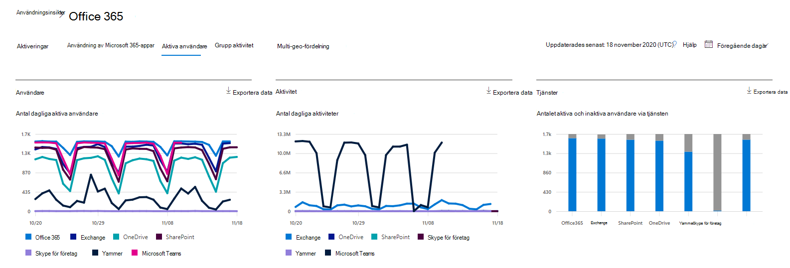

# Microsoft 365-rapporter i administrations centret – aktiva användare

Instrument panelen för Microsoft 365- **rapporter** visar en översikt över produkterna i organisationen. Här kan du gå in på detaljnivå i rapporter för enskilda produkter för att få bättre insikter om aktiviteterna inom varje produkt. Ta en titt på [översiktsavsnittet för Rapporter](activity-reports.md).
  
Du kan till exempel använda rapporten **Aktiva användare** för att ta reda på hur många produktlicenser som används av personerna i din organisation, och öka detaljnivån för att få information om vilka användare som använder respektive produkt. Den här rapporten kan hjälpa administratörer att identifiera underutnyttjade produkter eller användare som behöver ytterligare utbildning och information. 
  
> [!NOTE]
> Du måste vara global administratör, global läsare eller rapport läsare i Microsoft 365 eller en Exchange-, SharePoint-, teams-tjänst, grupp kommunikation eller Skype för företag-administratör för att se rapporter.  

## Så här kommer du till rapporten Aktiva användare

1. I administrationscentret går du till sidan **Rapporter** \> <a href="https://go.microsoft.com/fwlink/p/?linkid=2074756" target="_blank">Användning</a>. 
2. Från instrument panelens start sida klickar du på knappen **Visa mer** på aktiva användare-Microsoft 365-kort.

## Tolka rapporten Aktiva användare

Du kan visa aktiva användare i rapporten Office 365 genom att välja fliken **aktiva användare** . 

|||
|:-----|:-----|
|1.    |I rapporten **Aktiva användare** kan du se trender under de senaste 7, 30, 90 eller 180 dagarna. Om du däremot visar en viss dag i rapporten visar tabellen (7) data för upp till 28 dagar från det aktuella datumet (inte det datum då rapporten genererades).    |
|2.    |Informationen i varje rapport täcker vanligt vis upp till de senaste 24 till 48 timmar.    |
|3.    |I diagrammet **användare** visas dagliga aktiva användare under rapporterings perioden, avgränsade med produkt.    I **aktivitets** diagrammet visas dagliga aktivitets antalet i rapporterings perioden avdelad efter produkt.   I diagrammet **Tjänster** visas antalet användare efter aktivitetstyp och tjänst.    |
|4.    | I diagrammet **användare** visar x-axeln den valda rapporterings perioden och y-axeln visar de dagliga aktiva användarna avgränsade och färgkodade efter licens typ.     I diagrammet **aktivitet**   visar x-axeln den valda rapporterings perioden och y-axeln visar de dagliga aktivitets räknarna avgränsade efter licens typ.   I aktivitetsdiagrammet **Tjänster** visar X-axeln de enskilda tjänster som användarna är aktiverade för under en viss tidsperiod och Y-axeln är antalet användare efter aktivitetsstatus, färgkodade efter aktivitetsstatus.    |
|5.    |Du kan filtrera serien som visas i diagrammet genom att markera ett objekt i förklaringen. När du ändrar det här valet ändras inte informationen i rutnätstabellen.    |
|18.6.    |Du kan också exportera rapport data till en Excel. csv-fil genom att välja **Exportera** -länken. Då exporteras data för alla användare och du kan göra enkel sortering och filtrering för vidare analys. Om du har mindre än 2 000 användare kan du sortera och filtrera i tabellen i själva rapporten. Om du har fler än 2 000 användare måste du exportera data för att kunna filtrera och sortera.    |
|borttagning.    |Du kan ändra vilken information som visas i rutnätstabellen med kolumnkontroller.    Om ditt abonnemang drivs av 21Vianet visas inte Yammer.     |
|||

Om organisationens principer förhindrar dig att visa rapporter där användarinformationen är identifierbar kan du ändra sekretessinställningen för alla de här rapporterna. Kolla in **hur du döljer användar nivå informationen?** i [aktivitets rapporter i administrations centret för Microsoft 365](activity-reports.md).  
