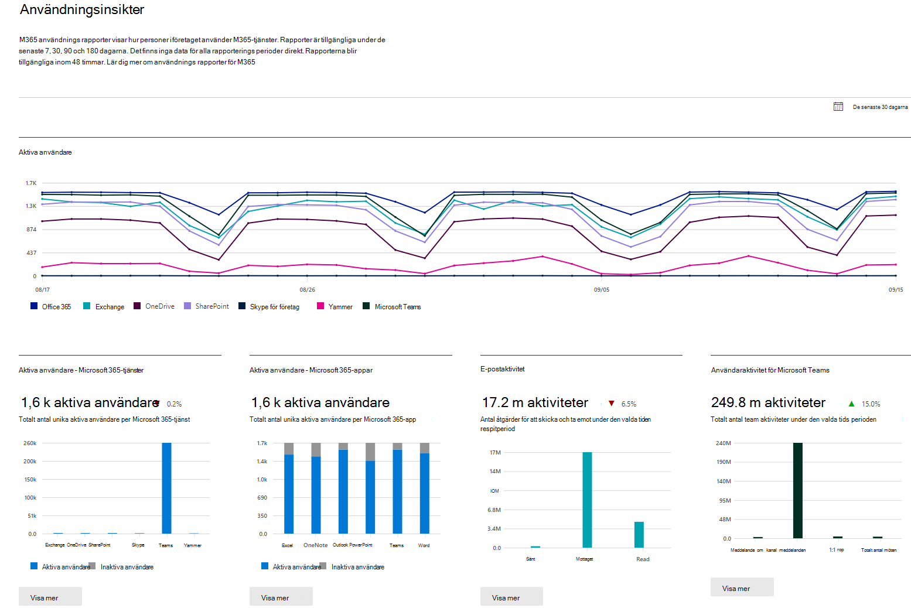

# Microsoft 365-rapporter i administrationscentret

Du ser enkelt hur personer i företaget använder Microsoft 365-tjänster. Du kan till exempel identifiera vem som använder en tjänst mycket och når kvoter och vem som kanske inte behöver någon Microsoft 365-licens alls.
  
Rapporter är tillgängliga för de senaste 7 dagarna, 30 dagarna, 90 dagarna och 180 dagarna. Det finns inte direktdata för alla rapporteringsperioder. Rapporterna blir tillgängliga inom 48 timmar.
  
I den här videon finns information om hur du kan använda rapporterna:
  
> [!VIDEO https://www.microsoft.com/videoplayer/embed/fb726f8e-aead-43b2-ba0f-53ba5b886bf7?autoplay=false]
  
## Så här öppnar du instrumentpanelen Rapporter

::: moniker range="o365-worldwide"

1. I administrationscentret går du till sidan **Rapporter** \> <a href="https://go.microsoft.com/fwlink/p/?linkid=2074756" target="_blank">Användning</a>.

::: moniker-end

::: moniker range="o365-germany"

1. I <a href="https://go.microsoft.com/fwlink/p/?linkid=848041" target="_blank">administrationscentret</a> går du till sidan **Rapporter** \> **Användning**.

::: moniker-end

::: moniker range="o365-21vianet"

1. I <a href="https://go.microsoft.com/fwlink/p/?linkid=850627" target="_blank">administrationscentret</a> går du till sidan **Rapporter** \> **Användning**.

::: moniker-end

2. Klicka på **Visa mer**-knappen från aktivitetskortet för en tjänst (till exempel e-post eller OneDrive) för att se rapportdetaljsidan. Där finns olika rapporter för tjänsten i flikar.   

## Vem kan se rapporter

Personer som har följande behörigheter:
  
- Globala administratörer: Vi rekommenderar att endast ett fåtal personer på företaget har den här rollen. Det minskar riskerna för företaget.
    
- Exchange-administratörer
    
- SharePoint-administratörer
    
- Skype för företag-administratörer

- Global läsare
    
- Rapportläsare

- Administratör för Teams-tjänst

- Administratör för Teams-kommunikation
    
Mer information finns i [Om administratörsroller](../add-users/about-admin-roles.md) och [Tilldela administratörsroller](../add-users/assign-admin-roles.md).
  
## Vilka aktivitetsrapporter är tillgängliga i administrationscentret

De här rapporterna är tillgängliga, beroende på din prenumeration.

- [Användning av Microsofts webbläsare](browser-usage-report.md) 
  
- [E-postaktivitet](email-activity-ww.md)

- [E-postaktivitet för US. Government](email-activity.md)
    
- [Postlådeanvändning](mailbox-usage.md)
    
- [Office-aktiveringar](microsoft-office-activations-ww.md)

- [Office-aktiveringar för US Government](microsoft-office-activations.md)

- [Aktiva användare](active-users-ww.md)

- [Aktiva användare för US Government](active-users.md)
  
- [Användning av e-postprogram](email-apps-usage-ww.md)

- [Användning av e-postprogram för US Government](email-apps-usage.md)

- [Formuläraktivitet](forms-activity-ww.md)

- [Formuläraktivitet för US Government](forms-activity.md)

- [Dynamics 365 Customer Voice-aktivitet](forms-pro-activity-ww.md)
  
- [Dynamics 365 Customer Voice-aktivitet för US Government](forms-pro-activity.md)

- [Microsoft 365-grupper](office-365-groups-ww.md)

- [Microsoft 365-grupper för US Government](office-365-groups.md)
  
- [Användaraktivitet i OneDrive för företag](onedrive-for-business-activity-ww.md)

- [Användaraktivitet i OneDrive för företag för US Government](onedrive-for-business-activity.md)

- [OneDrive för företag-användning](onedrive-for-business-usage-ww.md)

- [OneDrive för företag-användning för US Government](onedrive-for-business-usage.md)

- [Användning av Microsoft 365-appar](microsoft365-apps-usage-ww.md)
  
- [SharePoint-webbplatsanvändning](sharepoint-site-usage-ww.md)

- [SharePoint-webbplatsanvändning för US Government](sharepoint-site-usage.md)
  
- [SharePoint-aktivitet](sharepoint-activity-ww.md)

- [SharePoint-aktivitet för US Government](sharepoint-activity.md)
  
- [Aktivitet i Skype för företag – Online](/SkypeForBusiness/skype-for-business-online-reporting/activity-report)
  
- [Aktivitet relaterad till organiserad konferens i Skype för företag – Online](/SkypeForBusiness/skype-for-business-online-reporting/conference-organizer-activity-report)
  
- [Aktivitet relaterad till deltagare i konferens i Skype för företag – Online](/SkypeForBusiness/skype-for-business-online-reporting/conference-participant-activity-report)
  
- [Peer-to-peer-aktivitet i Skype för företag – Online](/SkypeForBusiness/skype-for-business-online-reporting/peer-to-peer-activity-report)
  
::: moniker range="o365-worldwide"

- [Yammer-aktivitet](yammer-activity-report-ww.md)

::: moniker-end

::: moniker range="o365-worldwide"

- [Yammer-aktivitet för US Government](yammer-activity-report.md)

::: moniker-end

::: moniker range="o365-worldwide"

- [Användning av Yammer-enheter](yammer-device-usage-report-ww.md)

::: moniker-end

::: moniker range="o365-worldwide"

- [Yammer enhetsanvändning för USA: s regering](yammer-device-usage-report.md)

::: moniker-end

::: moniker range="o365-worldwide"

- [Rapporten Aktivitet i Yammer-grupper](yammer-groups-activity-report-ww.md)

::: moniker-end

::: moniker range="o365-worldwide"

- [Rapporten Aktivitet i Yammer-grupper för USA: s regering](yammer-groups-activity-report.md)

::: moniker-end

::: moniker range="o365-worldwide"

- [Användaraktivitet för Microsoft Teams](microsoft-teams-user-activity-preview.md)

::: moniker-end

::: moniker range="o365-worldwide"

- [Microsoft Teams användaraktivitet för USA: s regering](microsoft-teams-user-activity.md)

::: moniker-end

::: moniker range="o365-worldwide"

- [Enhetsanvändning för Microsoft Teams](microsoft-teams-device-usage-preview.md)

::: moniker-end

::: moniker range="o365-worldwide"

- [Microsoft Teams enhetsanvändning för USA: s regering](microsoft-teams-device-usage.md)

::: moniker-end

## Så här visar du licensinformation

- Om du vill se hur många licenser du har tilldelat och tagit bort går du till sidan **Fakturering** \> <a href="https://go.microsoft.com/fwlink/p/?linkid=842264" target="_blank">Licenser</a> i administrationscentret.
    
- Om du vill se vem som är licensierad, olicensierad eller en gäst går du till **Användare** \> <a href="https://go.microsoft.com/fwlink/p/?linkid=834822" target="_blank">Aktiva användare</a> i administrationscentret. 
  
## Så här visar du användningsinformation för en viss användare

Använd tjänsterapporterna när du vill se hur mycket en viss användare använder tjänsten. Om du till exempel vill ta reda på hur mycket lagringsutrymme för e-post en viss användare har förbrukat öppnar du rapporten Postlådeanvändning och sorterar användarna efter namn. Om du har tusentals användare kan du exportera rapporten till Excel där du snabbt kan filtrera listan.
  
Det finns ingen rapport där du anger ett användarkonto och får en lista med vilka tjänster som används och hur mycket.

Det finns tillfällen då nya användare visas som **okända**. Det beror vanligtvis på tillfälliga förseningar i skapandet av användarprofiler.  
  
## Dölja användarinformation i rapporterna

Du kan snabbt göra en ändring i administrationscentret om du vill dölja information om användarnivå när du skapar rapporter.
  
1. I administrationscentret går du till sidan **Inställningar** \> <a href="https://go.microsoft.com/fwlink/p/?linkid=2053743" target="_blank">Tjänster och tillägg</a>.

2. Välj **Rapporter**. 
  
3. Välj de alternativ du vill använda i fönstret **Rapporter** och spara sedan ändringarna.
  
Din användarlista kommer att se ut så här:
  

  
Det tar några minuter innan ändringarna börjar gälla i rapporterna i instrumentpanelen för rapporter. Den här inställningen gäller även för API för rapporter.
  
## Vad händer med användningsdata när ett användarkonto stängs?

När du stänger en användares konto tar Microsoft bort användarens användningsdata inom 30 dagar. Användaren ingår fortfarande i aktivitetsdiagrammets summor (se nummer 1) för de perioder då användaren var aktiv, men visas inte i tabellen med användarinformation (se nummer 2).
  
När du däremot markerar en viss dag (se nummer 3), upp till 28 dagar från dagens datum, visar rapporten användarens användning för den dagen i tabellen med användarinformation (se nummer 2).
  
## Relaterade artiklar

[Rapporter i Säkerhets- och efterlevnadscenter](../../compliance/reports-in-security-and-compliance.md)
