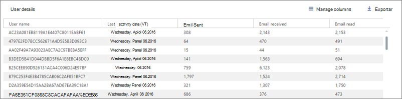

# Aktivitetsrapporter i administrationscentret för Microsoft 365

Du ser enkelt hur personer i företaget använder Office 365-tjänster. Du kan till exempel identifiera vem som använder en tjänst mycket och når kvoter och vem som kanske inte behöver någon Office 365-licens alls.
  
Rapporter är tillgängliga för de senaste 7 dagarna, 30 dagarna, 90 dagarna och 180 dagarna. Det finns inte direktdata för alla rapporteringsperioder. Rapporterna blir tillgängliga inom 48 timmar.
  
I den här videon finns information om hur du kan använda rapporterna:
  
> [!VIDEO https://www.microsoft.com/videoplayer/embed/fb726f8e-aead-43b2-ba0f-53ba5b886bf7?autoplay=false]
  
## Så här öppnar du instrumentpanelen Rapporter

::: moniker range="o365-worldwide"

1. I administrationscentret går du till sidan **Rapporter** \> <a href="https://go.microsoft.com/fwlink/p/?linkid=2074756" target="_blank">Användning</a>.

::: moniker-end

::: moniker range="o365-germany"

1. I <a href="https://go.microsoft.com/fwlink/p/?linkid=848041" target="_blank">administrationscentret</a> går du till sidan **Rapporter** \> **Användning**.

::: moniker-end

::: moniker range="o365-21vianet"

1. I <a href="https://go.microsoft.com/fwlink/p/?linkid=850627" target="_blank">administrationscentret</a> går du till sidan **Rapporter** \> **Användning**.

::: moniker-end

   
2. Om du väljer **Välj en rapport** längst upp på instrumentpanelen så kan du välja från en lista med alla tillgängliga rapporter. Du kan också välja en översiktlig aktivitetswidget för en tjänst (e-post, OneDrive o.s.v.) om du vill ha mer information.  
  
## Vem kan se rapporter

Personer som har följande behörigheter:
  
- Globala administratörer: Vi rekommenderar att endast ett fåtal personer på företaget har den här rollen. Det minskar riskerna för företaget.
    
- Exchange-administratörer
    
- SharePoint-administratörer
    
- Skype för företag-administratörer

- Global läsare
    
- Rapportläsare

- Administratör för Teams-tjänst

- Administratör för Teams-kommunikation
    
Mer information finns i [Om administratörsroller](../add-users/about-admin-roles.md) och [Tilldela administratörsroller](../add-users/assign-admin-roles.md).
  
## Vilka aktivitetsrapporter är tillgängliga i administrationscentret

De här rapporterna är tillgängliga, beroende på din prenumeration.
  
- [E-postaktivitet](email-activity.md)
    
- [Postlådeanvändning](mailbox-usage.md)
    
- [Office-aktiveringar](microsoft-office-activations.md)

- [Aktiva användare](active-users.md)
  
- [Användning av e-postprogram](email-apps-usage.md)
  
- [Grupper i Office 365](office-365-groups.md)
  
- [Användaraktivitet i OneDrive för företag](onedrive-for-business-activity.md)
  
- [OneDrive för företag-användning](onedrive-for-business-usage.md)
  
- [SharePoint-webbplatsanvändning](sharepoint-site-usage.md)
  
- [SharePoint-aktivitet](sharepoint-activity.md)
  
- [Aktivitet i Skype för företag – Online](https://docs.microsoft.com/SkypeForBusiness/skype-for-business-online-reporting/activity-report)
  
- [Aktivitet relaterad till organiserad konferens i Skype för företag – Online](https://docs.microsoft.com/SkypeForBusiness/skype-for-business-online-reporting/conference-organizer-activity-report)
  
- [Aktivitet relaterad till deltagare i konferens i Skype för företag – Online](https://docs.microsoft.com/SkypeForBusiness/skype-for-business-online-reporting/conference-participant-activity-report)
  
- [Peer-to-peer-aktivitet i Skype för företag – Online](https://docs.microsoft.com/SkypeForBusiness/skype-for-business-online-reporting/peer-to-peer-activity-report)
  
::: moniker range="o365-worldwide"

- [Yammer-aktivitet](yammer-activity-report.md)

::: moniker-end

::: moniker range="o365-worldwide"

- [Användning av Yammer-enheter](yammer-device-usage-report.md)

::: moniker-end

::: moniker range="o365-worldwide"

- [Rapporten Aktivitet i Yammer-grupper](yammer-groups-activity-report.md)

::: moniker-end

::: moniker range="o365-worldwide"

- [Användaraktivitet för Microsoft Teams](microsoft-teams-user-activity.md)

::: moniker-end

::: moniker range="o365-worldwide"

- [Enhetsanvändning för Microsoft Teams](microsoft-teams-device-usage.md)

::: moniker-end

## Så här visar du licensinformation

- Om du vill se hur många licenser du har tilldelat och tagit bort går du till sidan **Fakturering** \> <a href="https://go.microsoft.com/fwlink/p/?linkid=842264" target="_blank">Licenser</a> i administrationscentret.
    
- Om du vill se vem som är licensierad, olicensierad eller en gäst går du till **Användare** \> <a href="https://go.microsoft.com/fwlink/p/?linkid=834822" target="_blank">Aktiva användare</a> i administrationscentret. 
  
## Så här visar du användningsinformation för en viss användare

Använd tjänsterapporterna när du vill se hur mycket en viss användare använder tjänsten. Om du till exempel vill ta reda på hur mycket lagringsutrymme för e-post en viss användare har förbrukat öppnar du rapporten Postlådeanvändning och sorterar användarna efter namn. Om du har tusentals användare kan du exportera rapporten till Excel där du snabbt kan filtrera listan.
  
Det finns ingen rapport där du anger ett användarkonto och får en lista med vilka tjänster som används och hur mycket.
  
## Dölja användarinformation i rapporterna

Du kan snabbt göra en ändring i administrationscentret om du vill dölja information om användarnivå när du skapar rapporter.
  
1. I administrationscentret går du till sidan **Inställningar** \> <a href="https://go.microsoft.com/fwlink/p/?linkid=2053743" target="_blank">Tjänster och tillägg</a>.

2. Välj **Rapporter**. 
  
3. Välj de alternativ du vill använda i fönstret **Rapporter** och spara sedan ändringarna.
  
Din användarlista kommer att se ut så här:
  

  
Det tar några minuter innan ändringarna börjar gälla i rapporterna i instrumentpanelen för rapporter. Den här inställningen gäller även för API för rapporter.
  
## Vad händer med användningsdata när ett användarkonto stängs?

När du stänger en användares konto tar Microsoft bort användarens användningsdata inom 30 dagar. Användaren ingår fortfarande i aktivitetsdiagrammets summor (se nummer 1) för de perioder då användaren var aktiv, men visas inte i tabellen med användarinformation (se nummer 2).
  
När du däremot markerar en viss dag (se nummer 3), upp till 28 dagar från dagens datum, visar rapporten användarens användning för den dagen i tabellen med användarinformation (se nummer 2).
  
## Relaterade artiklar

[Rapporter i Säkerhets- och efterlevnadscenter](https://support.office.com/article/7acd33ce-1ec8-49fb-b625-43bac7b58c5a)
  

