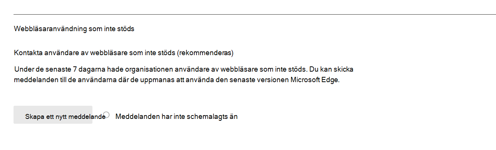

# Microsoft 365 Rapporter i administrationscentret – Microsofts webbläsaranvändning

På Microsoft 365 **Rapporter** visas en översikt över aktiviteter för alla produkter i organisationen. Där kan du gå in på detaljnivå i rapporter för enskilda produkter för att få bättre insikter om aktiviteterna inom varje produkt. Ta en titt på [översiktsavsnittet för Rapporter](activity-reports.md). I Microsofts användningsrapport för webbläsare får du inblick i Internet Explorer, Microsoft Edge (äldre version) och ny Microsoft Edge användning. Användningsrapportering baseras på hur Microsoft 365 onlinetjänster som nås via en Microsoft-webbläsare.

 > [!NOTE]
 > Du måste vara global administratör, global läsare eller rapportläsare i Microsoft 365 eller Exchange, SharePoint eller Skype för företag-administratör för att kunna se rapporter.

## Öppna användningsrapporten för Microsoft-webbläsare

1. I administrationscentret går du till sidan **Rapporter** \> <a href="https://go.microsoft.com/fwlink/p/?linkid=2074756" target="_blank">Användning</a>. 
2. På startsidan för instrumentpanelen klickar du på **knappen Visa mer** på Microsoft-kortet för webbläsaranvändning.

## Så här meddelar du användarna att uppgradera sin webbläsare

Globala administratörer kan registrera sig för att skicka meddelanden till användare som använder Microsoft 365-tjänster i Edge (stöds inte) och Internet Explorer (stöds snart inte). Det riktade meddelandet meddelar användarna att stöd för dessa webbläsare snart kommer att upphöra och länkar till en supportartikel med information om Microsoft Edge och enkla steg att följa för att byta webbläsare. 

Du hittar den här funktionen på rapportsidan. När meddelandet har skapats meddelas användarna med angiven frekvens fram till den 17 augusti 2021. Du kan inaktivera den här funktionen när som helst om du inte vill skicka meddelanden till användarna. Om du vill börja skicka meddelanden igen aktiverar du funktionen igen.

Mer information finns i Microsoft Edge [hjälp & utbildning](https://support.microsoft.com/microsoft-edge).

## Tolka Microsofts användningsrapport för webbläsare

|Objekt|Beskrivning|
 |:-----|:-----|
 |1.   |I **rapporten Microsofts** webbläsaranvändning kan du se trender under de senaste 7, 30, 90 eller 180 dagarna.    |
 |2.   |Data i varje rapport täcker vanligtvis upp till de senaste sju dagarna.   |
 |3.   |I **diagrammet Dagliga aktiva** användare visas det dagliga antalet användare för varje Microsoft Edge, Microsoft Edge (äldre version) och Internet Explorer när de används för åtkomst Microsoft 365 tjänster.   |
 |4. |Diagrammet **Aktiva användare** visar det totala antalet användare som använder Microsoft Edge, Microsoft Edge (äldre version) och Internet Explorer när de används för åtkomst till Microsoft 365-tjänster under den valda tidsperioden. |
 |5. |I tabellen visas en uppdelning av data per användare. Du kan lägga till eller ta bort kolumner i tabellen.    **Användarnamn** är e-postadressen till den användare som anslöt till e Microsoft 365 tjänster med microsoft-webbläsare.  **Används Microsoft Edge** ett skalstreck om användaren använt Microsoft Edge för att ansluta till Microsoft 365 tjänster.  **Används Microsoft Edge (äldre version)** ett skalstreck om användaren använt Microsoft Edge (äldre version) ansluta till Microsoft 365 tjänster.  **Internet Explorer visar** en bockmarkering om användaren använde Internet Explorer för att ansluta Microsoft 365 tjänster. |
 |6. |Välj ikonen **Välj kolumner för** att lägga till eller ta bort kolumner i rapporten.|
 |7. |Du kan också exportera rapportdata till en Excel .csv fil genom att välja **länken** Exportera. Då exporteras data för alla användare och du kan göra enkla aggregeringar, sortering och filtrering för vidare analys. Om du har mindre än 100 användare kan du sortera och filtrera i tabellen i själva rapporten. Om du har fler än 100 användare måste du exportera data för att kunna filtrera och sortera.|
