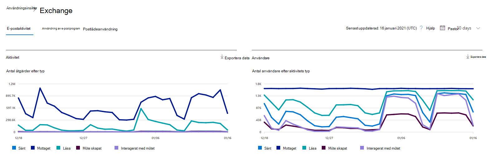
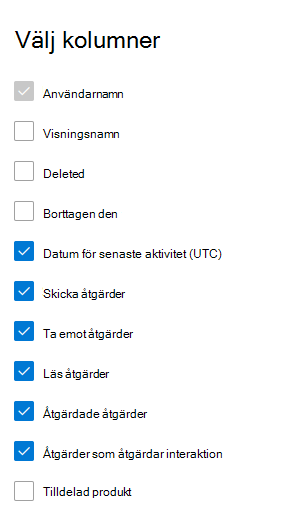

# Microsoft 365-rapporter i administrationscentret – E-postaktivitet

Instrumentpanelen Microsoft **365-rapporter** visar en översikt över aktiviteter för produkter i din organisation. Här kan du gå in på detaljnivå i rapporter för enskilda produkter för att få bättre insikter om aktiviteterna inom varje produkt. Ta en titt på [översiktsavsnittet för Rapporter](activity-reports.md).
  
Du kan till exempel få en övergripande vy av e-postaktiviteten inom organisationen från sidan Rapporter och sedan mer detaljerat i widgeten E-postaktivitet för att förstå trenderna och detaljerna i e-postaktiviteten per användare inom organisation.
  
> [!NOTE]
> Du måste vara global administratör, global läsare eller rapportläsare i Microsoft 365 eller Exchange-, SharePoint-, Teams-tjänst, Teams Communications- eller Skype för företag-administratör för att kunna se rapporter. 

## Komma åt e-postaktivitetsrapporten

1. I administrationscentret går du till sidan **Rapporter** \> <a href="https://go.microsoft.com/fwlink/p/?linkid=2074756" target="_blank">Användning</a>.
2. Välj **Visa mer under E-postaktivitet.**  
3. Välj **Exchange-e-postaktivitet** i  \> **listrutan E-postaktivitet.**
  
## Tolka e-postaktivitetsrapporten

Du kan få inblick i användarnas e-postaktivitet genom att titta på diagrammen **Aktivitet** och **Användare**. 
  

  
|Objekt|Beskrivning|
|:-----|:-----|
|1.    |I rapporten **E-postaktivitet** kan du se trender under de senaste 7, 30, 90 eller 180 dagarna. Men om du väljer en viss dag i rapporten visar tabellen (7) data för de senaste 28 dagarna (inte från det datum då rapporten skapades).    |
|2.    |Data i varje rapport täcker vanligtvis upp till de senaste 24 till 48 timmarna.    |
|3.    |Med hjälp av diagrammet **Aktivitet** förstår du trenden med hur mycket e-postaktivitet som pågår i organisationen. Du kan förstå delningen av e-post, läsa e-post, mottagen e-post, skapa möte eller interagerade aktiviteter för möten.    |
|4.    |Med hjälp av diagrammet **Användare** förstår du trenden med mängden unika användare som skapar e-postaktiviteter. Du kan titta på trenden för användare som utför e-postavsändande, e-postläsning, e-postmottagning, mötesskapande eller interagerande aktiviteter för möten.    |
|5.    | I **aktivitetsdiagrammet** är Y-axeln antalet aktiviteter av typen e-postmeddelande som skickats, e-postmeddelande mottaget, läst e-postmeddelande, skapat möte och möten interagerat.     I diagrammet **Användaraktivitet** är Y-axeln användarens aktivitet av den typ av e-postmeddelande som skickats, e-postmeddelande mottaget, läst e-postmeddelande, möte som skapats eller möten som interagerats.     X-axeln i båda diagrammen är det valda datumintervallet för den här specifika rapporten.    |
|6.    |Du kan filtrera serierna du ser i diagrammet genom att välja ett objekt i förklaringen.    |
|7.    | Tabellen visar en uppdelning av e-postaktiviteter per användare. Här visas alla användare som har en Exchange-produkt som tilldelats dem och deras e-aktiviteter.     **Användarnamn** är användarens e-postadress.    **Visningsnamnet** är det fullständiga namnet om användaren.    **Borttagen** refererar till användare vars aktuella status har tagits bort, men som var aktiv under en del av rapportens rapporteringsperiod.    **Borttaget datum** är det datum användaren togs bort.    **Datum för senaste aktivitet** refererar till den senaste gången användaren utförde en aktivitet för att läsa eller skicka e-post.    **Skicka-åtgärder** är antalet gånger åtgärden att skicka ett e-postmeddelande har registrerats för användaren.    **Mottagningsåtgärder** är antalet gånger åtgärden att ta emot ett e-postmeddelande har registrerats för användaren.    **Läsåtgärder** är antalet gånger åtgärden att läsa ett e-postmeddelande har registrerats för användaren.    **Åtgärder som skapats i** ett möte är antalet gånger åtgärden att skicka en mötesförfrågan registrerats för användaren.    **Mötesåtgärder är antalet** gånger en mötesförfrågan har registrerats för användaren, preliminärt, avböjt eller avbrutit en mötesförfrågan.    **Tilldelad** produkt är de produkter som har tilldelats till den här användaren.     Om organisationens principer förhindrar dig att visa rapporter där användarinformationen är identifierbar kan du ändra sekretessinställningen för alla de här rapporterna. Titta i avsnittet **Hur döljer jag information på användarnivå?** i [aktivitetsrapporterna i administrationscentret för Microsoft 365.](activity-reports.md)    |
|8.    |Välj **Välj kolumner för** att lägga till eller ta bort kolumner i rapporten.    |
|9.    |Du kan också exportera rapportdata till en CSV-fil för Excel genom att välja **länken** Exportera. Då exporteras data för alla användare och du kan göra enkel sortering och filtrering för vidare analys. Om du har mindre än 2 000 användare kan du sortera och filtrera i tabellen i själva rapporten. Om du har fler än 2 000 användare måste du exportera data för att kunna filtrera och sortera.    |
|||
   
> [!NOTE]
> Rapporten e-postaktivitet är endast tillgänglig för postlådor som är associerade med användare som har licenser.
