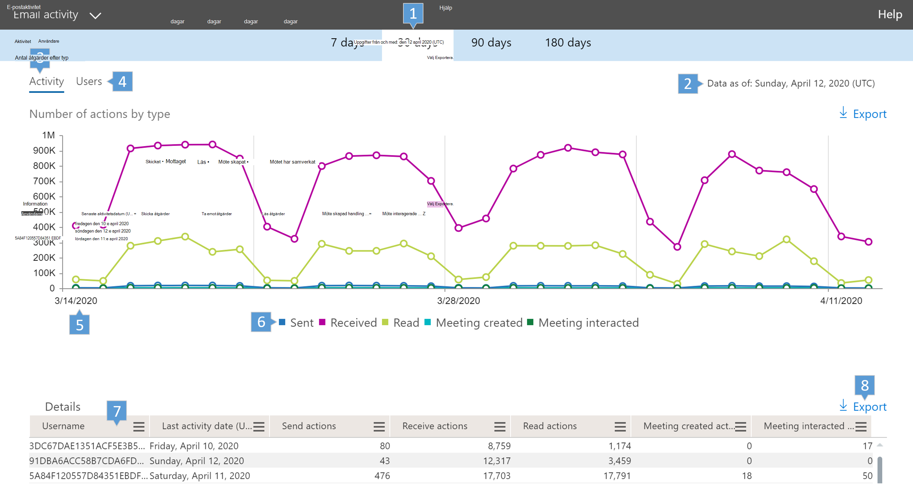
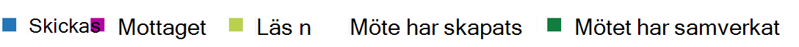

# Microsoft 365-rapporter i administrationscentret – E-postaktivitet

Instrumentpanelen Microsoft 365 **Reports** visar aktivitetsöversikten för produkterna i organisationen. Här kan du gå in på detaljnivå i rapporter för enskilda produkter för att få bättre insikter om aktiviteterna inom varje produkt. Ta en titt på [översiktsavsnittet för Rapporter](activity-reports.md).
  
Du kan till exempel få en övergripande vy av e-postaktiviteten inom organisationen från sidan Rapporter och sedan mer detaljerat i widgeten E-postaktivitet för att förstå trenderna och detaljerna i e-postaktiviteten per användare inom organisation.
  
> [!NOTE]
> Du måste vara global administratör, global läsare eller rapportläsare i Microsoft 365 eller exchange-, SharePoint-, Teams-tjänst, Teams Communications eller Skype för företag-administratör för att kunna se rapporter. 

## Komma åt e-postaktivitetsrapporten

1. I administrationscentret går du till sidan **Rapporter** \> <a href="https://go.microsoft.com/fwlink/p/?linkid=2074756" target="_blank">Användning</a>.

    
2. Välj **Select a report** **Exchange** \> **Exchange-e-postaktivitet**i listrutan Välj en rapport .
  
## Tolka e-postaktivitetsrapporten

Du kan få inblick i användarnas e-postaktivitet genom att titta på diagrammen **Aktivitet** och **Användare**. 
  

  
|||
|:-----|:-----|
|1.    |I rapporten **E-postaktivitet** kan du se trender under de senaste 7, 30, 90 eller 180 dagarna. Om du väljer en viss dag i rapporten visas data i tabellen (7) i upp till 28 dagar från det aktuella datumet (inte det datum då rapporten genererades).    |
|2.    |Uppgifterna i varje rapport omfattar vanligtvis upp till de senaste 24 till 48 timmarna.    |
|3.    |Med hjälp av diagrammet **Aktivitet** förstår du trenden med hur mycket e-postaktivitet som pågår i organisationen. Du kan förstå uppdelningen av e-postsändning, e-postläsning, mottagna e-postmeddelanden, mötesskapade eller mötesaktiviteterade aktiviteter.    |
|4.    |Med hjälp av diagrammet **Användare** förstår du trenden med mängden unika användare som skapar e-postaktiviteter. Du kan titta på trenden för användare som utför e-postsändning, e-postläsning, e-postmottagning, mötesskapande eller mötesaktivitet.    |
|5.    | I **aktivitetsdiagrammet** är Y-axeln antalet aktiviteter av typen e-post som skickas, e-post som tas emot, e-postläsning, möte skapas och möte interageras.     I aktivitetsdiagrammet **Användare** är Y-axeln användarens utförande aktivitet av den typ e-post som skickas, e-post som tas emot, e-postläsning, möte skapas eller möte interageras.     X-axeln i båda diagrammen är det valda datumintervallet för den här specifika rapporten.    |
|6.    |Du kan filtrera serien som visas i diagrammet genom att markera ett objekt i förklaringen. I **aktivitetsdiagrammet** väljer du till exempel **Skickat,** **Mottaget,** **Läst,** **Möteskapat**eller **Mötesaverkade**  om du bara vill visa information som är relaterad till var och en.   När du ändrar det här valet ändras inte informationen i rutnätstabellen.    |
|7.    | Tabellen visar en uppdelning av e-postaktiviteter per användare. Här visas alla användare som har en Exchange-produkt som tilldelats dem och deras e-aktiviteter.     **Användarnamn** är användarens e-postadress.    **Visningsnamnet** är det fullständiga namnet om användaren.    **Borttagen** refererar till användare vars aktuella status har tagits bort, men som var aktiv under en del av rapportens rapporteringsperiod.    **Borttaget datum** är det datum användaren togs bort.    **Datum för senaste aktivitet** refererar till den senaste gången användaren utförde en aktivitet för att läsa eller skicka e-post.    **Skicka-åtgärder** är antalet gånger åtgärden att skicka ett e-postmeddelande har registrerats för användaren.    **Mottagningsåtgärder** är antalet gånger åtgärden att ta emot ett e-postmeddelande har registrerats för användaren.    **Läsåtgärder** är antalet gånger åtgärden att läsa ett e-postmeddelande har registrerats för användaren.    **Möte skapade åtgärder** är antalet gånger en mötesförfrågan skicka åtgärd spelades in för användaren.    **Mötessammanverkade åtgärder** är antalet gånger en mötesförfrågan accepterar, preliminärt, avböjer eller avbryter åtgärden har registrerats för användaren.    **Produkt som tilldelats** är de produkter som har tilldelats den här användaren.     Om organisationens principer förhindrar dig att visa rapporter där användarinformationen är identifierbar kan du ändra sekretessinställningen för alla de här rapporterna. Kolla in avsnittet **Hur döljer jag information på användarnivå?** [Activity Reports in the Microsoft 365 admin center](activity-reports.md)    |
|8.    |Du kan också exportera rapportdata till en CSV-fil i Excel genom att välja länken **Exportera**  export. Då exporteras data för alla användare och du kan göra enkel sortering och filtrering för vidare analys. Om du har mindre än 2 000 användare kan du sortera och filtrera i tabellen i själva rapporten. Om du har fler än 2 000 användare måste du exportera data för att kunna filtrera och sortera.    |
|||
   
Rapporten E-postaktivitet är endast tillgänglig för postlådor som är associerade med användare som har licenser.
