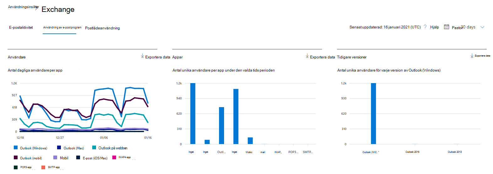
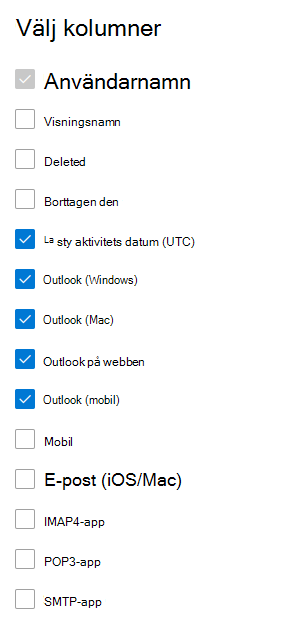

# Microsoft 365 Rapporter i administrationscentret – Användning av e-postprogramMicrosoft 365 Reports in the admin center - Email apps usage

På Microsoft 365 **Rapporter** ser du en översikt över aktiviteter i organisationens produkter.The Microsoft 365 **Reports** dashboard shows you the activity overview across the products in your organization. Här kan du gå in på detaljnivå i rapporter för enskilda produkter för att få bättre insikter om aktiviteterna inom varje produkt.It enables you to drill in to individual product level reports to give you more granular insight about the activities within each product. Ta en titt på [översiktsavsnittet för Rapporter](activity-reports.md).Check out [the Reports overview topic](activity-reports.md). I användningsrapporten för e-postprogram kan du se hur många e-postprogram som ansluter till Exchange Online.In the email apps usage report, you can see how many email apps are connecting to Exchange Online. Du kan även se versionsinformationen för Outlook-program som användarna använder, så att du kan följa upp med dem som använder versioner som inte stöds och installera versioner av Outlook som stöds.You can also see the version information of Outlook apps that users are using, which will allow you to follow up with those who are using unsupported versions to install supported versions of Outlook.
  
> [!NOTE]
> Du måste vara global administratör, global läsare eller rapportläsare i Microsoft 365 eller Exchange-, SharePoint-, Teams-tjänst, Teams Communications- eller Skype för företag-administratör för att kunna se rapporter.You must be a global administrator, global reader or reports reader in Microsoft 365 or an Exchange, SharePoint, Teams Service, Teams Communications, or Skype for Business administrator to see reports.  
 
## Så här kommer du åt rapporten om e-postprogramHow to get to the email apps report

1. I administrationscentret går du till sidan **Rapporter** \> <a href="https://go.microsoft.com/fwlink/p/?linkid=2074756" target="_blank">Användning</a>.In the admin center, go to the **Reports** \> <a href="https://go.microsoft.com/fwlink/p/?linkid=2074756" target="_blank">Usage</a> page.
2. Välj **Visa mer under** **E-postaktivitet**.Select **View More** under **Email activity**. 
3. I **listrutan** E-postaktivitet väljer du Ange Exchange  \> **E-postprogramsanvändning**.From the **Email activity** drop-down list, select **Exchange** \> **Email apps usage**.
  
## Tolka rapporten om e-postprogramInterpret the email apps report

Du kan få information om aktiviteten i e-postappar genom att titta på **diagrammen** Användare **och** Klienter.You can get a view into email apps activity by looking at the **Users** and **Clients** charts. 
  

  
|ObjektItem|BeskrivningDescription|
|:-----|:-----|
|1.1.    |I **användningsrapporten för** e-postprogram kan du se trender under de senaste 7, 30, 90 eller 180 dagarna.The **Email apps usage** report can be viewed for trends over the last 7 days, 30 days, 90 days, or 180 days. Men om du väljer en viss dag i rapporten visar tabellen (7) data för de senaste 28 dagarna (inte från det datum då rapporten skapades).However, if you select a particular day in the report, the table (7) will show data for up to 28 days from the current date (not the date the report was generated).    |
|2.2.    |Data i varje rapport täcker vanligtvis upp till de senaste 24 till 48 timmarna.The data in each report usually covers up to the last 24 to 48 hours.    |
|3.3.    |I vyn **Användare** visas antalet unika användare som har anslutit till Exchange Online med ett e-postprogram.The **Users** view shows you the number of unique users that connected to Exchange Online using any email app.    |
|4.4.    |I vyn **Appar** visas antalet unika användare per app under den valda tidsperioden.The **Apps** view shows you the number of unique users by app over the selected time period.    |
|5.5.    |I **vyn** Versioner visas antalet unika användare för varje version av Outlook i Windows.The **Versions** view shows you the number of unique users for each version of Outlook in Windows.    |
|6.6.    | I diagrammet **Användare** är Y-axeln det totala antalet unika användare som har anslutit till ett program någon dag under rapporteringsperioden.On the **Users** chart, the Y axis is the total count of unique users that connected to an app on any day of the reporting period.     I diagrammet **Användare** är X-axeln antalet unika användare som har använt programmet under rapporteringsperioden.On the **Users** chart, the X axis is number of unique users that used the app for that reporting period.     I diagrammet **Appar** är Y-axeln det totala antalet unika användare som har använt ett visst program under rapporteringsperioden.On the **Apps** chart, the Y axis is the total count of unique users who used a specific app during the reporting period.     I diagrammet **Appar** är X-axeln listan över program i organisationen.On the **Apps** chart, the X axis is the list of apps in your organization.     I diagrammet **Versioner** är Y-axeln det totala antalet unika användare med en viss version av Outlook för skrivbordet.On the **Versions** chart, the Y axis is the total count of unique users using a specific version of Outlook desktop. Om rapporten inte kan matcha versionsnumret för Outlook visas antalet som **Obestämbar**.If the report can't resolve the version number of Outlook, the quantity will show as **Undetermined**.     I diagrammet **Versioner** är X-axeln listan över program i organisationen.On the **Versions** chart, the X axis is the list of apps in your organization.    |
|7.7.    |Du kan filtrera serierna du ser i diagrammet genom att välja ett objekt i förklaringen.You can filter the series you see on the chart by selecting an item in the legend.    |
|8.8.    | Du kan kanske inte se alla objekt i listan nedan i kolumnerna förrän du lägger till dem.You might not see all the items in the list below in the columns until you add them.  **Användarnamn** är namnet på e-postprogrammets ägare.**Username** is the name of the email app's owner.    **Datum för senaste aktivitet** är det senaste datumet som användaren läst eller skickat ett e-postmeddelande.**Last activity date** is the latest date the user read or sent an email message.    **Mac Mail**, **Outlook för Mac** och **Outlook**, **Outlook Mobile** och **Outlook på webben** är exempel på e-postprogram som du kan ha i organisationen.**Mac mail**, **Mac Outlook** and **Outlook**, **Outlook mobile** and **Outlook on the web** are examples of email apps you may have in your organization.     Om organisationens principer förhindrar dig att visa rapporter där användarinformationen är identifierbar kan du ändra sekretessinställningen för alla de här rapporterna.If your organization's policies prevents you from viewing reports where user information is identifiable, you can change the privacy setting for all these reports. Mer information **finns i avsnittet Hur döljer jag information på användarnivå?** i [Aktivitetsrapporter i Microsoft 365 administrationscenter](activity-reports.md).Check out the **How do I hide user level details?** section in the [Activity Reports in the Microsoft 365 admin center](activity-reports.md).    |
|9.9.    |Välj **Välj kolumner för** att lägga till eller ta bort kolumner i rapporten.Select **Choose columns** to add or remove columns from the report.    |
|10.10.    |Du kan också exportera rapportdata till en Excel .csv fil genom att välja **länken** Exportera.You can also export the report data into an Excel .csv file, by selecting the **Export** link. Då exporteras data för alla användare och du kan göra enkel sortering och filtrering för vidare analys.This exports data of all users and enables you to do simple sorting and filtering for further analysis. Om du har mindre än 2 000 användare kan du sortera och filtrera i tabellen i själva rapporten.If you have less than 2000 users, you can sort and filter within the table in the report itself. Om du har fler än 2 000 användare måste du exportera data för att kunna filtrera och sortera.If you have more than 2000 users, in order to filter and sort, you will need to export the data.    |
|||
   
