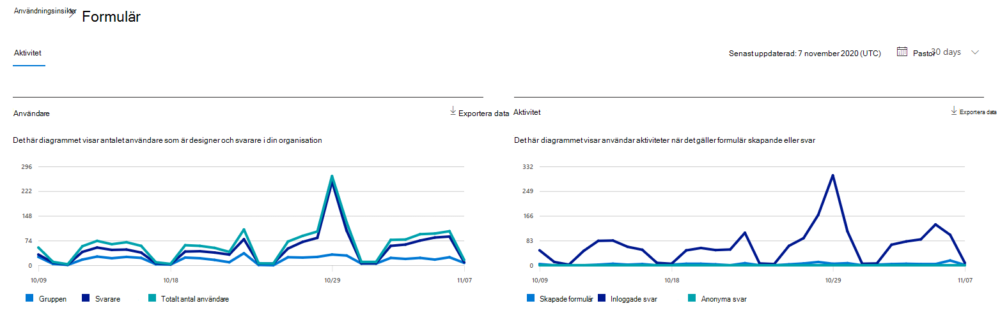
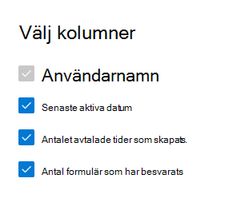

# Microsoft 365 Rapporter i administrationscentret – FormuläraktivitetMicrosoft 365 Reports in the admin center - Forms activity

På Microsoft 365 **Rapporter** ser du en översikt över aktiviteter i organisationens produkter.The Microsoft 365 **Reports** dashboard shows you the activity overview across the products in your organization. Här kan du gå in på detaljnivå i rapporter för enskilda produkter för att få mer ingående förståelse för aktiviteterna inom varje produkt.It lets you drill in to individual product level reports to give you more granular insight about the activities within each product. Ta en titt på [översiktsavsnittet för rapporter](activity-reports.md).Check out [the Reports overview topic](activity-reports.md).
  
Du kan till exempel få information om aktiviteten för varje användare som har en licens för att använda Microsoft Forms genom att titta på deras interaktion med formulär.For example, you can understand the activity of every user licensed to use Microsoft Forms by looking at their interaction with forms. Det hjälper dig också att förstå samarbetsnivån genom att titta på antalet formulär som skapats och formulär som användaren har svarat på.It also helps you to understand the level of collaboration going on by looking at the number of forms created and forms the user responded to.
  
> [!NOTE]
> Du måste vara global administratör, global läsare eller rapportläsare i Microsoft 365 eller Exchange-, SharePoint-, Teams-tjänst, Teams Communications- eller Skype för företag-administratör för att kunna se rapporter.You must be a global administrator, global reader or reports reader in Microsoft 365 or an Exchange, SharePoint, Teams Service, Teams Communications, or Skype for Business administrator to see reports.  
 
## Så här kommer du till formuläraktivitetsrapportenHow to get to the Forms activity report

1. I administrationscentret går du till sidan **Rapporter** \> <a href="https://go.microsoft.com/fwlink/p/?linkid=2074756" target="_blank">Användning</a>.In the admin center, go to the **Reports** \> <a href="https://go.microsoft.com/fwlink/p/?linkid=2074756" target="_blank">Usage</a> page. 
2. På startsidan för instrumentpanelen klickar du på **knappen Visa** mer på kortet Formulär.From the dashboard homepage, click on the **View more** button on the Forms card.
  
## Tolka formuläraktivitetsrapportenInterpret the Forms activity report

Du kan visa aktiviteterna i formulärrapporten genom att välja **fliken** Aktivitet.You can view the activities in the Forms report by choosing the **Activity** tab. 

Välj **Välj kolumner för** att lägga till eller ta bort kolumner i rapporten.Select **Choose columns** to add or remove columns from the report.    

Du kan också exportera rapportdata till en Excel .csv fil genom att välja **länken** Exportera.You can also export the report data into an Excel .csv file by selecting the **Export** link. Då exporteras data för alla användare och du kan göra enkel sortering och filtrering för vidare analys.This exports data of all users and enables you to do simple sorting and filtering for further analysis. Om du har mindre än 2 000 användare kan du sortera och filtrera i tabellen i själva rapporten.If you have less than 2000 users, you can sort and filter within the table in the report itself. Om du har fler än 2 000 användare måste du exportera data för att kunna filtrera och sortera.If you have more than 2000 users, in order to filter and sort, you will need to export the data. 
  
|ObjektItem|BeskrivningDescription|
|:-----|:-----|
|**Metrisk****Metric**|**Definition****Definition**|
|AnvändarnamnUsername    |E-postadressen för den användare som utförde aktiviteten på Microsoft Forms.The email address of the user who performed the activity on Microsoft Forms.    |
|Datum för senaste aktivitet (UTC)Last activity date (UTC)    |Det senaste datum då en formuläraktivitet utfördes av användaren för det valda datumintervallet.The latest date a form activity was performed by the user for the selected date range. Om du vill se aktivitet som inträffat på ett visst datum markerar du datumet direkt i diagrammet.To see activity that occurred on a specific date, select the date directly in the chart.  Då filtreras tabellen så att data för filaktivitet endast visas för användare som utförde aktiviteten på den specifika dagen.This will filter the table to display file activity data only for users who performed the activity on that specific day.    |
|Antal formulär som skapatsNumber of forms created    |Antalet formulär som användaren har skapat.The number of forms that the user created.     |
|Antal formulär som svaratNumber of forms responded    |Antalet formulär som användaren har skickat svar till.The number of forms that the user has submitted responses to.|
|||
