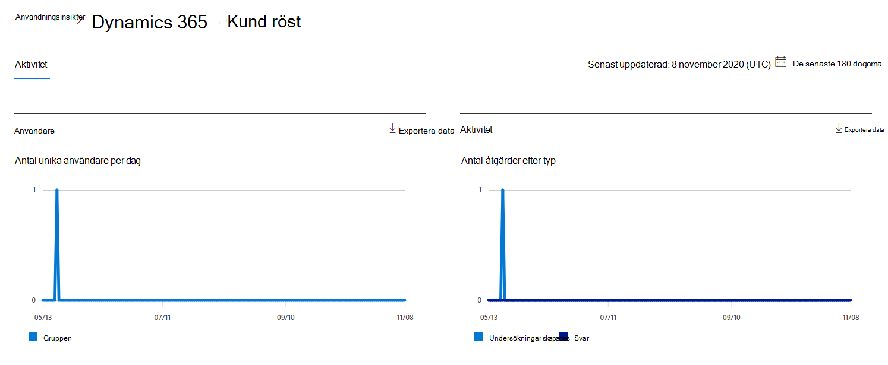
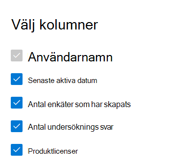

# Microsoft 365-rapporter i administrations centret – Dynamics 365 kund röst aktivitet

Instrument panelen för Microsoft 365- **rapporter** visar en översikt över produkterna i organisationen. Här kan du gå in på detaljnivå i rapporter för enskilda produkter för att få mer ingående förståelse för aktiviteterna inom varje produkt. Ta en titt på [översiktsavsnittet för rapporter](activity-reports.md).
  
Du kan till exempel förstå aktiviteten hos alla användare som har licens att använda Microsoft Dynamics 365 Customer Voice genom att titta på deras interaktioner med Dynamics 365 Customer Voice. Det hjälper dig också att förstå samarbetets möjligheter genom att titta på antalet Pro-undersökningar som skapats och Pro-undersökningar som användarna svarade på. 
  
> [!NOTE]
> Du måste vara global administratör, global läsare eller rapport läsare i Microsoft 365 eller en Exchange-, SharePoint-, teams-tjänst, grupp kommunikation eller Skype för företag-administratör för att se rapporter.  
 
## Så här kommer du till rapporten Dynamics 365 Customer Voice Activity

1. I administrationscentret går du till sidan **Rapporter** \> <a href="https://go.microsoft.com/fwlink/p/?linkid=2074756" target="_blank">Användning</a>. 
2. Från instrument panelens start sida klickar du på knappen **Visa mer** på kortet Dynamics 365 Customer Voice.
  
## Tolka rapporten Dynamics 365 Customer Voice Activity

Du kan visa aktiviteterna i röst rapporteringen för Dynamics 365 Customer genom att välja fliken **aktivitet** . 

Välj **Välj kolumner** för att lägga till eller ta bort kolumner i rapporten.    

Du kan också exportera rapport data till en Excel. csv-fil genom att välja **Exportera** -länken. Då exporteras data för alla användare och du kan göra enkel sortering och filtrering för vidare analys. Om du har mindre än 2 000 användare kan du sortera och filtrera i tabellen i själva rapporten. Om du har fler än 2 000 användare måste du exportera data för att kunna filtrera och sortera. 
  
|Objekt|Beskrivning|
|:-----|:-----|
|**Mät**|**Definition**|
|Användarnamn    |E-postadressen för den användare som utförde aktiviteten på Microsoft Forms.    |
|Datum för senaste aktivitet (UTC)    |Det senaste datum då en formulär aktivitet utfördes av användaren för det valda datum intervallet. Om du vill se aktivitet som inträffat på ett visst datum markerar du datumet direkt i diagrammet. Då filtreras tabellen för att endast Visa fil aktiviteter för användare som utförde aktiviteten på den aktuella dagen.    |
|Antal undersökningar som har skapats    |Antalet undersökningar som användaren har skapat.     |
|Antal undersöknings svar    |Antalet svar från svarare som undersökningen distribuerades till.|
|||