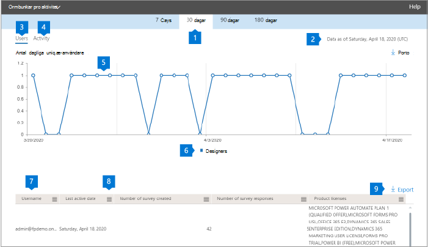

# Microsoft 365-rapporter i administrationscentret – formuläraktivitetMicrosoft 365 Reports in the admin center - Forms activity

Instrumentpanelen Microsoft 365 **Reports** visar aktivitetsöversikten för produkterna i organisationen.The Microsoft 365 **Reports** dashboard shows you the activity overview across the products in your organization. Här kan du gå in på detaljnivå i rapporter för enskilda produkter för att få bättre insikter om aktiviteterna inom varje produkt.It enables you to drill in to individual product level reports to give you more granular insight about the activities within each product. Ta en titt på [översiktsavsnittet för Rapporter](activity-reports.md).Check out [the Reports overview topic](activity-reports.md).
  
Du kan till exempel förstå aktiviteten hos alla användare som licensieras för att använda Microsoft Forms Pro genom att titta på deras interaktioner med Forms Pro.For example, you can understand the activity of every user licensed to use Microsoft Forms Pro by looking at their interactions with Forms Pro. Det hjälper dig också att förstå graden av samarbete som pågår genom att titta på antalet Pro Undersökningar som skapats och Pro Undersökningar som användarna svarade på.It also helps you to understand the level of collaboration going on by looking at the number of Pro Surveys created and Pro Surveys to which the users responded to. 
  
> [!NOTE]
> Du måste vara global administratör, global läsare eller rapportläsare i Microsoft 365 eller exchange-, SharePoint-, Teams-tjänst, Teams Communications eller Skype för företag-administratör för att kunna se rapporter.You must be a global administrator, global reader or reports reader in Microsoft 365 or an Exchange, SharePoint, Teams Service, Teams Communications, or Skype for Business administrator to see reports. 

## Så här kommer du till aktivitetsrapporten För Formulär proHow to get to the Forms Pro activity report

1. I administrationscentret går du till sidan **Rapporter** \> <a href="https://go.microsoft.com/fwlink/p/?linkid=2074756" target="_blank">Användning</a>.In the admin center, go to the **Reports** \> <a href="https://go.microsoft.com/fwlink/p/?linkid=2074756" target="_blank">Usage</a> page.

    
2. Välj **Formulär Pro-aktivitet** \> **activity**i listrutan **Välj en rapport** .From the **Select a report** drop-down, select **Forms Pro** \> **activity**.

## Tolka formuläraktivitetsrapportenInterpret the forms activity report

Du kan få en vy över användarens Forms Pro-aktivitet genom att titta på diagrammen **Aktivitet** **och Användare.**You can get a view into your user's Forms Pro activity by looking at the **Activity** and **Users** charts. 

|||
|:-----|:-----|
|1.1.    |Aktivitetsrapporten **Forms Pro** kan visas för trender under de senaste 7 dagarna, 30 dagarna, 90 dagarna eller 180 dagarna.The **Forms Pro** activity report can be viewed for trends over the last 7 days, 30 days, 90 days, or 180 days. Om du väljer en viss dag i rapporten visas data i tabellen (7) i upp till 28 dagar från det aktuella datumet (inte det datum då rapporten genererades).However, if you select a particular day in the report, the table (7) will show data for up to 28 days from the current date (not the date the report was generated).     |
|2.2.    |Uppgifterna i varje rapport är vanligtvis lika aktuella som de senaste 48 timmarna.The data in each report is usually as recent as the last 48 hours.    |
|3.3.    |Vyn **Användare** hjälper dig att förstå trenden i antalet aktiva Forms Pro-användare.The **Users** view helps you to understand the trend in the number of active Forms Pro users. En användare anses vara aktiv om de har utfört en aktivitet runt en Pro Survey (skapa, redigera, visa, etc.) inom den specifika tidsperioden.A user is considered active if they have executed an activity around a Pro Survey (create, edit, view, etc.) within the specific time period.    |
|4.4.    |**Aktivitetsvyn** hjälper dig att förstå trenden i antalet aktiva användare.The **Activity** view helps you to understand the trend in the number of active users. En användare anses vara aktiv om han eller hon har genomfört en filaktivitet (spara, synkronisera, ändra eller dela) eller besökt en sida inom den angivna tidsperioden.A user is considered active if he or she has executed a file activity (save, sync, modify, or share) or visited a page within the specific time period.  En aktivitet kan inträffa flera gånger för en enskild undersökning, men räknas bara som en aktiv undersökning.NOTE: An activity can occur multiple times for a single survey, but will count only as one active Survey. Du kan till exempel skapa en Pro Survey och fortsätta att redigera samma undersökning flera gånger under en angiven tidsperiod, det räknas bara som en enda undersökning.For example, you can create a Pro Survey and continue to edit the same Survey multiple times over a specified time period, it will count only as one single Survey.  |
|5.5. |I diagrammet **Användare** är Y-axeln antalet unika användare.On the **Users** chart, the Y axis is the number of unique users. X-axeln är det datum som de unika användarna är aktiva på.X axis is the date that the unique users are active on. Legenderna är:The legends are:  **Designers** innebär att användaren har skapat eller redigerat en Forms Pro Survey.**Designers** means the user has created or edited a Forms Pro Survey.  I **aktivitetsdiagrammet** är Y-axeln antalet Formulär Pro-svar per undersökning.On the **Activity** chart, the Y axis is the count of Forms Pro responses per survey. X-axeln är det datum då aktiviteten Undersökning eller Svar inträffade.X axis is the date that the Survey or Response activity occurred. Legenderna är:The legends are:  **Undersökningar som skapats** är antalet unika Forms Pro-undersökningar som användarna har skapat**Surveys created** is the count of unique Forms Pro surveys that the users have created **Svar** är antalet anonyma eller icke-anonyma svar som de användare som har fått undersökningen har skickat in.**Responses** is the count of anonymous or non-anonymous responses that the users who received the survey have submitted. |
|6.6. |Du kan filtrera serien som visas i diagrammet genom att markera ett objekt i förklaringen.You can filter the series you see on the chart by selecting an item in the legend. I diagrammet Användare väljer du till exempel designers, responders eller totala användare om du bara vill se information som är relaterad till var och en.For example, on the Users chart, select designers, responders, or total users to see only the info related to each one. Om du ändrar det här valet ändras inte informationen i rutnätstabellen under den.Changing this selection doesn't change the info in the grid table below it.|
|7.7. |Tabellen visar en uppdelning av aktiviteterna på användarnivå. Legenderna är:The table shows you a breakdown of the activities at the per-user level.The legends are:  **Användarnamn** är e-postadressen till den användare som utförde aktiviteten i Microsoft Forms.**Username** is the email address of the user who performed the activity on Microsoft Forms. **Sista aktivitetsdatum (UTC)** är det senaste datumet då en formuläraktivitet utfördes av användaren för det valda datumintervallet.**Last activity date (UTC)** is the latest date a form activity was performed by the user for the selected date range. Om du vill se aktivitet som inträffat på ett visst datum markerar du datumet direkt i diagrammet.To see activity that occurred on a specific date, select the date directly in the chart. Detta filtrerar tabellen så att filaktivitetsdata endast visas för användare som utförde aktiviteten den specifika dagen.This will filter the table to display file activity data only for users who performed the activity on that specific day.  **Antal undersökningar som har skapats** är antalet undersökningar som användaren har skapat.**Number of surveys created** is the number of surveys that the user created.  **Antalet enkätsvar** är antalet svar från de som svarade på vem undersökningen har distribuerats till.**Number of survey responses** is the number of responses from responders to whom the survey was distributed to.|
|8.8. |Markera ikonen **Hantera kolumner** om du vill lägga till eller ta bort kolumner från rapporten.Select the **Manage columns** icon to add or remove columns from the report.|
|9.9. |Du kan också exportera rapportdata till en CSV-fil i Excel genom att välja länken **Exportera.**You can also export the report data into an Excel .csv file by selecting the **Export** link. Detta exporterar data för alla användare och gör att du kan göra enkel aggregering, sortering och filtrering för vidare analys.This exports data for all users and enables you to do simple aggregation, sorting and filtering for further analysis. Om du har färre än 100 användare kan du sortera och filtrera i tabellen i själva rapporten.If you have less than 100 users, you can sort and filter within the table in the report itself. Om du har fler än 100 användare måste du exportera data för att kunna filtrera och sortera.If you have more than 100 users, in order to filter and sort, you will need to export the data.|