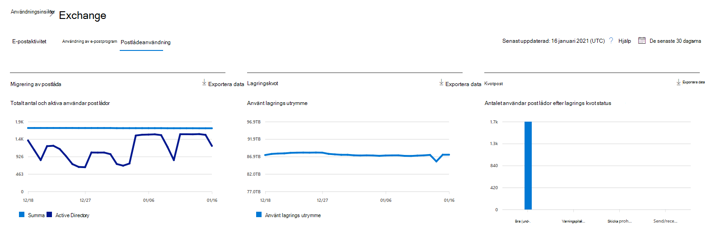
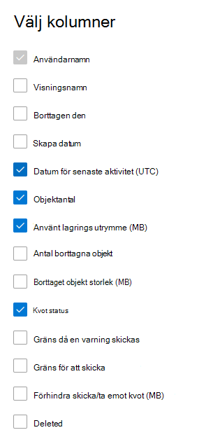

# Microsoft 365 Rapporter i administrationscentret – PostlådeanvändningMicrosoft 365 Reports in the admin center - Mailbox usage

Rapporten **Postlådeanvändning** innehåller information om användare med en användarpostlåda och aktivitetsnivån för dem baserat på aktivitet när du skickar och läser e-post, skapar avtalad tid, skickar möten, accepterar möten, avböjer möten och ställer in möten.The **Mailbox usage report** provides information about users with a user mailbox and the level of activity by each based on the email send, read, create appointment, send meeting, accept meeting, decline meeting and cancel meeting activity. Du får även information om hur mycket lagringsutrymme som har förbrukats av varje användarpostlåda och hur många av dem som närmar sig lagringskvotens gräns.It also provides information about how much storage has been consumed by each user mailbox, and how many of them are approaching storage quotas. 
  
> [!NOTE]
> Du måste vara global administratör, global läsare eller rapportläsare i Microsoft 365 eller Exchange-, SharePoint-, Teams-tjänst, Teams Communications- eller Skype för företag-administratör för att kunna se rapporter.You must be a global administrator, global reader or reports reader in Microsoft 365 or an Exchange, SharePoint, Teams Service, Teams Communications, or Skype for Business administrator to see reports. 
 
## Så här kommer du åt rapporten om postlådeanvändningHow to get to the mailbox usage report

1. I administrationscentret går du till sidan **Rapporter** \> <a href="https://go.microsoft.com/fwlink/p/?linkid=2074756" target="_blank">Användning</a>.In the admin center, go to the **Reports** \> <a href="https://go.microsoft.com/fwlink/p/?linkid=2074756" target="_blank">Usage</a> page.
2. Välj **Visa mer under** **E-postaktivitet**.Select **View More** under **Email activity**. 
3. I **listrutan** E-postaktivitet väljer du Exchange **Postlådeanvändning.** \> From the **Email activity** drop-down list, select **Exchange** \> **Mailbox usage**.

## Tolka rapporten om postlådeanvändningInterpret the mailbox usage report

Du kan få en inblick i organisationens **Postlådeanvändning** genom att titta på diagrammen **Postlåda**, **Lagring** och **Kvot**.You can get a view into your organization's **Mailbox usage** by looking at the **Mailbox**, **Storage** and **Quota** charts. 
  

|ObjektItem|BeskrivningDescription|
|:-----|:-----|
|1.1.    |I rapporten **Postlådeanvändning** kan du se trender under de senaste 7, 30, 90 eller 180 dagarna.The **Mailbox usage** report can be viewed for trends over the last 7 days, 30 days, 90 days, or 180 days. Men om du väljer en viss dag i rapporten visar tabellen data för de senaste 28 dagarna (inte från det datum då rapporten skapades).However, if you select a particular day in the report, the table will show data for up to 28 days from the current date (not the date the report was generated).    |
|2.2.    |Data i varje rapport täcker vanligtvis upp till de senaste 24 till 48 timmarna.The data in each report usually covers up to the last 24 to 48 hours.    |
|3.3.    |Postlådediagrammet visar det totala antalet användarpostlådor i organisationen och hur många som är aktiva på en viss dag under rapportperioden. En användarpostlåda anses vara aktiv om någon av följande aktiviteter har utförts: skicka e-post, läsa e-post, skapa avtalad tid, skicka möte, acceptera möte, avböja möte eller ställa in ett möte.The Mailbox chart shows you the total number of user mailbox in your organization, and the total number that are active on any given day of the reporting period. A user mailbox is considered active if it had an email send, read, create appointment, send meeting, accept meeting, decline meeting and cancel meeting activity.    |
|4.4.    |Diagrammet **Lagring** visar hur stort lagringsutrymme som används i din organisation.The **Storage** chart shows you amount of storage used in your organization. Storage Diagram innehåller inte arkivpostlådor.Storage Chart doesn't include archive mailboxes. Mer information om automatiskt expanderande arkivering finns i [Översikt över obegränsat arkivering i Microsoft 365](../../compliance/unlimited-archiving.md).For more information about auto-expanding archiving, see [Overview of unlimited archiving in Microsoft 365](../../compliance/unlimited-archiving.md).  |
|5.5.    | Diagrammet **Kvot** visar antalet användarpostlådor i varje kvotkategori. Det finns fyra kvotkategorier:  The **Quota** chart shows you the number of user mailboxes in each quota category. There are four quota categories:     Bra - antal användare vars använda lagring ligger under kvotvärdet då varning utfärdas.Good - number of users whose storage used is below the issue warning quota.     Varning - antalet användare vars använda lagring ligger på eller över värdet då varning utfärdas, men under kvoten då sändning förhindrasWarning - number of users whose storage used is at or above issue warning, but below prohibit send quota     Det går inte att skicka - antalet användare vars använda lagring ligger på eller över värdet då sändning förhindras, men under kvoten då både sändning och mottagning förhindrasCan't send - number of users whose storage used is at or above the prohibit send quota, but below prohibit send/receive quota     Det går inte att skicka/ta emot - antalet användare vars använda lagring ligger på eller över kvoten då både sändning och mottagning förhindrasCan't send/receive - number of users whose storage used is at or above prohibit send/receive quota    |
|6.6.    | I diagrammet **Postlåda** är Y-axeln antalet användarpostlådor.On the **Mailbox** chart, the Y axis is the count of user mailboxes.     I diagrammet **Lagring** är Y-axeln mängden lagringsutrymme som används av användarpostlådor i din organisation.On the **Storage** chart, the Y axis is the amount of storage being used by user mailboxes in your organization.     I diagrammet **Kvot** är Y-axeln antalet användarpostlådor i varje lagringskvot.On the **Quota** chart, the Y axis is the number of user mailboxes in each storage quota.     X-axeln i diagrammen Postlåda och Lagring är det valda datumintervallet för den här specifika rapporten.The X axis on the Mailbox and Storage charts is the selected date range for this specific report.     X-axeln i diagrammen för Kvot är kvotkategorin.The X axis on the Quota charts is the quota category.    |
|7.7.    |Du kan filtrera diagrammen du ser genom att välja ett objekt i förklaringen.You can filter charts you see by selecting an item in the legend.    |
|8.8.    | Tabellen visar en uppdelning av postlådeanvändningen per användare. Du kan lägga till fler kolumner i tabellen.  The table shows you a breakdown of mailbox usage at the per-user level. You can add additional columns to the table.    **Användarnamn** är användarens e-postadress.**User name** is the email address of the user.    **Visningsnamn** är användarens fullständiga namn.**Display Name** is the full name if the user.    **Borttagen** refererar till den postlåda vars aktuella status är borttagen, men som var aktiv under en del av rapportens rapporteringsperiod.**Deleted** refers to the mailbox whose current state is deleted, but was active during some part of the reporting period of the report.    **Borttagen den** är det datum postlådan togs bort.**Deleted date** is the date the mailbox was deleted.    **Skapad den** är det datum postlådan skapades.**Create date** is the date the mailbox was created.    **Datum för senaste aktivitet** refererar till det datum postlådan senast användes för att skicka eller läsa ett e-postmeddelande.**Last activity date** refers to the date the mailbox had an email send or read activity.    **Objektantal** refererar till det totala antalet objekt i postlådan.**Item count** refers to the total number of items in the mailbox.    **Använt lagringsutrymme (MB)** refererar till det totala använda lagringsutrymmet.**Storage used (MB)** refers to the total storage used.    **Antal borttagna** objekt refererar till det totala antalet borttagna objekt i postlådan.**Deleted Item Count** refers to the total number of deleted items in the mailbox.   **Borttagna objektstorlekar (MB)** refererar till den totala storleken för alla borttagna objekt i postlådan.**Deleted Item Size (MB)** refers to the total size of all deleted items in the mailbox.   **Kvot då varning utfärdas (MB)** refererar till lagringsgränsen då postlådans ägare får en varning om att lagringskvoten snart är nådd.**Issue warning quota (MB)** refers to the storage limit when the mailbox owner will receive a warning that it's about to hit the storage quota.    **Kvot då sändning förhindras (MB)** refererar till lagringsgränsen då postlådan inte längre får skicka e-postmeddelanden.**Prohibit send quota (MB)** refers to the storage limit when the mailbox can no longer send emails.    **Kvot då sändning/mottagning förhindras (MB)** refererar till lagringsgränsen då postlådan inte längre får skicka eller ta emot e-postmeddelanden.**Prohibit send receive quota (MB)** refers to the storage limit when the mailbox can no longer send or receive emails.     Om organisationens principer förhindrar dig att visa rapporter där användarinformationen är identifierbar kan du ändra sekretessinställningen för alla de här rapporterna.If your organization's policies prevents you from viewing reports where user information is identifiable, you can change the privacy setting for all these reports. Ta en titta **på avsnittet Dölj användarinformation i** rapporterna i [Aktivitetsrapporter i Microsoft 365 administrationscenter](activity-reports.md).Check out the **Hide user details in the reports** section in the [Activity Reports in the Microsoft 365 admin center](activity-reports.md).    |
|9.9.    |Välj **Välj kolumner för** att lägga till eller ta bort kolumner i rapporten.Select **Choose columns** to add or remove columns from the report.    |
|10.10.    |Du kan också exportera rapportdata till en Excel .csv fil genom att välja **länken** Exportera.You can also export the report data into an Excel .csv file, by selecting the **Export** link.    |
|||
