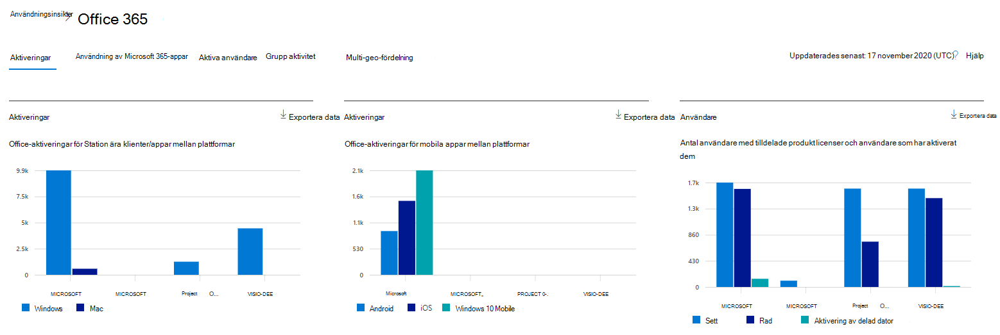
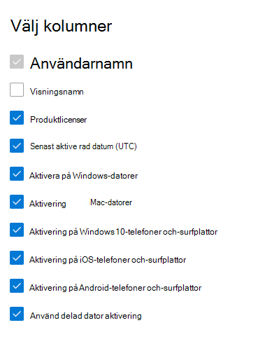

# Microsoft 365 Rapporter i administrationscentret – Microsoft Office aktiveringarMicrosoft 365 Reports in the admin center - Microsoft Office activations

På Microsoft 365 **Rapporter** ser du en översikt över aktiviteter i organisationens produkter.The Microsoft 365 **Reports** dashboard shows you the activity overview across the products in your organization. Här kan du gå in på detaljnivå i rapporter för enskilda produkter för att få bättre insikter om aktiviteterna inom varje produkt.It enables you to drill in to individual product level reports to give you more granular insight about the activities within each product. Ta en titt på [översiktsavsnittet för Rapporter](activity-reports.md).Check out [the Reports overview topic](activity-reports.md).
  
I rapporten Office-aktivering får du en översikt över vilka användare som har aktiverat Office-prenumerationen på minst en enhet.The Office Activation report gives you a view of which users have activated their Office subscription on at least one device. Den ger en uppdelning av aktiveringar Microsoft 365-appar för företag, Project och Visio Pro för Office 365- och prenumerationsaktiveringar samt en uppdelning av aktiveringar på datorer och andra enheter.It provides a breakdown of the Microsoft 365 Apps for enterprise, Project, and Visio Pro for Office 365 subscription activations, as well as the breakdown of activations across desktop and devices. Den här rapporten kan vara användbar när du vill identifiera användare som kan behöva extra hjälp och stöd för att aktivera Office-prenumerationen.This report could be useful in helping you identify users that might need additional help and support to activate their Office subscription.
  
> [!NOTE]
> Du måste vara global administratör, global läsare eller rapportläsare i Microsoft 365 eller Exchange-, SharePoint-, Teams-tjänst, Teams Communications- eller Skype för företag-administratör för att kunna se rapporter.You must be a global administrator, global reader or reports reader in Microsoft 365 or an Exchange, SharePoint, Teams Service, Teams Communications, or Skype for Business administrator to see reports.  
  
## Så här kommer du åt rapporten över Office-aktiveringarHow to get to the Office activations report

1. I administrationscentret går du till sidan **Rapporter** \> <a href="https://go.microsoft.com/fwlink/p/?linkid=2074756" target="_blank">Användning</a>.In the admin center, go to the **Reports** \> <a href="https://go.microsoft.com/fwlink/p/?linkid=2074756" target="_blank">Usage</a> page. 
2. På startsidan för instrumentpanelen klickar du på **knappen Visa mer** på Office aktiveringskort.From the dashboard homepage, click on the **View more** button on the Office activations card.
  
## Tolka rapporten över Office-aktiveringarInterpret the Office activations report
  
Du kan visa aktiveringar i Office 365 genom att välja **fliken Aktiveringar.**You can view the activations in the Office 365 report by choosing the **Activations** tab. 

Välj **Välj kolumner för** att lägga till eller ta bort kolumner i rapporten.Select **Choose columns** to add or remove columns from the report.    

Du kan också exportera rapportdata till en Excel .csv fil genom att välja **länken** Exportera.You can also export the report data into an Excel .csv file by selecting the **Export** link. Då exporteras data för alla användare och du kan göra enkel sortering och filtrering för vidare analys.This exports data of all users and enables you to do simple sorting and filtering for further analysis. Om du har mindre än 2 000 användare kan du sortera och filtrera i tabellen i själva rapporten.If you have less than 2000 users, you can sort and filter within the table in the report itself. Om du har fler än 2 000 användare måste du exportera data för att kunna filtrera och sortera.If you have more than 2000 users, in order to filter and sort, you will need to export the data. 

|ObjektItem|BeskrivningDescription|
|:-----|:-----|
|**Metrisk****Metric**|**Definition****Definition**|
|AnvändarnamnUsername    |Användarens e-postadress.The email address of the user.    |
|VisningsnamnDisplay name    |Användarens fullständiga namn.The full name of the user.    |
|ProduktlicenserProduct licenses    |Produkterna som är tilldelade till den här användaren.The products that are assigned to this user.    |
|Senast aktiverat datum(UTC)Last activated date(UTC)    |Det datum då användaren aktiverade Office på ett skrivbord eller en enhet.The date the user activated Office on a desktop or a device.    |
|Aktivering på Windows datorerActivation on Windows computers    |Antalet datorprogram Windows en användare har aktiverat Office på.The number of Windows desktops a user activated Office on.    |
|Aktivering på Mac-datorerActivation on Mac computers   |Antalet Mac-datorer som en användare aktiverat Office på.The number of Mac desktops a user activated Office on.|
|Aktivering på Windows 10 telefoner och surfplattorActivation on Windows 10 phones and tablets    |Antalet Windows 10 mobila enheter som en användare aktiverat Office på.The number of Windows 10 mobile devices a user activated Office on.    |
|Aktivering på telefoner och surfplattor med iOSActivation on iOS phones and tablets    |Antalet iOS-enheter som en användare aktiverat Office på.The number of iOS devices a user activated Office on.|
|Aktivering på telefoner och surfplattor med AndroidActivation on Android phones and tablets    |Antalet Android-enheter som en användare aktiverat Office på.The number of Android devices a user activated Office on.    |
|Aktivering av delad dator användsUsed Shared Computer Activation |Det gäller om användaren använt ett Office via aktivering på delad dator.This is true if the user used Office through shared computer activation.|
|||
   