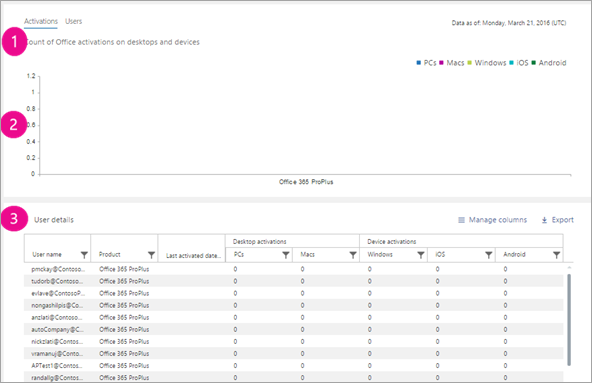

# Microsoft 365-rapporter i administrationscentret – Microsoft Office-aktiveringarMicrosoft 365 Reports in the admin center - Microsoft Office activations

Instrumentpanelen Microsoft 365 **Reports** visar aktivitetsöversikten för produkterna i organisationen.The Microsoft 365 **Reports** dashboard shows you the activity overview across the products in your organization. Här kan du gå in på detaljnivå i rapporter för enskilda produkter för att få bättre insikter om aktiviteterna inom varje produkt.It enables you to drill in to individual product level reports to give you more granular insight about the activities within each product. Ta en titt på [översiktsavsnittet för Rapporter](activity-reports.md).Check out [the Reports overview topic](activity-reports.md).
  
I rapporten Office-aktivering får du en översikt över vilka användare som har aktiverat Office-prenumerationen på minst en enhet. Du får uppgifter på detaljnivå om prenumerationsaktiveringar för Office 365 Proplus, Project och Visio Pro för Office 365 samt detaljerad information om aktiveringar på olika datorer och andra enheter. Den här rapporten kan vara användbar när du vill identifiera användare som kan behöva extra hjälp och stöd för att aktivera Office-prenumerationen.The Office Activation report gives you a view of which users have activated their Office subscription on at least one device. It provides a breakdown of the Office 365 Proplus, Project, and Visio Pro for Office 365 subscription activations, as well as the breakdown of activations across desktop and devices. This report could be useful in helping you identify users that might need additional help and support to activate their Office subscription.
  
> [!NOTE]
> Du måste vara global administratör, global läsare eller rapportläsare i Microsoft 365 eller exchange-, SharePoint-, Teams-tjänst, Teams Communications eller Skype för företag-administratör för att kunna se rapporter.You must be a global administrator, global reader or reports reader in Microsoft 365 or an Exchange, SharePoint, Teams Service, Teams Communications, or Skype for Business administrator to see reports.  
  
## Så här kommer du åt rapporten över Office-aktiveringarHow to get to the Office activations report

1. I administrationscentret går du till sidan **Rapporter** \> <a href="https://go.microsoft.com/fwlink/p/?linkid=2074756" target="_blank">Användning</a>.In the admin center, go to the **Reports** \> <a href="https://go.microsoft.com/fwlink/p/?linkid=2074756" target="_blank">Usage</a> page.

    
2. Välj **Office 365-aktiveringar** \> **Activations**i listrutan **Välj en rapport** .From the **Select a report** drop-down, select **Office 365** \> **Activations**. 
  
## Tolka rapporten över Office-aktiveringarInterpret the Office activations report

Du kan se organisationens Office-aktiveringar genom att titta på diagrammen **Aktiveringar** och **Användare**.You can get a view into your organization's Office activations by looking at the **Activations** and **Users** charts. 
  

  
|||
|:-----|:-----|
|11    |Rapporten Office-aktiveringar visar aktuell status för data om Office-licensaktiveringar [från rapportdatumet som visas längst upp till höger i diagrammet].The Office Activations report presents the current state of the office license activations data [as of the date of the report presented on the top right of the chart].    |
|22    |Uppgifterna i varje rapport omfattar vanligtvis upp till de senaste 24 till 48 timmarna.The data in each report usually covers up to the last 24 to 48 hours.    |
|33    |Diagrammet **Aktiveringar** visar antalet Office-aktiveringar på datorer och andra enheter.The **Activations** chart shows you the count of Office activations on desktops and devices.    |
|44    |Diagrammet **Användare** visar antalet användare som har aktiverats, och användare som har aktiverat Office-prenumerationen på datorn eller andra enheter.The **Users** chart shows you the count of users that are enabled, and users that have activated the Office subscription on desktop or devices..    |
|55    | I diagrammet **Aktiveringar** är Y-axeln antalet Office-aktiveringar.On the **Activations** chart, the Y axis is the count of Office activations.     I diagrammet **Användare** är Y-axeln användarens aktivitet för att aktivera Office.On the **Users** chart, the Y axis is the user's performing activity of activating Office.     X-axeln i båda diagrammen är det valda datumintervallet för den här specifika rapporten.The X axis on both charts is the selected date range for this specific report.    |
|66    |Du kan filtrera diagram som du ser genom att markera ett objekt i förklaringen.You can filter charts you see by selecting an item in the legend. I diagrammet **Aktiveringar** väljer du till exempel **Windows OS**, **Mac OS**, Windows **10 mobile**, **iOS** eller **Android** för att bara se information som är relaterad till var och en.For example, on the **Activations** chart, select **Windows OS**, **Mac OS**, **Windows 10 mobile**, **iOS** or **Android** to see only the info related to each one. När du ändrar det här valet ändras inte informationen i rutnätstabellen.Changing this selection doesn't change the info in the grid table.       |
|77    | I tabellen visas detaljerad information om Office-aktiveringar på användarnivå. Det här är listan över alla användare med Office-produkten tilldelad till dem. Du kan lägga till fler kolumner i tabellen.  The table shows you a breakdown of Office activations at the user level. This is the list of all user's with the Office product assigned to them. You can add the additional columns to the table.      **Användarnamn** är användarens e-postadress.**Username** is the email address of the user.    **Visningsnamnet** är det fullständiga namnet om användaren.**Display name** is the full name if the user.    **Produktlicenser** är de produkter som tilldelas den här användaren.**Product licenses** is the products that are assigned to this user.    **Senaste aktiveringsdatum** är datumet då användaren aktiverade Office på en dator eller annan enhet.**Last activated date** refers to the date the user activated Office on a desktop or a device.    **Använd aktivering av delad dator** är sann om användaren använde Office via aktivering av delade datorer.**Used Shared Computer Activation** is true if the user used Office through shared computer activation.   **Windows** refererar till antalet Windows-skrivbord som en användare har aktiverat Office på.**Windows** refers to the number of Windows desktops a user activated Office on.    **Mac** refererar till antalet Mac-datorer som en användare har aktiverat Office på.**Mac** refers to the number of Mac desktops a user activated Office on.    **Windows 10 mobile** refererar till antalet mobila Windows 10-enheter som en användare har aktiverat Office på.**Windows 10 mobile** refers to the number of Windows 10 mobile devices a user activated Office on.    **iOS** avser antalet iOS-enheter som en användare har aktiverat Office på.**iOS** refers to the number of iOS devices a user activated Office on.    **Android** refererar till antalet Android-enheter som en användare har aktiverat Office på.**Android** refers to the number of Android devices a user activated Office on.     Om organisationens principer förhindrar dig att visa rapporter där användarinformationen är identifierbar kan du ändra sekretessinställningen för alla de här rapporterna.If your organization's policies prevents you from viewing reports where user information is identifiable, you can change the privacy setting for all these reports. Läs avsnittet **Dölj användare i avsnittet Dölj i rapporterna** i [aktivitetsrapporterna i administrationscentret för Microsoft 365](activity-reports.md).Check out the **Hide user details in the reports** section in the [Activity Reports in the Microsoft 365 admin center](activity-reports.md).    |
|||
   

