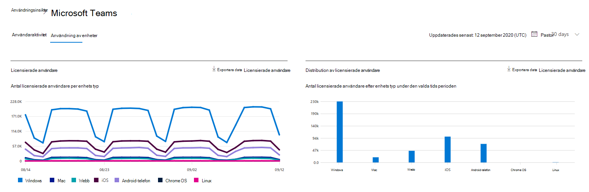
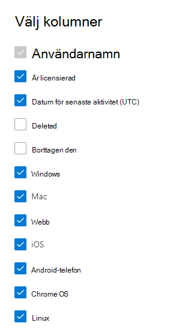

# Microsoft 365-rapporter i administrations Center – användning av Microsoft Teams-enheter

Instrument panelen för Microsoft 365- **rapporter** visar en översikt över produkterna i organisationen. Här kan du gå in på detaljnivå i rapporter för enskilda produkter för att få bättre insikter om aktiviteterna inom varje produkt. Läs [översiktsavsnittet om rapporter](activity-reports.md). I appanvändningsrapporten för Microsoft Teams får du inblick i vilka Microsoft Teams-appar som används inom organisationen.
  
> [!NOTE]
> Du måste vara global administratör, global läsare eller rapport läsare i Microsoft 365 eller en Exchange-, SharePoint-, teams-tjänst, grupp kommunikation eller Skype för företag-administratör för att se rapporter.  
 
## Så här visar du appanvändningsrapporten för Microsoft Teams

1. I administrationscentret går du till sidan **Rapporter** \> <a href="https://go.microsoft.com/fwlink/p/?linkid=2074756" target="_blank">Användning</a>. 
2. Från instrument panelens start sida klickar du på knappen **Visa mer** på aktivitets kortet för Microsoft Teams.
  
## Tolka appanvändningsrapporten för Microsoft Teams

Du kan se vilken enhet som används i Teams-rapporten genom att välja fliken **enhets användning** . 

Välj **Välj kolumner** för att lägga till eller ta bort kolumner i rapporten.    

Du kan också exportera rapport data till en Excel. csv-fil genom att välja **Exportera** -länken. Då exporteras data för alla användare och du kan göra enkel sortering och filtrering för vidare analys. Om du har mindre än 2 000 användare kan du sortera och filtrera i tabellen i själva rapporten. Om du har fler än 2 000 användare måste du exportera data för att kunna filtrera och sortera. 
  
|Objekt|Beskrivning|
|:-----|:-----|
|**Mät**|**Definition**|
|Användar namn    |Användarens visnings namn. Du kan klicka på visnings namnet för att gå till användarens inställnings sida i administrations centret för Microsoft Teams.    |
|Windows    |Markerad om användaren varit aktiv i Teams-klienten på en Windows-baserad dator.    |
|Mac    |Markerad om användaren varit aktiv i Teams-klienten på en Mac-dator.    |
|iOS    |Markerad om användaren varit aktiv i Teams Mobile-klienten för iOS.    |
|Android-telefon    | Markerad om användaren varit aktiv i Teams-mobilappen för Android.    |
|Chrome OS    |Markerad om användaren varit aktiv i Teams-klienten på en dator.|
|Linux    | Markerad om användaren varit aktiv i Teams-klienten på en Linux-dator.    |
|Webb    |Markerad om användaren varit aktiv i Teams-webbklienten på enheter.|
|Datum för senaste aktivitet (UTC)    |Det sista datum (UTC) som användaren deltog i en team aktivitet.    |
|Är licensierad|Markerad om användaren är licensierad för att använda Teams.|
|||