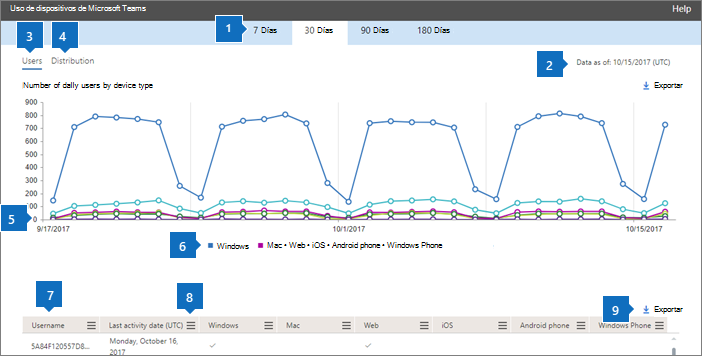
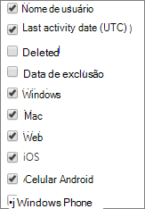

# Microsoft 365-rapporter i administrationscentret – användning av Microsoft Teams-enheterMicrosoft 365 Reports in the admin center - Microsoft Teams device usage

Instrumentpanelen Microsoft 365 **Reports** visar aktivitetsöversikten för produkterna i organisationen.The Microsoft 365 **Reports** dashboard shows you the activity overview across the products in your organization. Här kan du gå in på detaljnivå i rapporter för enskilda produkter för att få bättre insikter om aktiviteterna inom varje produkt.It enables you to drill in to individual product level reports to give you more granular insight about the activities within each product. Läs [översiktsavsnittet om rapporter](activity-reports.md).Check out [the Reports overview topic](activity-reports.md). I appanvändningsrapporten för Microsoft Teams får du inblick i vilka Microsoft Teams-appar som används inom organisationen.In the Microsoft Teams app usage report, you can gain insights into the Microsoft Teams apps that are used in your organization.
  
> [!NOTE]
> Du måste vara global administratör, global läsare eller rapportläsare i Microsoft 365 eller exchange-, SharePoint-, Teams-tjänst, Teams Communications eller Skype för företag-administratör för att kunna se rapporter.You must be a global administrator, global reader or reports reader in Microsoft 365 or an Exchange, SharePoint, Teams Service, Teams Communications, or Skype for Business administrator to see reports.  
 
## Så här visar du appanvändningsrapporten för Microsoft TeamsHow to get to the Microsoft Teams app usage report

1. I administrationscentret går du till sidan **Rapporter** \> <a href="https://go.microsoft.com/fwlink/p/?linkid=2074756" target="_blank">Användning</a>.In the admin center, go to the **Reports** \> <a href="https://go.microsoft.com/fwlink/p/?linkid=2074756" target="_blank">Usage</a> page.

    
2. Välj användning av **Microsoft Teams-enhet i** listrutan Välj en **rapport** \> **Device usage**.From the **Select a report** drop-down, select  **Microsoft Teams** \> **Device usage**.
  
## Tolka appanvändningsrapporten för Microsoft TeamsInterpret the Microsoft Teams app usage report

Genom att titta på diagrammen **Användare** och **Fördelning** kan du få insyn i användarnas användning av Microsoft Teams-appar.You can get a view into Microsoft Teams app usage by looking at the **Users** and **Distribution** charts. 
  

  
|||
|:-----|:-----|
|1.1.    |I rapporten **Microsoft Teams enhetsanvändning** visas trender för de senaste 7, 30, 90 eller 180 dagarna.The **Microsoft Teams device usage** report can be viewed for trends over the last 7 days, 30 days, 90 days, or 180 days. Om du väljer en viss dag i rapporten visas data i tabellen (7) i upp till 28 dagar från det aktuella datumet (inte det datum då rapporten genererades).However, if you select a particular day in the report, the table (7) will show data for up to 28 days from the current date (not the date the report was generated).    |
|2.2.    |Uppgifterna i varje rapport omfattar vanligtvis upp till de senaste 24 till 48 timmarna.The data in each report usually covers up to the last 24 to 48 hours.    |
|3.3.    |I vyn **Användare** visas antalet unika användare dagligen per app.The **Users** view shows you the number of daily unique users by app.    |
|4.4.    |I vyn **Fördelning** visas antalet unika användare per app under den valda tidsperioden.The **Distribution** view shows you the number of unique users by app over the selected time period.    |
|5.5.    | I diagrammet **Användare** visar Y-axeln antalet användare per app.On the **Users** chart, the Y axis is the number of users per app.     I diagrammet **Fördelning** visar Y-axeln antalet användare som använder den angivna appen.On the **Distribution** chart, the Y axis is the number of users using the specified app.     X-axeln i diagrammen visar det valda datumintervallet för den specifika rapporten.The X axis on the charts is the selected date range for the specific report.    |
|6.6.    |Du kan filtrera serien som visas i diagrammet genom att markera ett objekt i förklaringen.You can filter the series you see on the chart by selecting an item in the legend. I diagrammet **Användare** väljer du till exempel **Windows**, **Mac**, **Samtal,** **Webb,** **Android-telefon**eller **Windows-telefon** om du bara vill visa information som är relaterad till var och en.For example, on the **Users** chart, select **Windows**, **Mac**, **Calls**, **Web**, **Android phone**, or **Windows phone** to see only the info related to each one. När du ändrar det här valet ändras inte informationen i rutnätstabellen.Changing this selection doesn't change the info in the grid table.    |
|7.7.    | Listan över grupper som visas bestäms av totala uppsättningen grupper som fanns (inte togs bort) under den längsta (180 dagar) rapportperioden. Antal aktiviteter varierar beroende på vilka datum som väljs.  The list of groups shown is determined by the set of all groups that existed (weren't deleted) across the widest (180-day) reporting time frame. The activity count will vary according to the date selection.    Du kanske inte ser alla objekt i listan nedan i kolumnerna förrän du lägger till dem.NOTE: You might not see all the items in the list below in the columns until you add them.  **Användarnamn** är användarens e-postadress.**Username** is the email address of the user. Du kan visa den faktiska e-postadressen eller göra fältet anonymt.You can display the actual email address or make this field anonymous.    **Datum för senaste aktivitet (UTC)** anger det senaste datum då användaren deltog i en Microsoft Teams-aktivitet i en app.**Last Activity Date (UTC)** refers to the last date that the user participated in a Microsoft Teams activity in an app.    **Borttagen** anger om teamet har tagits bort. Om teamet har tagits bort, men det förekom aktiviteter under rapporteringsperioden visas det i tabellen med alternativet Borttagen angett till Sant.  **Deleted** indicates if the team is deleted. If the team is deleted, but had activity in the reporting period, it will show up in the grid with deleted set to true.    **Borttaget datum** är det datum då teamet togs bort.**Deleted date** is the date that the team was deleted.    **Windows** markeras om användaren varit aktiv i en Windows-app under den angivna tidsperioden.**Windows** is checked if the user was active in the Windows app during the specified time period.    **Mac** markeras om användaren varit aktiv i en Mac-app under den angivna tidsperioden.**Mac** is checked if the user was active in a Mac app during the specified time period.    **Webb** markeras om användaren varit aktiv i en webbapp under den angivna tidsperioden.**Web** is checked if the user was active in a web app during the specified time period.    **iOS** markeras om användaren varit aktiv i en iOS-app under den angivna tidsperioden.**iOS** is checked if the user was active in an iOS app during the specified time period.    **Android-telefon** markeras om användaren varit aktiv i en Android-telefonapp under den angivna tidsperioden.**Android phone** is checked if the user was active in an Android phone app during the specified time period.    **Windows-telefon** markeras om användaren varit aktiv i en Windows Phone-app under den angivna tidsperioden.**Windows phone** is checked if the user was active in a Windows Phone app during the specified time period.     Om organisationens principer förhindrar dig att visa rapporter där användarinformationen är identifierbar kan du ändra sekretessinställningen för alla de här rapporterna.If your organization's policies prevents you from viewing reports where user information is identifiable, you can change the privacy setting for all these reports. Kolla in avsnittet **Hur döljer jag information på användarnivå?** [Activity Reports in the Microsoft 365 admin center](activity-reports.md)Check out the **How do I hide user level details?** section in the [Activity Reports in the Microsoft 365 admin center](activity-reports.md).    |
|8.8.    |Välj **Kolumner om** du vill lägga till eller ta bort kolumner från rapporten.Select **Columns** to add or remove columns from the report.    |
|9.9.    |Du kan också exportera rapportdata till en CSV-fil i Excel genom att välja länken **Exportera.**You can also export the report data into an Excel .csv file, by selecting the **Export** link. Då exporteras data för alla användare och du kan göra enkel sortering och filtrering för vidare analys.This exports data of all users and enables you to do simple sorting and filtering for further analysis. Om du har mindre än 2 000 användare kan du sortera och filtrera i tabellen i själva rapporten.If you have less than 2000 users, you can sort and filter within the table in the report itself. Om du har fler än 2 000 användare måste du exportera data för att kunna filtrera och sortera.If you have more than 2000 users, in order to filter and sort, you will need to export the data.    |
|||
   
  

