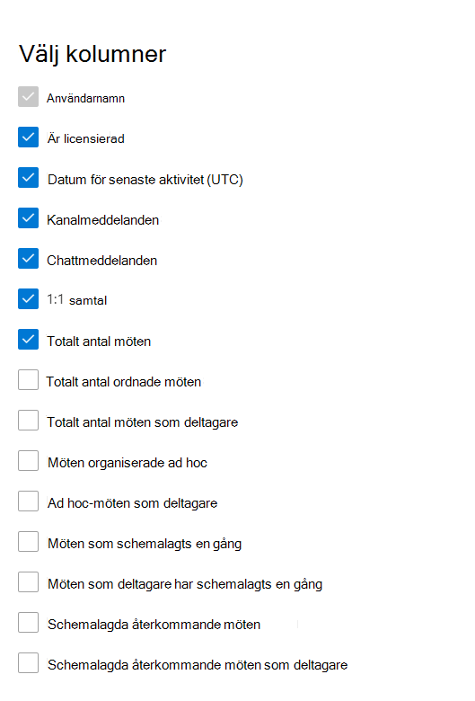

# Microsoft 365-rapporter i administrationscentret – Användaraktivitet för Microsoft Teams

På instrumentpanelen Rapporter **i** Microsoft 365 ser du en översikt över aktiviteter i organisationens produkter. Här kan du gå in på detaljnivå i rapporter för enskilda produkter för att få bättre insikter om aktiviteterna inom varje produkt. Ta en titt på [översiktsavsnittet för Rapporter](activity-reports.md). I användaraktivitetsrapporten för Microsoft Teams får du inblick i Microsoft Teams-aktiviteterna i organisationen.
  
> [!NOTE]
> Du måste vara global administratör, global läsare eller rapportläsare i Microsoft 365 eller Exchange-, SharePoint-, Teams-tjänst, Teams Communications- eller Skype för företag-administratör för att kunna se rapporter.  
 
## Så här visar du användaraktivitetsrapporten för Microsoft Teams

1. I administrationscentret går du till sidan **Rapporter** \> <a href="https://go.microsoft.com/fwlink/p/?linkid=2074756" target="_blank">Användning</a>.
2. På startsidan för instrumentpanelen klickar du på **knappen Visa mer** på microsoft Teams aktivitetskort.

## Tolka användaraktivitetsrapporten för Microsoft Teams

Du kan visa användaraktiviteten i Teams-rapporten genom att välja **fliken Användaraktivitet.**  

Välj **Välj kolumner för** att lägga till eller ta bort kolumner i rapporten.    

Du kan också exportera rapportdata till en Excel-CSV-fil genom att välja **länken** Exportera. Då exporteras data för alla användare och du kan göra enkel sortering och filtrering för vidare analys. Om du har mindre än 2 000 användare kan du sortera och filtrera i tabellen i själva rapporten. Om du har fler än 2 000 användare måste du exportera data för att kunna filtrera och sortera. Det exporterade formatet för **ljudtid,** **videotid och** skärmresurstid **följer** ISO8601-varaktighetsformatet.

I rapporten **Microsoft Teams användaraktivitet** visas trender för de senaste 7, 30, 90 eller 180 dagarna. Men om du väljer en viss dag i rapporten visar tabellen (7) data för de senaste 28 dagarna (inte från det datum då rapporten skapades).

För att säkerställa datakvaliteten utför vi dagliga dataverifieringskontroller under de senaste tre dagarna och kommer att fylla eventuella luckor som upptäckts. Du kanske märker skillnader i historiska data under processen.

|Objekt|Beskrivning|
|:-----|:-----|
|**Metrisk**|**Definition**|
|Användarnamn    |Användarens e-postadress. Du kan visa den faktiska e-postadressen eller göra fältet anonymt.     |
|Kanalmeddelanden     |Antalet unika meddelanden som användaren publicerat i en teamchatt under den angivna tidsperioden.    |
|Chattmeddelanden     |Antalet unika meddelanden som användaren publicerat i en privat chatt under den angivna tidsperioden.    |
|Totalt antal möten     |Antalet onlinemöten som användaren har deltagit i under den angivna tidsperioden.    |
|1:1-samtal     | Antalet 1:1-anrop som användaren har deltagit i under den angivna tidsperioden.    |
|Datum för senaste aktivitet (UTC)    |Det senaste datum då användaren deltog i en Microsoft Teams-aktivitet.  |
|Ad hoc-möten som deltagare     | Antalet ad hoc-möten som en användare deltagit i under den angivna tidsperioden.    |
|Möten organiserade ad hoc   |Antalet ad hoc-möten som en användare organiserat under den angivna tidsperioden.  |
|Totalt antal ordnade möten    |Summan av schemalagda engångsmöten, återkommande, ad hoc- och oklassificerade möten som en användare organiserat under den angivna tidsperioden.    |
|Totalt antal möten som deltagare    |Summan av de engångsmöten som en användare deltagit i under den angivna tidsperioden, återkommande, ad hoc och oklassificerade möten.    |
|Möten schemalagda en gång    |Antalet tidsbokade möten som en användare organiserat under den angivna tidsperioden.    |
|Schemalagda möten återkommande    |Antalet återkommande möten som en användare organiserat under den angivna tidsperioden.    |
|Möten som deltagit i schemalagda en gång    |Antalet tidsbokade möten som en användare deltagit i under den angivna tidsperioden.    |
|Schemalagda återkommande möten som deltagare    |Antalet återkommande möten som en användare har deltagit i under den angivna tidsperioden.    |
|Är licensierad    |Markerat om användaren är licensierad att använda Teams.  |
|Annan aktivitet   |Användaren är aktiv, men har utfört andra aktiviteter än de åtgärdstyper som exponeras som erbjuds i rapporten (skicka eller svara på kanalmeddelanden och chattmeddelanden, schemalägga eller delta i 1:1-samtal och -möten). Exempelåtgärder är när en användare ändrar Teams status eller Teams statusmeddelande eller öppnar ett inlägg i ett kanalmeddelande men inte svarar.   |
|oklassificerade möten  |Den som inte kan klassificeras som schema eller återkommande eller ad hoc. De är korta och kan för det mesta inte identifieras på grund av manipulerad telemetriinformation. |
|||