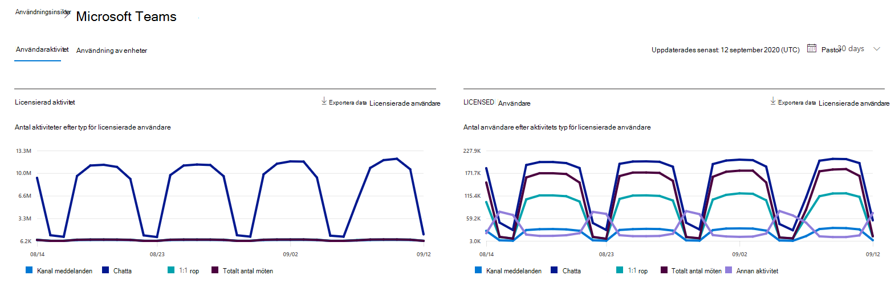
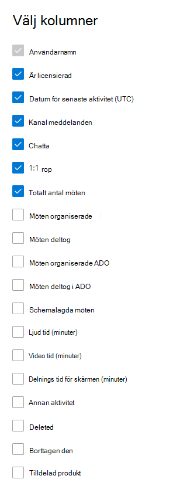

# Microsoft 365-rapporter i administrations Center – användar aktivitet för Microsoft TeamsMicrosoft 365 Reports in the admin center - Microsoft Teams user activity

Instrument panelen för Microsoft 365- **rapporter** visar en översikt över produkterna i organisationen.The Microsoft 365 **Reports** dashboard shows you the activity overview across the products in your organization. Här kan du gå in på detaljnivå i rapporter för enskilda produkter för att få bättre insikter om aktiviteterna inom varje produkt.It enables you to drill in to individual product level reports to give you more granular insight about the activities within each product. Ta en titt på [översiktsavsnittet för Rapporter](activity-reports.md).Check out [the Reports overview topic](activity-reports.md). I användaraktivitetsrapporten för Microsoft Teams får du inblick i Microsoft Teams-aktiviteterna i organisationen.In the Microsoft Teams user activity report, you can gain insights into the Microsoft Teams activity in your organization.
  
> [!NOTE]
> Du måste vara global administratör, global läsare eller rapport läsare i Microsoft 365 eller en Exchange-, SharePoint-, teams-tjänst, grupp kommunikation eller Skype för företag-administratör för att se rapporter.You must be a global administrator, global reader or reports reader in Microsoft 365 or an Exchange, SharePoint, Teams Service, Teams Communications, or Skype for Business administrator to see reports.  
 
## Så här visar du användaraktivitetsrapporten för Microsoft TeamsHow to get to the Microsoft Teams user activity report

1. I administrationscentret går du till sidan **Rapporter** \> <a href="https://go.microsoft.com/fwlink/p/?linkid=2074756" target="_blank">Användning</a>.In the admin center, go to the **Reports** \> <a href="https://go.microsoft.com/fwlink/p/?linkid=2074756" target="_blank">Usage</a> page.
2. Från instrument panelens start sida klickar du på knappen **Visa mer** på aktivitets kortet för Microsoft Teams.From the dashboard homepage, click on the **View more** button on the Microsoft Teams activity card.

## Tolka användaraktivitetsrapporten för Microsoft TeamsInterpret the Microsoft Teams user activity report

Du kan visa användar aktiviteten i Teams-rapporten genom att välja fliken **användar aktivitet** .You can view the user activity in the Teams report by choosing the **User activity** tab.  

Välj **Välj kolumner** för att lägga till eller ta bort kolumner i rapporten.Select **Choose columns** to add or remove columns from the report.    

Du kan också exportera rapport data till en Excel. csv-fil genom att välja **Exportera** -länken.You can also export the report data into an Excel .csv file by selecting the **Export** link. Då exporteras data för alla användare och du kan göra enkel sortering och filtrering för vidare analys.This exports data of all users and enables you to do simple sorting and filtering for further analysis. Om du har mindre än 2 000 användare kan du sortera och filtrera i tabellen i själva rapporten.If you have less than 2000 users, you can sort and filter within the table in the report itself. Om du har fler än 2 000 användare måste du exportera data för att kunna filtrera och sortera.If you have more than 2000 users, in order to filter and sort, you will need to export the data. Det exporterade formatet för **ljud tids** -, **video** -och **skärm delnings tid** följer iso8601.The exported format for **audio time** , **video time** and **screen share time** follows ISO8601 duration format.

|ObjektItem|BeskrivningDescription|
|:-----|:-----|
|**Mät****Metric**|**Definition****Definition**|
|Användar namnUser name    |Användarens e-postadress.The email address of the user. Du kan visa den faktiska e-postadressen eller göra fältet anonymt.You can display the actual email address or make this field anonymous.     |
|Kanal meddelandenChannel messages     |Antalet unika meddelanden som användaren har publicerat under den angivna tids perioden.The number of unique messages that the user posted in a team chat during the specified time period.    |
|ChattaChat messages     |Antalet unika meddelanden som användaren publicerat i en privat chatt under den angivna tids perioden.The number of unique messages that the user posted in a private chat during the specified time period.    |
|Totalt antal mötenTotal meetings     |Antalet onlinemöten som användaren deltog i under den angivna tids perioden.The number of online meetings that the user participated in during the specified time period.    |
|1:1-samtal1:1 calls     | Antalet 1:1-samtal som användaren deltog i under den angivna tids perioden.The number of 1:1 calls that the user participated in during the specified time period.    |
|Datum för senaste aktivitet (UTC)Last activity date (UTC)    |Det sista datum som användaren deltog i en Microsoft Teams-aktivitet.The last date that the user participated in a Microsoft Teams activity.  |
|Möten deltog i adhocMeetings participated adhoc     | Antalet möten som inte har schemalagts i den kalender som användaren deltog i under den angivna tids perioden.The number of meetings not scheduled on the calendar that the user participated in during the specified time period.    |
|Möten organiserade adhocMeetings organized adhoc   |Antalet möten som inte har schemalagts i den kalender som användaren organiserade under den angivna tids perioden.The number of meetings not scheduled on the calendar that the user organized during the specified time period.  |
|Schemalagda mötenMeetings organized scheduled    |Antalet schemalagda möten som en användare organiserat under den angivna tids perioden.The number of scheduled meetings  a user organized during the specified time period.    |
|Är licensieradIs licensed |Markerad om användaren är licensierad för att använda Teams.Selected if the user is licensed to use Teams.|
|Annan aktivitetOther activity|Användaren är aktiv men har gjort andra aktiviteter än utsatta åtgärds typer i rapporten (skickar eller svarar på kanal meddelanden och chattar, schemalägger eller deltar i 1:1-samtal och-möten).The User is active but has performed other activities than exposed action types offered in the report (sending or replying to channel messages and chat messages, scheduling or participating in 1:1 calls and meetings). Exempel på åtgärder är när en användare ändrar team status eller team status meddelandet eller öppnar ett meddelande inlägg, men som inte svarar.Examples actions are when a user changes the Teams status or the Teams status message or opens a Channel Message post but does not reply. |
|||