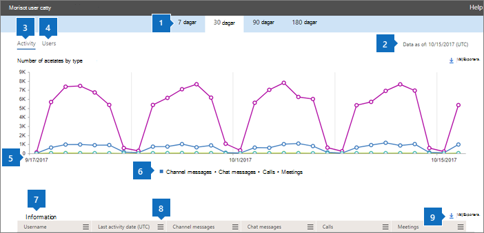

# Microsoft 365-rapporter i administrations Center – användar aktivitet för Microsoft Teams

Instrument panelen för Microsoft 365- **rapporter** visar en översikt över produkterna i organisationen. Här kan du gå in på detaljnivå i rapporter för enskilda produkter för att få bättre insikter om aktiviteterna inom varje produkt. Ta en titt på [översiktsavsnittet för Rapporter](activity-reports.md). I användaraktivitetsrapporten för Microsoft Teams får du inblick i Microsoft Teams-aktiviteterna i organisationen.
  
> [!NOTE]
> Du måste vara global administratör, global läsare eller rapport läsare i Microsoft 365 eller en Exchange-, SharePoint-, teams-tjänst, grupp kommunikation eller Skype för företag-administratör för att se rapporter.  
 
## Så här visar du användaraktivitetsrapporten för Microsoft Teams

1. I administrationscentret går du till sidan **Rapporter** \> <a href="https://go.microsoft.com/fwlink/p/?linkid=2074756" target="_blank">Användning</a>.

    
2. I list rutan **Välj en rapport** väljer du **Microsoft Teams** \> **användar aktivitet**.
  
## Tolka användaraktivitetsrapporten för Microsoft Teams

Du kan få inblick i användarnas Microsoft Teams-aktivitet genom att titta på diagrammen **Aktivitet** och **Användare**. 
  
|Objekt|Beskrivning|
|:-----|:-----|
|1.    |I rapporten **Microsoft Teams användaraktivitet** visas trender för de senaste 7, 30, 90 eller 180 dagarna. Om du väljer en viss dag i rapporten visar tabellen (7) data för upp till 28 dagar från det aktuella datumet (inte det datum då rapporten genererades).    |
|2.    |Informationen i varje rapport täcker vanligt vis upp till de senaste 24 till 48 timmar.    |
|3.    |För att säkerställa data kvaliteten utför vi dagliga data verifierings kontroller under de senaste fem dagarna och fyller eventuella luckor som upptäcks. Du kan lägga märke till skillnader i historiska data under processen.    |
|4.    |I vyn **Aktivitet** visas antalet Microsoft Teams-aktiviteter per aktivitetstyp. Aktivitetstyperna är chattmeddelanden för team, privata chattmeddelanden, samtal och möten.    |
|5.    |I vyn **Användare** visas antalet användare per aktivitetstyp. Aktivitetstyperna är chattmeddelanden för team, privata chattmeddelanden, samtal och möten.    |
|18.6.    | I diagrammet **aktivitet** är Y-axeln antalet angivna aktiviteter.     I diagrammet **filer** är Y-axeln antalet användare som deltar i gruppchatt, privata chattar, samtal och möten.     X-axeln i diagrammen är det valda datum intervallet för den specifika rapporten.    |
|borttagning.    |Du kan filtrera serien som visas i diagrammet genom att markera ett objekt i förklaringen. I diagrammet **aktivitet** väljer du till exempel **kanal meddelanden**, **chattar**, **samtal** eller **möten** för att bara se informationen som hör till var och en. När du ändrar det här valet ändras inte informationen i rutnätstabellen.    |
|8.2.    | Listan över grupper som visas bestäms av totala uppsättningen grupper som fanns (inte togs bort) under den längsta (180 dagar) rapportperioden. Antal aktiviteter varierar beroende på vilka datum som väljs.    Obs! Du kanske inte ser alla objekt i listan nedan i kolumnerna förrän du lägger till dem. **Användarnamn** är användarens e-postadress. Du kan visa den faktiska e-postadressen eller göra fältet anonymt.    **Datum för senaste aktivitet (UTC)** anger det senaste datum då användaren deltog i en Microsoft Teams-aktivitet.    **Kanalmeddelanden** är antalet unika meddelanden som användaren publicerat i en teamchatt under den angivna tidsperioden.    **Chattmeddelanden** är antalet unika meddelanden som användaren publicerat i en privat chatt under den angivna tidsperioden.    **Samtal** är antalet samtal som användaren har deltagit i under den angivna tidsperioden.    **Möten** är antalet onlinemöten som användaren har deltagit i under den angivna tidsperioden.    **Annan aktivitet** är antalet andra teamaktiviteter som användaren har använt.    **Borttagen** anger om teamet har tagits bort. Om teamet har tagits bort, men det förekom aktiviteter under rapporteringsperioden visas det i tabellen med alternativet Borttagen angett till Sant.    **Borttaget datum** är det datum då teamet togs bort.    **Tilldelad produkt** är en lista över de produkter som har tilldelats användaren.     Om organisationens principer hindrar dig från att visa rapporter där användar information är identifierbar kan du ändra sekretess inställningen för alla dessa rapporter. Kolla in **hur du döljer information om användar nivå?** i [aktivitets rapporterna i Microsoft 365 Admin Center](activity-reports.md).    |
|9.    |Välj **kolumner** för att lägga till eller ta bort kolumner i rapporten.    |
|10.3.    |Du kan också exportera rapport data till en Excel. csv-fil genom att välja **Exportera** -länken. Då exporteras data för alla användare och du kan göra enkel sortering och filtrering för vidare analys. Om du har mindre än 2 000 användare kan du sortera och filtrera i tabellen i själva rapporten. Om du har fler än 2 000 användare måste du exportera data för att kunna filtrera och sortera.    |
|||
   

