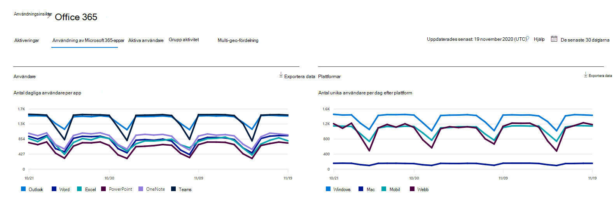

# Microsoft 365-rapporter i administrationscentret – användning av Microsoft 365-apparMicrosoft 365 Reports in the admin center - Microsoft 365 Apps usage

På instrumentpanelen Rapporter **i** Microsoft 365 ser du en översikt över aktiviteter i organisationens produkter.The Microsoft 365 **Reports** dashboard shows you the activity overview across the products in your organization. Här kan du gå in på detaljnivå i rapporter för enskilda produkter för att få bättre insikter om aktiviteterna inom varje produkt.It enables you to drill in to individual product level reports to give you more granular insight about the activities within each product. Ta en titt på [översiktsavsnittet för Rapporter](activity-reports.md).Check out [the Reports overview topic](activity-reports.md).

 Du kan till exempel få information om aktiviteten för varje användare som har en licens för att använda Microsoft 365-appar genom att titta på deras aktivitet i apparna och hur de används på olika plattformar.For example, you can understand the activity of each user licensed to use Microsoft 365 Apps apps by looking at their activity across the apps and how they are utilized across platforms.

 > [!NOTE]
 > Du måste vara global administratör, global läsare eller rapportläsare i Microsoft 365 eller Exchange-, SharePoint- eller Skype för företag-administratör för att kunna se rapporter.You must be a global administrator, global reader or reports reader in Microsoft 365 or an Exchange, SharePoint, or Skype for Business administrator to see reports.

## Öppna användningsrapporten för Microsoft 365-apparHow to get to the Microsoft 365 Apps usage report

1. I administrationscentret går du till sidan **Rapporter** \> <a href="https://go.microsoft.com/fwlink/p/?linkid=2074756" target="_blank">Användning</a>.In the admin center, go to the **Reports** \> <a href="https://go.microsoft.com/fwlink/p/?linkid=2074756" target="_blank">Usage</a> page. 
2. På startsidan för instrumentpanelen klickar du på **knappen Visa mer** på kortet Aktiva användare – Microsoft 365-appar.From the dashboard homepage, click on the **View more** button on the Active users - Microsoft 365 Apps card.

## Tolka användningsrapporten för Microsoft 365-apparInterpret the Microsoft 365 Apps usage report

Du kan få en uppfattning om användarnas aktiviteter i Microsoft 365-appar genom att titta på **diagrammen Användare** **och** Plattform.You can get a view into your user's Microsoft 365 Apps activity by looking at the **Users** and **Platform** charts.

|ObjektItem|BeskrivningDescription|
 |:-----|:-----|
 |1.1.   |I **användningsrapporten för Microsoft 365-appar** kan du se trender för de senaste 7, 30, 90 eller 180 dagarna.The **Microsoft 365 Apps usage** report can be viewed for trends over the last 7 days, 30 days, 90 days, or 180 days. Men om du väljer en viss dag i rapporten visar tabellen (7) data för de senaste 28 dagarna (inte från det datum då rapporten skapades).However, if you select a particular day in the report, the table (7) will show data for up to 28 days from the current date (not the date the report was generated).   |
 |2.2.   |Data i varje rapport täcker vanligtvis upp till de senaste sju dagarna.The data in each report usually covers up to the last seven days.   |
 |3.3.   |Vyn **Användare** visar trenden för antalet aktiva användare för varje app – Outlook, Word, Excel, PowerPoint, OneNote och Teams.The **Users** view shows the trend in the number of active users for each app – Outlook, Word, Excel, PowerPoint, OneNote, and Teams. "Aktiva användare" är alla användare som utför alla avsiktliga åtgärder i dessa appar."Active users" are any who perform any intentional actions within these apps.   |
 |4.4.   |I **vyn** Plattformar visas trenden för aktiva användare i alla appar för varje plattform – Windows, Mac, Webben och Mobil.The **Platforms** view shows the trend of active users across all apps for each platform – Windows, Mac, Web, and Mobile.   |
 |5.5. |I **diagrammet** Användare visar Y-axeln antalet unika aktiva användare för respektive app.On the **Users** chart, the Y-axis is the number of unique active users for the respective app. I **diagrammet Plattformar**   är Y-axeln antalet unika användare för respektive plattform.On the **Platforms** chart, the Y-axis is the number of unique users for the respective platform. X-axeln i båda diagrammen är det datum då en app användes på en viss plattform.The X-axis on both charts is the date on which an app was used on a given platform. |
 6.6. |Du kan filtrera serierna du ser i diagrammet genom att välja ett objekt i förklaringen.You can filter the series you see on the chart by selecting an item in the legend. Exempel: I diagrammet **Användare väljer** du Outlook, Word, Excel, PowerPoint, OneDrive eller Teams om du bara vill se den relaterade informationen.For example, on the **Users** chart, select Outlook, Word, Excel, PowerPoint, OneDrive, or Teams to see only the info related to each one. När du ändrar det här valet ändras inte informationen i rutnätstabellen nedanför den.Changing this selection doesn't change the info in the grid table below it.|
 |7.7. |I tabellen visas en uppdelning av data per användare.The table shows you a breakdown of data at the per-user level. Du kan lägga till eller ta bort kolumner i tabellen.You can add or remove columns from the table.   **Användarnamn** är e-postadressen till den användare som utförde aktiviteten på Microsoft-appar.**Username** is the email address of the user who performed the activity on Microsoft Apps.  **Senaste aktiveringsdatum (UTC)** är det senaste datum då användaren aktiverade sin Microsoft 365 Apps-prenumeration.**Last activation date (UTC)** is the latest date on which the user activated their Microsoft 365 Apps subscription.  **Datum för senaste aktivitet (UTC)** är det senaste datum då en avsiktlig aktivitet utfördes av användaren.**Last activity date (UTC)** is the latest date an intentional activity was performed by the user. Om du vill se aktivitet som inträffat på ett visst datum markerar du datumet direkt i diagrammet.To see activity that occurred on a specific date, select the date directly in the chart.  I de andra kolumnerna identifieras om användaren var aktiv på den plattformen för den appen (inom Microsoft 365-appar) under den valda perioden.The other columns identify if the user was active on that platform for that app (within Microsoft 365 Apps) in the period selected. |
 |8.8. |Välj ikonen **Välj kolumner för** att lägga till eller ta bort kolumner i rapporten.Select the **Choose columns** icon to add or remove columns from the report.|
 |9.9. |Du kan också exportera rapportdata till en Excel-CSV-fil genom att välja **länken** Exportera.You can also export the report data into an Excel .csv file by selecting the **Export** link. Då exporteras data för alla användare och du kan göra enkla aggregeringar, sortering och filtrering för vidare analys.This exports data for all users and enables you to do simple aggregation, sorting, and filtering for further analysis. Om du har mindre än 100 användare kan du sortera och filtrera i tabellen i själva rapporten.If you have less than 100 users, you can sort and filter within the table in the report itself. Om du har fler än 100 användare måste du exportera data för att kunna filtrera och sortera.If you have more than 100 users, in order to filter and sort, you will need to export the data.|
