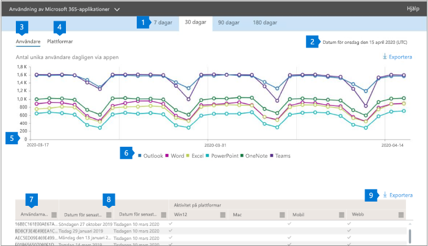

# Microsoft 365-rapporter i administrationscentret – användning av Microsoft 365-appar

Instrumentpanelen Microsoft 365 **Reports** visar aktivitetsöversikten för produkterna i organisationen. Här kan du gå in på detaljnivå i rapporter för enskilda produkter för att få bättre insikter om aktiviteterna inom varje produkt. Ta en titt på [översiktsavsnittet för Rapporter](activity-reports.md).

 Du kan till exempel förstå aktiviteten hos varje användare som licensieras för att använda Microsoft 365 Apps-appar genom att titta på deras aktivitet i apparna och hur de används på olika plattformar.

 > [!NOTE]
 > Du måste vara global administratör, global läsare eller rapportläsare i Microsoft 365 eller exchange-, SharePoint- eller Skype för företag-administratör för att kunna se rapporter.

## Så här kommer du till användningsrapporten för Microsoft 365 Apps

1. I administrationscentret går du till sidan **Rapporter** \> <a href="https://go.microsoft.com/fwlink/p/?linkid=2074756" target="_blank">Användning</a>.

 2. Välj användning av **Office 365**Microsoft \> **365 Apps** i listrutan **Välj en rapport** .

## Använda användningsrapporten för Microsoft 365 Apps

Du kan få en vy över användarens Aktivitet för Microsoft 365 Apps genom att titta på **diagrammen Användare** och **plattform.**

|||
 |:-----|:-----|
 |1.   |Användningsrapporten för **Microsoft 365 Apps** kan visas för trender under de senaste 7 dagarna, 30 dagarna, 90 dagarna eller 180 dagarna. Om du väljer en viss dag i rapporten visas data i tabellen (7) i upp till 28 dagar från det aktuella datumet (inte det datum då rapporten genererades).   |
 |2.   |Uppgifterna i varje rapport omfattar vanligtvis upp till de senaste 24 till 48 timmarna.   |
 |3.   |Vyn **Användare** visar trenden i antalet aktiva användare för varje app – Outlook, Word, Excel, PowerPoint, OneNote och Teams. "Aktiva användare" är de som utför avsiktliga åtgärder i dessa appar.   |
 |4.   |Vyn **Plattformar** visar trenden för aktiva användare i alla appar för varje plattform – Windows, Mac, Webb och Mobil.   |
 |5. |I diagrammet **Användare** är Y-axeln antalet unika aktiva användare för respektive app. I **diagrammet Plattformar** är Y-axeln antalet unika användare för respektive plattform. X-axeln på båda diagrammen är det datum då en app användes på en viss platform.rm. |
 6. |Du kan filtrera serien som visas i diagrammet genom att markera ett objekt i förklaringen. I diagrammet **Användare** väljer du till exempel Outlook, Word, Excel, PowerPoint, OneDrive eller Teams om du bara vill visa information som är relaterad till var och en. Om du ändrar det här valet ändras inte informationen i rutnätstabellen under den.|
 |7. |I tabellen visas en uppdelning av data per användare. Du kan lägga till eller ta bort kolumner i tabellen.   **Användarnamn** är e-postadressen till den användare som utförde aktiviteten på Microsoft Apps.  **Senaste aktiveringsdatum (UTC)** är det senaste datum då användaren aktiverade sin Microsoft 365 Apps-prenumeration.  **Senaste aktivitetsdatum (UTC)** är det senaste datumet då en avsiktlig aktivitet utfördes av användaren. Om du vill se aktivitet som inträffat på ett visst datum markerar du datumet direkt i diagrammet.  Följande kolumner som motsvarar varje app som identifierar om användaren var aktiv i appen under den valda perioden:   **Outlook**  **Word**  **Excel** **PowerPoint**  **OneNote**   Följande kolumner som motsvarar varje plattform som identifierar om användaren var aktiv på den plattformen för en app (inom Microsoft 365 Apps) under den valda perioden:  **Outlook (Windows)** **Outlook (Mac)** **Outlook (webb)**  **Outlook (mobil)**  **Word (Windows)**  **Ord (Mac)**  **Word (webb)**  **Word (mobil)**  **Excel (Windows)**  **Excel (Mac)**  **Excel (webb)**  **Excel (mobil)**  **PowerPoint (Windows)**  **PowerPoint (Mac)** **PowerPoint (webb)**  **PowerPoint (mobil)**  **OneNote (Windows)**  **OneNote (Mac)**  **OneNote (webb)** **OneNote (mobil)**  **Lag (Windows)**  **Lag (Mac)**  **Lag (webb)** **Lag (mobil)** |
 |8. |Markera ikonen **Hantera kolumner** om du vill lägga till eller ta bort kolumner från rapporten.|
 |9. |Du kan också exportera rapportdata till en CSV-fil i Excel genom att välja länken **Exportera.** Detta exporterar data för alla användare och gör att du kan göra enkel aggregering, sortering och filtrering för vidare analys. Om du har färre än 100 användare kan du sortera och filtrera i tabellen i själva rapporten. Om du har fler än 100 användare måste du exportera data för att kunna filtrera och sortera.|