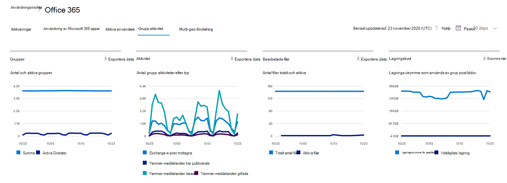

# Microsoft 365-rapporter i administrations Center – Microsoft 365-grupper

Instrument panelen för Microsoft 365- **rapporter** visar en översikt över produkterna i organisationen. Här kan du gå in på detaljnivå i rapporter för enskilda produkter för att få bättre insikter om aktiviteterna inom varje produkt. Ta en titt på [översiktsavsnittet för Rapporter](activity-reports.md). I rapporten Microsoft 365 Groups kan du få insikter i gruppen med grupper i din organisation och se hur många grupper som skapas och används.
  
> [!NOTE]
> Du måste vara global administratör, global läsare eller rapport läsare i Microsoft 365 eller en Exchange-, SharePoint-, teams-tjänst, grupp kommunikation eller Skype för företag-administratör för att se rapporter.  
  
## Så här kommer du till gruppen rapporter

1. I administrationscentret går du till sidan **Rapporter** \> <a href="https://go.microsoft.com/fwlink/p/?linkid=2074756" target="_blank">Användning</a>. 
2. Från instrument panelens start sida klickar du på knappen **Visa mer** på aktiva användare – Microsoft 365-appar eller aktiva användare-Microsoft 365-kort för att gå till sidan Office 365-rapporter.
  
## Tolka rapporten grupper

Du kan visa aktiveringarna i rapporten Office 365 genom att välja fliken **grupper aktivitet** . 

Välj **Välj kolumner** för att lägga till eller ta bort kolumner i rapporten.    

Du kan också exportera rapport data till en Excel. csv-fil genom att välja **Exportera** -länken. Då exporteras data för alla användare och du kan göra enkel sortering och filtrering för vidare analys. Om du har mindre än 2 000 användare kan du sortera och filtrera i tabellen i själva rapporten. Om du har fler än 2 000 användare måste du exportera data för att kunna filtrera och sortera. 

|Objekt|Beskrivning|
|:-----|:-----|
|**Mät**|**Definition**|
|Grupp namn    |Namnet på gruppen.    |
|Deleted    |Antalet grupper som tagits bort. Om gruppen tagits bort, men uppvisade aktivitet under rapporteringsperioden visas det i tabellen om här flaggan är satt till sant.    |
|Grupp ägare    |Grupp ägarens namn.    |
|Datum för senaste aktivitet (UTC)    |Det senaste datum då ett meddelande togs emot av gruppen. -Det här är det senaste datumet en aktivitet inträffade i en e-postkonversation, Yammer eller webbplatsen.    |
|Type (Typ)    |Typ av grupp. Det kan vara en privat eller offentlig grupp.    |
|E-postmeddelanden mottagna i Exchange    |Antalet meddelanden som tagits emot av gruppen.|
|E-postmeddelanden i Exchange (totalt)    |Totalt antal objekt i gruppens post låda.    |
|Post lådans lagrings utrymme för Exchange (MB)    |Det lagrings utrymme som används av gruppens post låda.  |
|SharePoint-filer (totalt)    |Antalet filer som lagras på SharePoint-gruppwebbplatser.    |
|SharePoint-filer (aktiva)    |Antalet filer i SharePoint-gruppwebbplatsen som har påverkat (visats eller ändrats, synkroniserats internt eller externt) under rapporterings perioden.    |
|Total webbplats lagring som används för SharePoint (MB)    |Mängden lagrings utrymme i MB som används under rapporterings perioden.    |
|Meddelanden i Yammer (anslaget)    |Antalet meddelanden som publicerats i Yammer-gruppen under rapporterings perioden.    |
|Meddelanden i Yammer (läsa)    |Antalet konversationer som lästs i Yammer-gruppen under rapporterings perioden.    |
|Meddelanden i Yammer (gillade)    |Antalet meddelanden som gillats i Yammer-gruppen under rapporterings perioden.    |
|Gruppen    |Antalet medlemmar i gruppen.    |
|Externa medlemmar |Antalet externa användare i gruppen.|
|||