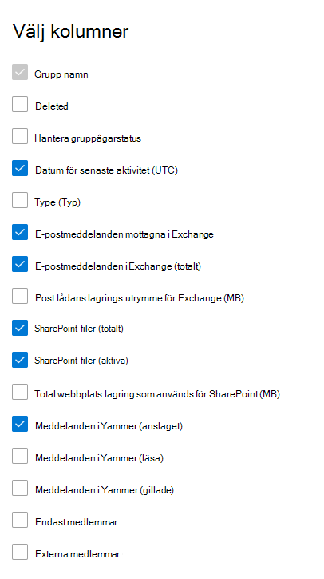

# Microsoft 365-rapporter i administrations Center – Microsoft 365-grupperMicrosoft 365 Reports in the admin center - Microsoft 365 groups

Instrument panelen för Microsoft 365- **rapporter** visar en översikt över produkterna i organisationen.The Microsoft 365 **Reports** dashboard shows you the activity overview across the products in your organization. Här kan du gå in på detaljnivå i rapporter för enskilda produkter för att få bättre insikter om aktiviteterna inom varje produkt.It enables you to drill in to individual product level reports to give you more granular insight about the activities within each product. Ta en titt på [översiktsavsnittet för Rapporter](activity-reports.md).Check out [the Reports overview topic](activity-reports.md). I rapporten Microsoft 365 Groups kan du få insikter i gruppen med grupper i din organisation och se hur många grupper som skapas och används.In the Microsoft 365 groups report, you can gain insights into the activity of groups in your organization and see how many groups are being created and used.
  
> [!NOTE]
> Du måste vara global administratör, global läsare eller rapport läsare i Microsoft 365 eller en Exchange-, SharePoint-, teams-tjänst, grupp kommunikation eller Skype för företag-administratör för att se rapporter.You must be a global administrator, global reader or reports reader in Microsoft 365 or an Exchange, SharePoint, Teams Service, Teams Communications, or Skype for Business administrator to see reports.  
  
## Så här kommer du till gruppen rapporterHow to get to the groups report

1. I administrationscentret går du till sidan **Rapporter** \> <a href="https://go.microsoft.com/fwlink/p/?linkid=2074756" target="_blank">Användning</a>.In the admin center, go to the **Reports** \> <a href="https://go.microsoft.com/fwlink/p/?linkid=2074756" target="_blank">Usage</a> page. 
2. Från instrument panelens start sida klickar du på knappen **Visa mer** på aktiva användare – Microsoft 365-appar eller aktiva användare-Microsoft 365-kort för att gå till sidan Office 365-rapporter.From the dashboard homepage, click on the **View more** button on the Active users - Microsoft 365 Apps or the Active users - Microsoft 365 Services card to get to the Office 365 report page.
  
## Tolka rapporten grupperInterpret the groups report

Du kan visa aktiveringarna i rapporten Office 365 genom att välja fliken **grupper aktivitet** .You can view the activations in the Office 365 report by choosing the **Groups activity** tab. 

Välj **Välj kolumner** för att lägga till eller ta bort kolumner i rapporten.Select **Choose columns** to add or remove columns from the report.    

Du kan också exportera rapport data till en Excel. csv-fil genom att välja **Exportera** -länken.You can also export the report data into an Excel .csv file by selecting the **Export** link. Då exporteras data för alla användare och du kan göra enkel sortering och filtrering för vidare analys.This exports data of all users and enables you to do simple sorting and filtering for further analysis. Om du har mindre än 2 000 användare kan du sortera och filtrera i tabellen i själva rapporten.If you have less than 2000 users, you can sort and filter within the table in the report itself. Om du har fler än 2 000 användare måste du exportera data för att kunna filtrera och sortera.If you have more than 2000 users, in order to filter and sort, you will need to export the data. 

|ObjektItem|BeskrivningDescription|
|:-----|:-----|
|**Mät****Metric**|**Definition****Definition**|
|Grupp namnGroup name    |Namnet på gruppen.The name of the group.    |
|DeletedDeleted    |Antalet grupper som tagits bort.The number of deleted groups. Om gruppen tagits bort, men uppvisade aktivitet under rapporteringsperioden visas det i tabellen om här flaggan är satt till sant.If the group is deleted, but had activity in the reporting period it will show up in the grid with this flag set to true.    |
|Grupp ägareGroup owner    |Grupp ägarens namn.The name of the group owner.    |
|Datum för senaste aktivitet (UTC)Last activity date (UTC)    |Det senaste datum då ett meddelande togs emot av gruppen.The latest date a message was received by the group. -Det här är det senaste datumet en aktivitet inträffade i en e-postkonversation, Yammer eller webbplatsen.- This is the latest date an activity happened in an email conversation, Yammer, or the Site.    |
|Type (Typ)Type    |Typ av grupp.The type of group. Det kan vara en privat eller offentlig grupp.This can be private or public group.    |
|E-postmeddelanden mottagna i ExchangeEmails received in Exchange    |Antalet meddelanden som tagits emot av gruppen.The number of messages received by the group.|
|E-postmeddelanden i Exchange (totalt)Emails in Exchange (total)    |Totalt antal objekt i gruppens post låda.The total number of items in the group's mailbox.    |
|Post lådans lagrings utrymme för Exchange (MB)Mailbox storage used for Exchange (MB)    |Det lagrings utrymme som används av gruppens post låda.The storage used by the group's mailbox.  |
|SharePoint-filer (totalt)SharePoint files (total)    |Antalet filer som lagras på SharePoint-gruppwebbplatser.The number of files stored in SharePoint group sites.    |
|SharePoint-filer (aktiva)SharePoint files (active)    |Antalet filer i SharePoint-gruppwebbplatsen som har påverkat (visats eller ändrats, synkroniserats internt eller externt) under rapporterings perioden.The number of files in the SharePoint group site that were acted on (viewed or modified, synched , shared internally or externally) during the reporting period.    |
|Total webbplats lagring som används för SharePoint (MB)Total site storage used for SharePoint (MB)    |Mängden lagrings utrymme i MB som används under rapporterings perioden.The amount of storage in MB used during the reporting period.    |
|Meddelanden i Yammer (anslaget)Messages in Yammer (posted)    |Antalet meddelanden som publicerats i Yammer-gruppen under rapporterings perioden.The number of messages posted in the Yammer group over the reporting period.    |
|Meddelanden i Yammer (läsa)Messages in Yammer (read)    |Antalet konversationer som lästs i Yammer-gruppen under rapporterings perioden.The number of conversations read in the Yammer group over the reporting period.    |
|Meddelanden i Yammer (gillade)Messages in Yammer (liked)    |Antalet meddelanden som gillats i Yammer-gruppen under rapporterings perioden.The number of messages liked in the Yammer group over the reporting period.    |
|GruppenMembers    |Antalet medlemmar i gruppen.The number of members in the group.    |
|Externa medlemmarExternal members |Antalet externa användare i gruppen.The number of external users in the group.|
|||