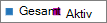

# Microsoft 365-rapporter i administrations Center – Microsoft 365-grupperMicrosoft 365 Reports in the admin center - Microsoft 365 groups

Instrument panelen för Microsoft 365- **rapporter** visar en översikt över produkterna i organisationen.The Microsoft 365 **Reports** dashboard shows you the activity overview across the products in your organization. Här kan du gå in på detaljnivå i rapporter för enskilda produkter för att få bättre insikter om aktiviteterna inom varje produkt.It enables you to drill in to individual product level reports to give you more granular insight about the activities within each product. Ta en titt på [översiktsavsnittet för Rapporter](activity-reports.md).Check out [the Reports overview topic](activity-reports.md). I rapporten Microsoft 365 Groups kan du få insikter i gruppen med grupper i din organisation och se hur många grupper som skapas och används.In the Microsoft 365 groups report, you can gain insights into the activity of groups in your organization and see how many groups are being created and used.
  
> [!NOTE]
> Du måste vara global administratör, global läsare eller rapport läsare i Microsoft 365 eller en Exchange-, SharePoint-, teams-tjänst, grupp kommunikation eller Skype för företag-administratör för att se rapporter.You must be a global administrator, global reader or reports reader in Microsoft 365 or an Exchange, SharePoint, Teams Service, Teams Communications, or Skype for Business administrator to see reports.  
  
## Så här kommer du till gruppen rapporterHow to get to the groups report

1. I administrationscentret går du till sidan **Rapporter** \> <a href="https://go.microsoft.com/fwlink/p/?linkid=2074756" target="_blank">Användning</a>.In the admin center, go to the **Reports** \> <a href="https://go.microsoft.com/fwlink/p/?linkid=2074756" target="_blank">Usage</a> page.

2. Välj **Visa mer** under **aktiva användare – Microsoft 365-tjänster**från alternativen.From the options, select **View more** under **Active users - Microsoft 365 Services**.
3. I list rutan **Välj en rapport** väljer du aktivitet i **Office 365** - \> **grupper**.From the **Select a report** drop-down, select **Office 365** \> **Groups activity**.
  
## Tolka rapporten grupperInterpret the groups report

Du kan få en vy i grupp aktivitet genom att titta på **grupperna grupper**, **aktivitet**, **filer**och **lagring** .You can get a view into groups activity by looking at the **Groups**, **Activity**, **Files**, and **Storage** charts. 
  

  
|ObjektItem|BeskrivningDescription|
|:-----|:-----|
|1.1.    |I rapporten **Microsoft 365-grupper** kan du se trender under de senaste 7, 30, 90 eller 180 dagar.The **Microsoft 365 groups** report can be viewed for trends over the last 7 days, 30 days, 90 days, or 180 days. Om du väljer en viss dag i rapporten visar tabellen (7) data för upp till 28 dagar från det aktuella datumet (inte det datum då rapporten genererades).However, if you select a particular day in the report, the table (7) will show data for up to 28 days from the current date (not the date the report was generated).    |
|2.2.    |Informationen i varje rapport täcker vanligt vis upp till de senaste 24 till 48 timmar.The data in each report usually covers up to the last 24 to 48 hours.    |
|3.3.    |I vyn **grupper** visas det totala antalet grupper som fanns under en given dag och aktiva grupper på den dagen baserat på e-postkonversationer, Yammer-inlägg och SharePoint-filaktiviteter och SharePoint-sidor som visas.The **Groups** view shows a total number of groups that existed on any given day, and active groups on that day based on Email Conversations, Yammer Posts and SharePoint file activities and SharePoint pages viewed.    |
|4.4.    |Vyn **Aktivitet** visar antalet gruppaktiviteter jämfört med gruppens arbetsbelastning.The **Activity** view shows you the number of group activities across group workloads. Du kan visa de Exchange-e-postmeddelanden som gruppostlådor i alla grupper sammanlagt tagit emot en given dag under rapporteringsperioden.You can view the Exchange emails received by the group mailboxes across all groups, on any day during the reporting period. Du kan också se meddelanden som publicerats, lästs in och gillats i Yammer-grupper som är kopplade till en grupp.You can also see messages posted, read, and liked across the Yammer groups associated with a group.   |
|5.5.    |I vyn **filer** visas totalt antal och aktiva filer på alla grupp webbplatser som är kopplade till en grupp.The **Files** view shows you the number of total and active files across all group sites associated with a group.    |
|18.6.6.    |Vyn **Lagring** visar använt lagringsutrymme för alla gruppostlådor och gruppwebbplatser.The **Storage** view shows you the total storage used across all group mailboxes and group sites.    |
|borttagning.7.    | I diagrammet **Grupper** är Y-axeln antalet grupper (som kan visas som totalt jämfört med aktiva).On the **Groups** chart, Y-axis is the number of groups (which can be seen as total vs active).     I diagrammet **aktivitet** är Y-axeln antalet gånger som en aktivitet utförts i grupper.On the **Activity** chart, Y-axis is the number of times an activity was performed in groups.     I diagrammet **Filer** är Y-axeln antingen det totala antalet filer eller aktiva filer.On the **Files** chart, the Y axis is the number of either total or active files.     I diagrammet **Lagring** är Y-axeln totalt lagringsutrymme som används av gruppostlådan eller webbplatsen.On the **Storage** chart, the Y axis is total storage used by the group mailbox or site.     X-axeln i alla tre diagram är det valda datumintervallet för den specifika rapporten.The X axis on all three charts is the selected date range for the specific report.    |
|8.2.8.    |Du kan filtrera serien som visas i diagrammet genom att markera ett objekt i förklaringen.You can filter the series you see on the chart by selecting an item in the legend. I diagrammet **grupper** kan du till exempel välja **Total** eller **aktiv**  för att bara se informationen relaterad till var och en.For example, on the **Groups** chart, select **Total** or **Active**  to see only the info related to each one. När du ändrar det här valet ändras inte informationen i rutnätstabellen.Changing this selection doesn't change the info in the grid table.    |
|9.9.    | Listan över grupper som visas bestäms av totala uppsättningen grupper som fanns (inte togs bort) under den längst (180 dagar) rapporterade tidsperioden. Antal aktiviteter (e-postkonversationer, inlägg i Yammer och filaktiviteter på SharePoint) varierar beroende på valda datum.  The list of groups shown is determined by the set of all groups that existed (weren't deleted) across the widest (180-day) reporting time frame. The activity count (email conversations, Yammer posts and SharePoint file activities) will vary according to the date selection.    Obs! Du kanske inte ser alla objekt i listan nedan i kolumnerna förrän du lägger till dem.NOTE: You might not see all the items in the list below in the columns until you add them. **Gruppnamn** är namnet på gruppen.**Group name** is the name of the group.    **Borttagna** är antalet borttagna grupper. Om gruppen tagits bort, men uppvisade aktivitet under rapporteringsperioden visas det i tabellen om här flaggan är satt till sant.  **Deleted** is the number of deleted groups. If the group is deleted, but had activity in the reporting period it will show up in the grid with this flag set to true.    **Gruppägare** är namnet på den som äger gruppen.**Group owner** is the name of the group owner.    **Datum för senaste aktivitet** är det senaste datum då ett meddelande togs emot av gruppen.**Last activity date** is the latest date a message was received by the group. -Det här är det senaste datumet en aktivitet inträffade i en e-postkonversation, Yammer eller webbplatsen.- This is the latest date an activity happened in an email conversation, Yammer, or the Site.    **Typ** är grupptypen. Det kan vara en privat eller offentlig grupp.  **Type** is the type of group. This can be private or public group.    **Medlemmar** är antalet medlemmar i gruppen.**Members** is the number of members in the group.    **Externa medlemmar** är antalet externa användare i gruppen.**External members** is the number of external users in the group.    **Exchange****Exchange**   **Mottagna e-postmeddelanden** är antalet meddelanden som tagits emot av gruppen.**Emails received** is the number of messages received by the group.    **Objektantal** är det totala antalet meddelanden i gruppens postlåda.**Mailbox total items** is the total number of items in the group's mailbox.    **Använt lagringsutrymme** är det lagringsutrymme som används av gruppens postlåda.**Mailbox storage used** is the storage used by the group's mailbox.    **SharePoint-filer****SharePoint Files**   **Totalt antal filer** är antalet filer som lagras på SharePoint-gruppwebbplatser.**Total files** is the number of files stored in SharePoint group sites.    **Aktiva filer** är antalet filer i SharePoint-gruppwebbplatsen som har påverkat (visas eller ändras, synkroniseras, delats internt eller externt) under rapporteringsperioden**Active files** is the number of files in the SharePoint group site that were acted on (viewed or modified, synched , shared internally or externally) during the reporting period    **Använt lagringsutrymme** är lagringsutrymme i MB som används under rapporteringsperioden.**Site storage used (MB)** is the amount of storage in MB used during the reporting period.    **Yammer-meddelanden****Yammer Messages**   **Publicerade** är antalet meddelanden som publicerats i Yammer-gruppen under rapporteringsperioden.**Posted** is the number of messages posted in the Yammer group over the reporting period.    **Lästa** är antalet konversationer som lästs i Yammer-gruppen under rapporteringsperioden.**Read** is the number of conversations read in the Yammer group over the reporting period.    **Gillade** är antalet meddelanden som gillats i Yammer-gruppen under rapporteringsperioden.**Liked** is the number of messages liked in the Yammer group over the reporting period.     Om organisationens principer förhindrar dig att visa rapporter där användarinformationen är identifierbar kan du ändra sekretessinställningen för alla de här rapporterna.If your organization's policies prevents you from viewing reports where user information is identifiable, you can change the privacy setting for all these reports. Kolla in **hur du döljer information om användar nivå?** i [aktivitets rapporterna i Microsoft 365 Admin Center](activity-reports.md).Check out the **How do I hide user level details?** section in the [Activity Reports in the Microsoft 365 admin center](activity-reports.md).    |
|10.310,    |Välj eller tryck på knappen **fler åtgärder**  bredvid en kolumn rubrik för att lägga till eller ta bort kolumner i rapporten.Select or tap **More Actions** button  next to a column heading to add or remove columns from the report.    |
|Nr11,    |Du kan också exportera rapport data till en Excel. csv-fil genom att välja **Exportera** -länken.You can also export the report data into an Excel .csv file by selecting the **Export** link. Då exporteras data för alla användare och du kan göra enkel sortering och filtrering för vidare analys.This exports data of all users and enables you to do simple sorting and filtering for further analysis. Om du har mindre än 2 000 användare kan du sortera och filtrera i tabellen i själva rapporten.If you have less than 2000 users, you can sort and filter within the table in the report itself. Om du har fler än 2 000 användare måste du exportera data för att kunna filtrera och sortera.If you have more than 2000 users, in order to filter and sort, you will need to export the data.    |
|||
   
