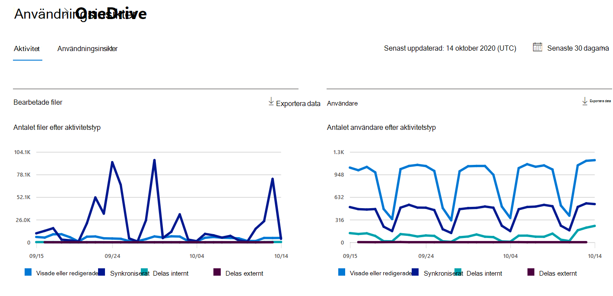
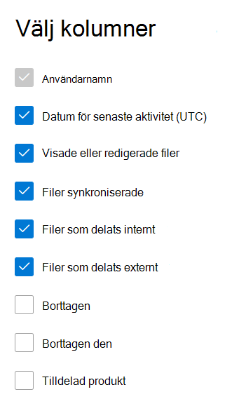

# Microsoft 365 Rapporter i administrationscentret – OneDrive för företag aktivitetMicrosoft 365 Reports in the admin center - OneDrive for Business activity

På Microsoft 365 **Rapporter** ser du en översikt över aktiviteter i organisationens produkter.The Microsoft 365 **Reports** dashboard shows you the activity overview across the products in your organization. Här kan du gå in på detaljnivå i rapporter för enskilda produkter för att få mer ingående förståelse för aktiviteterna inom varje produkt.It lets you drill in to individual product level reports to give you more granular insight about the activities within each product. Ta en titt på [översiktsavsnittet för rapporter](activity-reports.md).Check out [the Reports overview topic](activity-reports.md).
  
Du kan till exempel få information om aktiviteten för var och en av de användare som har en licens för att använda SharePoint genom att titta på hans eller hennes interaktion med filer. Genom att titta på hur många filer som delas kan du även få hjälp att förstå samarbetsnivån.For example, you can understand the activity of every user licensed to use OneDrive by looking at their interaction with files on OneDrive. It also helps you to understand the level of collaboration going on by looking at the number of files shared.
  
> [!NOTE]
> Du måste vara global administratör, global läsare eller rapportläsare i Microsoft 365 eller Exchange-, SharePoint-, Teams-tjänst, Teams Communications- eller Skype för företag-administratör för att kunna se rapporter.You must be a global administrator, global reader or reports reader in Microsoft 365 or an Exchange, SharePoint, Teams Service, Teams Communications, or Skype for Business administrator to see reports.  
 
## Hur får jag fram OneDrive-aktivitetsrapporten?How do I get to the OneDrive Activity report?

1. I administrationscentret går du till sidan **Rapporter** \> <a href="https://go.microsoft.com/fwlink/p/?linkid=2074756" target="_blank">Användning</a>.In the admin center, go to the **Reports** \> <a href="https://go.microsoft.com/fwlink/p/?linkid=2074756" target="_blank">Usage</a> page. 
2. På startsidan för instrumentpanelen klickar du på **knappen Visa** mer på OneDrive kort.From the dashboard homepage, click on the **View more** button on the OneDrive card.
  
## Förstå aktivitetsrapporten i OneDrive för företagInterpret the OneDrive for Business activity report

Du kan visa aktiviteterna i OneDrive genom att välja **fliken** Aktivitet.You can view the activities in the OneDrive report by choosing the **Activity** tab. 

Välj **Välj kolumner för** att lägga till eller ta bort kolumner i rapporten.Select **Choose columns** to add or remove columns from the report.    

Du kan också exportera rapportdata till en Excel .csv fil genom att välja **länken** Exportera.You can also export the report data into an Excel .csv file by selecting the **Export** link. Då exporteras data för alla användare och du kan göra enkel sortering och filtrering för vidare analys.This exports data of all users and enables you to do simple sorting and filtering for further analysis. Om du har mindre än 2 000 användare kan du sortera och filtrera i tabellen i själva rapporten.If you have less than 2000 users, you can sort and filter within the table in the report itself. Om du har fler än 2 000 användare måste du exportera data för att kunna filtrera och sortera.If you have more than 2000 users, in order to filter and sort, you will need to export the data. 
  
|ObjektItem|BeskrivningDescription|
|:-----|:-----|
|**Metrisk****Metric**|**Definition****Definition**|
|AnvändarnamnUsername    |Användarnamnet på ägaren av OneDrive konto.The user name of the owner of the OneDrive account.    |
|Datum för senaste aktivitet (UTC)Last activity date (UTC)    |Det senaste datum då en filaktivitet utfördes OneDrive för det valda datumintervallet.The latest date a file activity was performed on the OneDrive account for the selected date range. .. Om du vill se aktivitet som inträffat på ett visst datum markerar du datumet direkt i diagrammet.To see activity that occurred on a specific date, select the date directly in the chart.    |
|Visade eller redigerade filerFiles viewed or edited    |Antalet filer som användaren har laddat upp, laddat ned, ändrat eller visat.The number of files that the user uploaded, downloaded, modified, or viewed.     |
|Filer synkroniseradeFiles synced    |Antalet filer som har synkroniserats från en användares lokala enhet till det OneDrive kontot.The number of files that have been synced from a user's local device to the OneDrive account.   |
|Filer som delats interntFiles shared internally    | Antalet filer som har delats med användare inom organisationen eller med användare i grupper (som kan omfatta externa användare).The number of files that have been shared with users within the organization, or with users within groups (that might include external users).    |
|Filer som delats externtFiles shared externally    |Antalet filer som har delats med användare utanför organisationen.The number of files that have been shared with users outside of the organization.  |
|BorttagenDeleted    | Det här anger att användarens licens har tagits bort.This indicates that the user's license was removed.    Obs! Aktivitet för en borttagna användare visas fortfarande i en rapport om han eller hon har licensieras någon gång under den valda tidsperioden.NOTE: Activity for a deleted user will still display in a report as long as he or she was licensed at some time during the selected time period. I kolumnen **Borttagen** får du information om att användaren inte längre är aktiv, men att han eller hon har bidragit till data i rapporten.The **Deleted** column helps you to note that the user may no longer be active, but contributed to the data in the report.    |
|Borttagna datumDeleted date    |Datumet då användarens licens togs bort.The date on which the user's license was removed.  |
|Tilldelad produktProduct assigned    |Den Microsoft 365 produkter som är licensierade till användaren.The Microsoft 365 products that are licensed to the user.|
|||