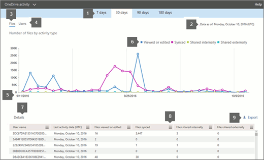

# Microsoft 365-rapporter i administrations Center – OneDrive för företag-aktivitetMicrosoft 365 Reports in the admin center - OneDrive for Business activity

Instrument panelen för Microsoft 365- **rapporter** visar en översikt över produkterna i organisationen.The Microsoft 365 **Reports** dashboard shows you the activity overview across the products in your organization. Här kan du gå in på detaljnivå i rapporter för enskilda produkter för att få mer ingående förståelse för aktiviteterna inom varje produkt.It lets you drill in to individual product level reports to give you more granular insight about the activities within each product. Ta en titt på [översiktsavsnittet för rapporter](activity-reports.md).Check out [the Reports overview topic](activity-reports.md).
  
Du kan till exempel få information om aktiviteten för var och en av de användare som har en licens för att använda SharePoint genom att titta på hans eller hennes interaktion med filer. Genom att titta på hur många filer som delas kan du även få hjälp att förstå samarbetsnivån.For example, you can understand the activity of every user licensed to use OneDrive by looking at their interaction with files on OneDrive. It also helps you to understand the level of collaboration going on by looking at the number of files shared.
  
> [!NOTE]
> En del funktioner införs stegvis. Det innebär att du kanske ännu inte kan se den här funktionen eller att den ser annorlunda ut jämfört med beskrivningen i hjälpartiklarna. Men oroa dig inte, den kommer snart!Some functionality is introduced gradually. This means that you may not yet see this feature or it may look different than what is described in the help articles. But don't worry - it's coming soon! 
  
Om du vill veta mer om mängden aktivitet på respektive OneDrive-konto och lagringsutnyttjandet kan du titta på [rapporten om OneDrive-användning](onedrive-for-business-usage.md).If you want to understand the amount of activity happening against each OneDrive account and the storage utilization, you can view the [OneDrive usage report](onedrive-for-business-usage.md).
  
> [!NOTE]
> Du måste vara global administratör, global läsare eller rapport läsare i Microsoft 365 eller en Exchange-, SharePoint-, teams-tjänst, grupp kommunikation eller Skype för företag-administratör för att se rapporter.You must be a global administrator, global reader or reports reader in Microsoft 365 or an Exchange, SharePoint, Teams Service, Teams Communications, or Skype for Business administrator to see reports.  
 
## Hur får jag fram OneDrive-aktivitetsrapporten?How do I get to the OneDrive Activity report?

1. I administrationscentret går du till sidan **Rapporter** \> <a href="https://go.microsoft.com/fwlink/p/?linkid=2074756" target="_blank">Användning</a>.In the admin center, go to the **Reports** \> <a href="https://go.microsoft.com/fwlink/p/?linkid=2074756" target="_blank">Usage</a> page.

    
2. Välj **OneDrive** -aktivitet i list rutan **Välj en rapport** \> **Activity**.From the **Select a report** drop-down, select **OneDrive** \> **Activity**.
  
## Förstå aktivitetsrapporten i OneDrive för företagInterpret the OneDrive for Business activity report

Du kan få information om OneDrive för företag-aktivitet genom att titta på vyerna **Filer** och **Användare**.You can get a view into OneDrive for Business activity by looking at the **Files** and **Users** views. 
  

  
|ObjektItem|BeskrivningDescription|
|:-----|:-----|
|1.1.    |I aktivitetsrapporten för **OneDrive för företag** kan du se trender under de senaste 7, 30, 90 eller 180 dagarna.The **OneDrive for Business activity** report can be viewed for trends over the last 7 days, 30 days, 90 days, or 180 days. Om du väljer en viss dag i rapporten visar tabellen (7) data för upp till 28 dagar från det aktuella datumet (inte det datum då rapporten genererades).However, if you select a particular day in the report, the table (7) will show data for up to 28 days from the current date (not the date the report was generated).    |
|2.2.    |Informationen i varje rapport täcker vanligt vis upp till de senaste 24 till 48 timmar.The data in each report usually covers up to the last 24 to 48 hours.  |
|3.3.    |Med vyn **Filer** kan du förstå det unika antalet licensierade användare som interagerat med filer mot något OneDrive-konto.The **Files** view helps you to understand the unique number of licensed users that performed file interactions against any OneDrive account.    |
|4.4.    |Vyn **Användare** hjälper dig förstå trenden för antalet aktiva OneDrive-användare. En användare anses vara aktiv om han eller hon har genomfört en filaktivitet (spara, synkronisera, ändra eller dela) inom den angivna tidsperioden.  The **Users** view helps you to understand the trend in the number of active OneDrive users. A user is considered active if he or she has executed a file activity (save, sync, modify, or share) within the specified time period.    Obs! en fil aktivitet kan förekomma flera gånger i en fil, men räknas bara som en aktiv fil.NOTE: A file activity can occur multiple times for a single file, but will only count as one active file. Du kan till exempel spara och synkronisera samma fil flera gånger under en viss tidsperiod, men den räknas bara som en enda aktiv fil och en enda synkroniserad fil i dina data.For example, you can save and sync the same file multiple times over a specified time period, but it will only count as one single active file and one single synced file in the data.           |
|5.5.    | På Y-axeln i diagrammet **Filer** visas antalet unika filer som en användare antingen har sparat, synkroniserat, ändrat eller delat.On the **Files** chart, the Y axis is the number of unique files that any user either saved, synced, modified, or shared.     På Y-axeln i diagrammet **Användare** visas antalet unika användare som har interagerat med en fil (sparat, synkroniserat, ändrat eller delat) på ett OneDrive-konto.On the **Users** chart, the Y axis is the number of unique users that performed file interactions (save, sync, modify, or share) on any OneDrive account.     X-axeln i alla diagram är det valda datumintervallet för den här specifika rapporten.The X axis on all charts is the selected date range for this specific report.    |
|18.6.6.    |Du kan filtrera serien som visas i diagrammet genom att markera ett objekt i förklaringen.You can filter the series you see on the chart by selecting an item in the legend. I diagrammet **filer** väljer du till exempel **Visa eller redigera** eller **synkroniserat** för att bara se informationen som är relaterad till var och en.For example, on the **Files** chart, select **Viewed or edited** or **Synced** to see only the information related to each one. När du ändrar det här valet ändras inte informationen i rutnätstabellen.Changing this selection doesn't change the information in the grid table.    |
|borttagning.7.    | I tabellen visas en uppdelning av data per användare.The table shows you a breakdown of data at the per-user level. Du kan lägga till eller ta bort kolumner i tabellen.You can add or remove columns from the table.      **Username** är användar namnet för ägaren av OneDrive-kontot.**Username** is the user name of the owner of the OneDrive account.    **Datum för senaste aktivitet (UTC)** är det senaste datum då en filaktivitet utfördes på OneDrive-kontot för det valda datumintervallet. Om du vill se aktivitet som inträffat på ett visst datum markerar du datumet direkt i diagrammet.  **Last activity date (UTC)** is the latest date a file activity was performed on the OneDrive account for the selected date range. To see activity that occurred on a specific date, select the date directly in the chart.         Då filtreras tabellen för att endast Visa fil aktiviteter för användare som utförde aktiviteten på den aktuella dagen.This will filter the table to display file activity data only for users who performed the activity on that specific day.    **Visade eller redigerade filer** är antalet filer som användaren har laddat upp, laddat ned, ändrat eller visat.**Files viewed or edited** is the number of files that the user uploaded, downloaded, modified, or viewed.    **Synkroniserade filer** är antalet filer som har synkroniserats från en användares lokala enhet till OneDrive-kontot.**Files synced** is the number of files that have been synced from a user's local device to the OneDrive account.    **Filer som delas internt** är antalet filer som har delats med användare inom organisationen eller med användare inom grupper (som kan inkludera externa användare).**Files shared internally** is the number of files that have been shared with users within the organization, or with users within groups (that might include external users).    **Filer som delats externt** är antalet filer som har delats med användare utanför organisationen.**Files shared externally** is the number of files that have been shared with users outside of the organization.    **Borttagen** anger att användarens licens har tagits bort.**Deleted** indicates that the user's license was removed.    Obs! aktiviteten för en borttagen användare visas fortfarande i en rapport så länge han eller hon har licensierats vid ett visst tillfälle under den valda tids perioden.NOTE: Activity for a deleted user will still display in a report as long as he or she was licensed at some time during the selected time period. I kolumnen **Borttagen** får du information om att användaren inte längre är aktiv, men att han eller hon har bidragit till data i rapporten.The **Deleted** column helps you to note that the user may no longer be active, but contributed to the data in the report. **Borttagningsdatum** är det datum då användarens licens togs bort.**Deleted date** is the date on which the user's license was removed.    **Tilldelad produkt** är de Microsoft 365-produkter som är licensierade till användaren.**Product assigned** are the Microsoft 365 products that are licensed to the user.     Om organisationens principer hindrar dig från att visa rapporter där användar information är identifierbar kan du ändra sekretess inställningen för alla dessa rapporter.If your organization's policies prevent you from viewing reports where user information is identifiable, you can change the privacy setting for all these reports. Kolla in **hur du döljer information om användar nivå?** i [aktivitets rapporterna i Microsoft 365 Admin Center](activity-reports.md).Check out the **How do I hide user level details?** section in the [Activity Reports in the Microsoft 365 admin center](activity-reports.md).    |
|8.2.8.    |Välj ikonen **Hantera kolumner**  för att lägga till eller ta bort kolumner i rapporten.Select the **Manage columns** icon  to add or remove columns from the report.    |
|9.9.    |Du kan också exportera rapport data till en Excel. csv-fil genom att välja **Exportera** -länken.You can also export the report data into an Excel .csv file, by selecting the **Export** link. Då exporteras data för alla användare och du kan göra enkel sortering och filtrering för vidare analys.This exports data of all users and enables you to do simple sorting and filtering for further analysis. Om du har mindre än 2 000 användare kan du sortera och filtrera i tabellen i själva rapporten.If you have less than 2000 users, you can sort and filter within the table in the report itself. Om du har fler än 2 000 användare måste du exportera data för att kunna filtrera och sortera.If you have more than 2000 users, in order to filter and sort, you will need to export the data.    |
|||
   

