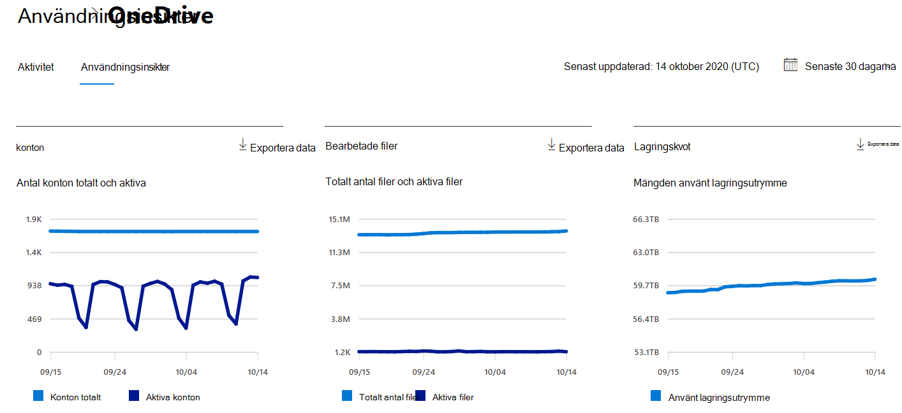
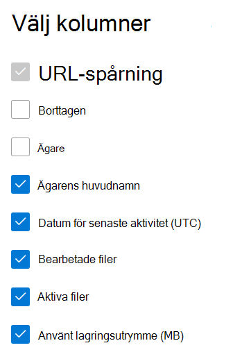

# Microsoft 365 Rapporter i administrationscentret – OneDrive för företag användningMicrosoft 365 Reports in the admin center - OneDrive for Business usage

På Microsoft 365 **Rapporter** ser du en översikt över aktiviteter i organisationens produkter.The Microsoft 365 **Reports** dashboard shows you the activity overview across the products in your organization. Här kan du gå in på detaljnivå i rapporter för enskilda produkter för att få bättre insikter om aktiviteterna inom varje produkt.It enables you to drill in to individual product level reports to give you more granular insight about the activities within each product. Ta en titt på [översiktsavsnittet för Rapporter](activity-reports.md).Check out [the Reports overview topic](activity-reports.md).
  
OneDrive-kortet på instrumentpanelen ger till exempel en övergripande bild av värdet som du får från OneDrive för företag vad gäller det totala antalet filer och lagringsutrymmet som används i din organisation. Du kan sedan öka detaljnivån för att förstå trender för aktiva OneDrive-konton, hur många filer som användare interagerar med samt hur mycket lagring som används. Det ger dig även information om varje användares OneDrive.For example, the OneDrive card on the dashboard gives you a high-level view of the value you are getting from OneDrive for Business in terms of the total number of files and storage used across your organization. You can then drill into it to understand the trends of active OneDrive accounts, how many files are users interacting with as well as the storage used. It also gives you details for each user's OneDrive.
  
> [!NOTE]
> Du måste vara global administratör, global läsare eller rapportläsare i Microsoft 365 eller Exchange-, SharePoint-, Teams-tjänst, Teams Communications- eller Skype för företag-administratör för att kunna se rapporter.You must be a global administrator, global reader or reports reader in Microsoft 365 or an Exchange, SharePoint, Teams Service, Teams Communications, or Skype for Business administrator to see reports.  
 
## Hur får jag fram OneDrive-aktivitetsrapporten?How do I get to the OneDrive Activity report?

1. I administrationscentret går du till sidan **Rapporter** \> <a href="https://go.microsoft.com/fwlink/p/?linkid=2074756" target="_blank">Användning</a>.In the admin center, go to the **Reports** \> <a href="https://go.microsoft.com/fwlink/p/?linkid=2074756" target="_blank">Usage</a> page. 
2. På startsidan för instrumentpanelen klickar du på **knappen Visa** mer på OneDrive kort.From the dashboard homepage, click on the **View more** button on the OneDrive card.
  
## Förstå användningsrapporten i OneDriveInterpret the OneDrive usage report

Du kan visa användningen i OneDrive genom att välja **fliken** Användning.You can view the usage in the OneDrive report by choosing the **Usage** tab. 

Välj **Välj kolumner för** att lägga till eller ta bort kolumner i rapporten.Select **Choose columns** to add or remove columns from the report.    

Du kan också exportera rapportdata till en Excel .csv fil genom att välja **länken** Exportera.You can also export the report data into an Excel .csv file by selecting the **Export** link. Då exporteras data för alla användare och du kan göra enkel sortering och filtrering för vidare analys.This exports data of all users and enables you to do simple sorting and filtering for further analysis. Om du har mindre än 2 000 användare kan du sortera och filtrera i tabellen i själva rapporten.If you have less than 2000 users, you can sort and filter within the table in the report itself. Om du har fler än 2 000 användare måste du exportera data för att kunna filtrera och sortera.If you have more than 2000 users, in order to filter and sort, you will need to export the data. 
  
|ObjektItem|BeskrivningDescription|
|:-----|:-----|
|**Metrisk****Metric**|**Definition****Definition**|
|URLURL    |Webbadressen till användarens OneDrive.The web address for the user's OneDrive.   |
|BorttagenDeleted    |Borttagningsstatus för OneDrive.The deletion status of the OneDrive. Det tar minst 7 dagar för konton att markeras som borttagna.It takes at least 7 days for accounts to be marked as deleted.    |
|ÄgareOwner    |Användarnamnet på den primära administratören för OneDrive.The username of the primary administrator of the OneDrive.     |
|Ägarens huvudnamnOwner principal name    |E-postadressen till ägaren av OneDrive.The email address of the owner of the OneDrive.   |
|Datum för senaste aktivitet (UTC)Last activity date (UTC)    | Det senaste datum då en filaktivitet utfördes i OneDrive.The latest date a file activity was performed in the OneDrive. Om OneDrive-kontot inte haft någon filaktivitet är värdet tomt.If the OneDrive has had no file activity, the value will be blank.    |
|FilerFiles    |Antalet filer i OneDrive.The number of files in the OneDrive.  |
|Aktiva filerActive files    | Antalet aktiva filer under tidsperioden.The number of active files within the time period.  Obs! Om du tog bort filer under den angivna tidsperioden för rapporten kan antalet aktiva filer som visas i rapporten vara större än det aktuella antalet filer i OneDrive.NOTE: If files were removed during the specified time period for the report, the number of active files shown in the report may be larger than the current number of files in the OneDrive. >  Borttagna användare kommer att finnas med i rapporter under 180 dagar.>  Deleted users will continue to appear in reports for 180 days.    |
|Storage (MB)Storage used (MB)    |Mängden lagringsutrymme som används OneDrive MB.The amount of storage the OneDrive uses in MB. |
|||