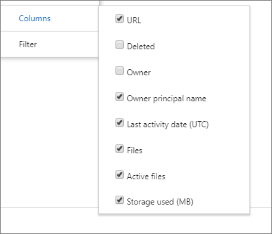

# Microsoft 365-rapporter i administrationscentret – Användning av OneDrive för företag

Instrumentpanelen Microsoft 365 **Reports** visar aktivitetsöversikten för produkterna i organisationen. Här kan du gå in på detaljnivå i rapporter för enskilda produkter för att få bättre insikter om aktiviteterna inom varje produkt. Ta en titt på [översiktsavsnittet för Rapporter](activity-reports.md).
  
OneDrive-kortet på instrumentpanelen ger till exempel en övergripande bild av värdet som du får från OneDrive för företag vad gäller det totala antalet filer och lagringsutrymmet som används i din organisation. Du kan sedan öka detaljnivån för att förstå trender för aktiva OneDrive-konton, hur många filer som användare interagerar med samt hur mycket lagring som används. Det ger dig även information om varje användares OneDrive.
  
> [!NOTE]
> Du måste vara global administratör, global läsare eller rapportläsare i Microsoft 365 eller exchange-, SharePoint-, Teams-tjänst, Teams Communications eller Skype för företag-administratör för att kunna se rapporter.  
 
## Hur får jag fram OneDrive-användningsrapporten?

1. I administrationscentret går du till sidan **Rapporter** \> <a href="https://go.microsoft.com/fwlink/p/?linkid=2074756" target="_blank">Användning</a>.

    
2. Välj **OneDrive-användning** \> **Usage**i listrutan **Välj en rapport** . 
  
## Förstå användningsrapporten i OneDrive

Du kan få en inblick i hur OneDrive för företag används genom att titta på vyerna **Konton**, **Filer** och **Lagring**. 
  

  
|||
|:-----|:-----|
|1.    |I användningsrapporten för **OneDrive** kan du se trender under de senaste 7, 30, 90 eller 180 dagarna. Om du väljer en viss dag i rapporten visas data i tabellen (7) i upp till 28 dagar från det aktuella datumet (inte det datum då rapporten genererades).    |
|2.    |Uppgifterna i varje rapport omfattar vanligtvis upp till de senaste 24 till 48 timmarna.  |
|3.    |Vyn **Konton** visar trenden för det totala antalet och aktiva OneDrive-konton. "Aktiva konton" är alla konton där användare visar, ändrar, laddar upp, laddar ned, delar eller synkroniserar filer.    |
|4.    |I vyn **Filer** visas det totala antalet filer och antalet aktiva filer. En fil anses vara aktiv om den har sparats, synkroniserats, ändrats eller delats inom en viss tidsperiod.    En filaktivitet kan inträffa flera gånger för en enskild fil, men räknas bara som en aktiv fil. Du kan till exempel spara och synkronisera samma fil flera gånger under en viss tidsperiod, men den räknas bara som en enda aktiv fil och en enda synkroniserad fil i dina data.           |
|5.    |I vyn **Lagring** visas trenden för mängden lagringsutrymme som du använder i OneDrive.    > OBS: Storleken innehåller alla versioner och metadata som är associerade med filerna.           |
|6.    | I diagrammet **Konton** visar Y-axeln antalet OneDrive-konton.     I diagrammet **Filer** visar Y-axeln antalet filer som lagrats på OneDrive.     I diagrammet **Lagring** visar Y-axeln hur mycket lagringsutrymme som används på OneDrive.     X-axeln i alla diagram är det valda datumintervallet för den här specifika rapporten.    |
|7.    |Du kan filtrera serien som visas i diagrammet genom att markera ett objekt i förklaringen. I **fildiagrammet** väljer du till exempel **Summafiler** eller **Aktiva filer**. I **kontodiagrammet** väljer du **Totalt antal konton** eller Aktiva **konton**. Eller i **lagringsdiagrammet** väljer du **Lagring som används**. När du ändrar ditt val ändras inte informationen i tabellen.    |
|8.    | Tabellen visar en sammanfattning av data för varje användares OneDrive. För att visas i tabellen måste användaren ha tilldelats en produktlicens som innehåller OneDrive, och de måste ha SharePoint Online aktiverat. Användaren måste även antingen logga in på OneDrive-synkroniseringsklienten eller bläddra till sin egen OneDrive med hjälp av en webbläsare.     Om OneDrive har haft filaktivitet visas det senaste datum som filaktiviteten utfördes. Raderna i tabellen sorteras efter **Datum för senaste aktivitet** så OneDrive-kontot med den senaste filaktiviteten visas därför högst upp i listan.     Du kan lägga till eller ta bort kolumner i tabellen.        **URL** är webbadressen till användarens OneDrive.    **Borttaget** är borttagningsstatusen för OneDrive. Det tar minst 7 dagar för konton att markeras som borttagna.    **Ägare** är användarnamnet på den primära administratören för OneDrive.    **Ägarens huvudnamn** är e-postadressen till ägaren av OneDrive.    **Datum för senaste aktivitet (UTC)** är det senaste datum då en filaktivitet utfördes på OneDrive. Om OneDrive-kontot inte haft någon filaktivitet är värdet tomt.    **Filer** är antalet filer på OneDrive.    **Aktiva filer** är antalet aktiva filer under tidsperioden. En fil anses vara aktiv om den har sparats, synkroniserats, ändrats eller delats inom en viss tidsperiod.    En filaktivitet kan inträffa flera gånger för en enskild fil, men räknas bara som en aktiv fil. Du kan till exempel spara och synkronisera samma fil flera gånger under en viss tidsperiod, men den räknas bara som en enda aktiv fil och en enda synkroniserad fil i dina data. >  Om du tog bort filer under tidsperioden som angetts för rapporten kan antalet aktiva filer som visas i rapporten vara större än det aktuella antalet filer på OneDrive. >  Borttagna användare kommer att finnas med i rapporter under 180 dagar. **Använt lagringsutrymme (MB)** är mängden lagringsutrymme som används på OneDrive i MB. Detta inkluderar alla versioner och metadata som är kopplade till filerna.     Om organisationens principer hindrar dig från att visa rapporter där användarinformation kan identifieras kan du ändra sekretessinställningen för alla dessa rapporter. Kolla in avsnittet **Hur döljer jag information på användarnivå?** [Activity Reports in the Microsoft 365 admin center Preview](activity-reports.md)    |
|9.    |Markera **Manage columns** ikonen  Hantera kolumner om du vill lägga till eller ta bort kolumner från rapporten.    |
|10.    |Du kan också exportera rapportdata till en CSV-fil i Excel genom att välja länken **Exportera.** Då exporteras data för varje OneDrive och du kan göra en enkel sortering och filtrering för vidare analys. Om du har mindre än 2 000 OneDrive-konton kan du sortera och filtrera i tabellen i själva rapporten. Om du har fler än 2 000 OneDrive-konton måste du exportera data för att kunna filtrera och sortera.    När data exporteras till en Excel-fil bör du tänka på att datumet då innehållsrapporten genererades återspeglas i filen i kolumnen **Data från** och med.    |
|||
   

