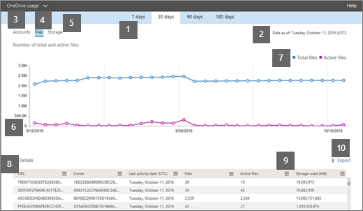

# Microsoft 365-rapporter i administrationscentret – Användning av OneDrive för företagMicrosoft 365 Reports in the admin center - OneDrive for Business usage

Instrumentpanelen Microsoft 365 **Reports** visar aktivitetsöversikten för produkterna i organisationen.The Microsoft 365 **Reports** dashboard shows you the activity overview across the products in your organization. Här kan du gå in på detaljnivå i rapporter för enskilda produkter för att få bättre insikter om aktiviteterna inom varje produkt.It enables you to drill in to individual product level reports to give you more granular insight about the activities within each product. Ta en titt på [översiktsavsnittet för Rapporter](activity-reports.md).Check out [the Reports overview topic](activity-reports.md).
  
OneDrive-kortet på instrumentpanelen ger till exempel en övergripande bild av värdet som du får från OneDrive för företag vad gäller det totala antalet filer och lagringsutrymmet som används i din organisation. Du kan sedan öka detaljnivån för att förstå trender för aktiva OneDrive-konton, hur många filer som användare interagerar med samt hur mycket lagring som används. Det ger dig även information om varje användares OneDrive.For example, the OneDrive card on the dashboard gives you a high-level view of the value you are getting from OneDrive for Business in terms of the total number of files and storage used across your organization. You can then drill into it to understand the trends of active OneDrive accounts, how many files are users interacting with as well as the storage used. It also gives you details for each user's OneDrive.
  
> [!NOTE]
> Du måste vara global administratör, global läsare eller rapportläsare i Microsoft 365 eller exchange-, SharePoint-, Teams-tjänst, Teams Communications eller Skype för företag-administratör för att kunna se rapporter.You must be a global administrator, global reader or reports reader in Microsoft 365 or an Exchange, SharePoint, Teams Service, Teams Communications, or Skype for Business administrator to see reports.  
 
## Hur får jag fram OneDrive-användningsrapporten?How do I get to the OneDrive Usage Report?

1. Gå till Rapporteranvändning i **administrationscentret** \> <a href="https://go.microsoft.com/fwlink/p/?linkid=2074756" target="_blank">Usage</a>.In the admin center, go to **Reports** \> <a href="https://go.microsoft.com/fwlink/p/?linkid=2074756" target="_blank">Usage</a>.

    
2. Välj **OneDrive-användning** i listrutan **Välj en rapport** \> **Usage**.From the **Select a report** drop-down, select **OneDrive** \> **Usage**. 
  
## Förstå användningsrapporten i OneDriveInterpret the OneDrive usage report

Du kan få en inblick i hur OneDrive för företag används genom att titta på vyerna **Konton**, **Filer** och **Lagring**.You can get a view into OneDrive for Business usage by looking at the **Accounts**, **Files**, and **Storage** views. 
  

  
|||
|:-----|:-----|
|1.1.    |I användningsrapporten för **OneDrive** kan du se trender under de senaste 7, 30, 90 eller 180 dagarna.The **OneDrive usage** report shows trends over the last 7 days, 30 days, 90 days, or 180 days. Om du väljer en viss dag i rapporten visas data i tabellen (7) i upp till 28 dagar från det aktuella datumet (inte det datum då rapporten genererades).However, if you select a particular day in the report, the table (7) will show data for up to 28 days from the current date (not the date the report was generated).    |
|2.2.    |Uppgifterna i varje rapport omfattar vanligtvis upp till de senaste 24 till 48 timmarna.The data in each report usually covers up to the last 24 to 48 hours.  |
|3.3.    |Vyn **Konton** visar trenden för det totala antalet och aktiva OneDrive-konton. "Aktiva konton" är alla konton där användare visar, ändrar, laddar upp, laddar ned, delar eller synkroniserar filer.  The **Accounts** view shows the trend in the number of total and active OneDrive accounts. "Active accounts" are any in which users view, modify, upload, download, share, or sync files.    |
|4.4.    |I vyn **Filer** visas det totala antalet filer och antalet aktiva filer. En fil anses vara aktiv om den har sparats, synkroniserats, ändrats eller delats inom en viss tidsperiod.  The **Files** view shows the number of number of total and active files. A file is considered active if it has been saved, synced, modified or shared within the specific time period.    En filaktivitet kan inträffa flera gånger för en enskild fil, men räknas bara som en aktiv fil.NOTE: A file activity can occur multiple times for a single file, but will count only as one active file. Du kan till exempel spara och synkronisera samma fil flera gånger under en viss tidsperiod, men den räknas bara som en enda aktiv fil och en enda synkroniserad fil i dina data.For example, you can save and sync the same file multiple times over a specified time period, but it will count only as one single active file and one single synced file in the data.           |
|5.5.    |I vyn **Lagring** visas trenden för mängden lagringsutrymme som du använder i OneDrive.The **Storage** view shows the trend in the amount of OneDrive storage you're using.    > OBS: Storleken innehåller alla versioner och metadata som är associerade med filerna.> NOTE: The size includes any versions and metadata associated with the files.           |
|6.6.    | I diagrammet **Konton** visar Y-axeln antalet OneDrive-konton.On the **Accounts** chart, the Y axis is the number of OneDrive accounts.     I diagrammet **Filer** visar Y-axeln antalet filer som lagrats på OneDrive.On the **Files** chart, the Y axis is the number of files stored in OneDrive.     I diagrammet **Lagring** visar Y-axeln hur mycket lagringsutrymme som används på OneDrive.On the **Storage** chart, the Y axis is the amount of OneDrive storage used.     X-axeln i alla diagram är det valda datumintervallet för den här specifika rapporten.The X axis on all charts is the selected date range for this specific report.    |
|7.7.    |Du kan filtrera serien som visas i diagrammet genom att markera ett objekt i förklaringen.You can filter the series you see on the chart by selecting an item in the legend. I **fildiagrammet** väljer du till exempel **Summafiler** eller **Aktiva filer**.For example, on the **Files** chart, select **Total files** or **Active files**. I **kontodiagrammet** väljer du **Totalt antal konton** eller Aktiva **konton**.On the **Accounts** chart, select **Total accounts** or **Active accounts**. Eller i **lagringsdiagrammet** väljer du **Lagring som används**.Or on the **Storage** chart, select **Storage used**. När du ändrar ditt val ändras inte informationen i tabellen.Changing your selection doesn't change the information in the table.    |
|8.8.    | Tabellen visar en sammanfattning av data för varje användares OneDrive. För att visas i tabellen måste användaren ha tilldelats en produktlicens som innehåller OneDrive, och de måste ha SharePoint Online aktiverat. Användaren måste även antingen logga in på OneDrive-synkroniseringsklienten eller bläddra till sin egen OneDrive med hjälp av en webbläsare.  The table shows you a breakdown of data for each user's OneDrive. To appear in the table, a user needs to have been assigned a product license that includes OneDrive, and they need to have SharePoint Online turned on. The user also needed to either sign in to the OneDrive sync client, or browse to their OneDrive using a web browser.     Om OneDrive har haft filaktivitet visas det senaste datum som filaktiviteten utfördes. Raderna i tabellen sorteras efter **Datum för senaste aktivitet** så OneDrive-kontot med den senaste filaktiviteten visas därför högst upp i listan.  If the OneDrive has had file activity, it will have the latest date that the file activity was performed. The rows in the table are sorted by **Last activity date** so the OneDrive with the most recent file activity appears at the top of the list.     Du kan lägga till eller ta bort kolumner i tabellen.You can add or remove columns from the table.        **URL** är webbadressen till användarens OneDrive.**URL** is the web address for the user's OneDrive.    **Borttaget** är borttagningsstatusen för OneDrive. Det tar minst 7 dagar för konton att markeras som borttagna.  **Deleted** is the deletion status of the OneDrive. It takes at least 7 days for accounts to be marked as deleted.    **Ägare** är användarnamnet på den primära administratören för OneDrive.**Owner** is the username of the primary administrator of the OneDrive.    **Ägarens huvudnamn** är e-postadressen till ägaren av OneDrive.**Owner principal name** is the email address of the owner of the OneDrive.    **Datum för senaste aktivitet (UTC)** är det senaste datum då en filaktivitet utfördes på OneDrive. Om OneDrive-kontot inte haft någon filaktivitet är värdet tomt.  **Last activity date (UTC)** is the latest date a file activity was performed in the OneDrive. If the OneDrive has had no file activity, the value will be blank.    **Filer** är antalet filer på OneDrive.**Files** is the number of files in the OneDrive.    **Aktiva filer** är antalet aktiva filer under tidsperioden.**Active files** is the number of active files within the time period.  Om filer har tagits bort under den angivna tidsperioden för rapporten kan antalet aktiva filer som visas i rapporten vara större än det aktuella antalet filer på OneDrive.NOTE: If files were removed during the specified time period for the report, the number of active files shown in the report may be larger than the current number of files in the OneDrive. >  Borttagna användare kommer att finnas med i rapporter under 180 dagar.>  Deleted users will continue to appear in reports for 180 days. **Använt lagringsutrymme (MB)** är mängden lagringsutrymme som används på OneDrive i MB.**Storage used (MB)** is the amount of storage the OneDrive uses in MB.    Om organisationens principer hindrar dig från att visa rapporter där användarinformation kan identifieras kan du ändra sekretessinställningen för alla dessa rapporter.If your organization's policies prevent you from viewing reports where user information is identifiable, you can change the privacy setting for all these reports. Kolla in avsnittet **Hur döljer jag information på användarnivå?** [Activity Reports in the Microsoft 365 admin center](activity-reports.md)Check out the **How do I hide user level details?** section in the [Activity Reports in the Microsoft 365 admin center](activity-reports.md).    |
|9.9.    |Markera ikonen **Hantera kolumner** Hantera kolumner om du vill lägga till eller ta bort kolumner  rapporten.Select the **Manage columns** icon  to add or remove columns from the report.    |
|10.10.    |Du kan också exportera rapportdata till en CSV-fil i Excel genom att välja länken **Exportera.**You can also export the report data into an Excel .csv file, by selecting the **Export** link. Då exporteras data för varje OneDrive och du kan göra en enkel sortering och filtrering för vidare analys.This exports the date for each OneDrive and allows you to do simple sorting and filtering for further analysis. Om du har mindre än 2 000 OneDrive-konton kan du sortera och filtrera i tabellen i själva rapporten.If you have less than 2000 OneDrive accounts, you can sort and filter within the table in the report itself. Om du har fler än 2 000 OneDrive-konton måste du exportera data för att kunna filtrera och sortera.If you have more than 2000 OneDrive accounts, you need to export the data to filter and sort.    När data exporteras till en Excel-fil återspeglas datumet då innehållsrapporten genererades i filen i kolumnen **Data från** och med.NOTE: When the data is exported to an Excel file, the date the content report was generated is reflected in the file in the **Data as of** column.    |
|||
   

