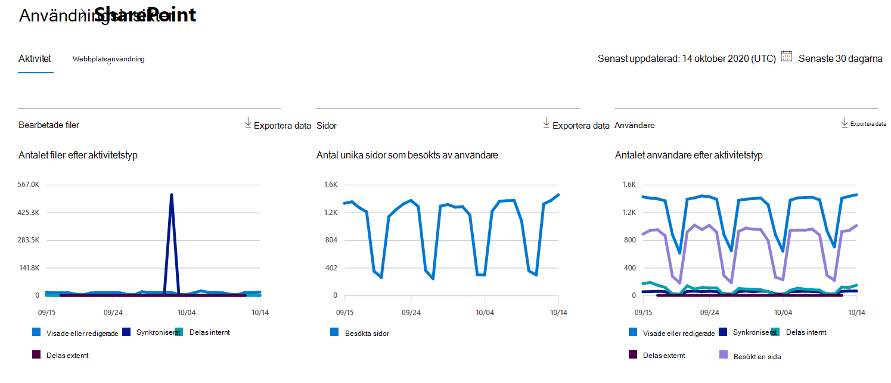

# Microsoft 365 Rapporter i administrationscentret – SharePoint aktivitetMicrosoft 365 Reports in the admin center - SharePoint activity

Som Microsoft 365 administratör kan du **i instrumentpanelen** Rapporter se en översikt över olika produkter i organisationen.As an Microsoft 365 admin, the **Reports** dashboard shows you the activity overview across various products in your organization. Där kan du öka detaljnivån för att få bättre inblick i de aktiviteter som är specifika för varje produkt.It enables you to drill in to get more granular insight about the activities specific to each product. Titta i [aktivitetsrapporterna i Microsoft 365 administrationscenter.](activity-reports.md)Check out the [activity reports in the Microsoft 365 admin center](activity-reports.md).
  
Du kan till exempel få information om aktiviteten för varje användare som har en licens för att använda SharePoint genom att titta på deras interaktion med filer. Genom att titta på hur många filer som delas kan du även få hjälp med att förstå samarbetsnivån.For example, you can understand the activity of every user licensed to use SharePoint by looking at their interaction with files. It also helps you to understand the level of collaboration going on by looking at the number of files shared.
  
> [!NOTE]
> Du måste vara global administratör, global läsare eller rapportläsare i Microsoft 365 eller Exchange-, SharePoint-, Teams-tjänst, Teams Communications- eller Skype för företag-administratör för att kunna se rapporter.You must be a global administrator, global reader or reports reader in Microsoft 365 or an Exchange, SharePoint, Teams Service, Teams Communications, or Skype for Business administrator to see reports. 
 
## Hur kommer jag åt SharePoint-aktivitetsrapporten?How do I get to the to the SharePoint activity report?

1. I administrationscentret går du till sidan **Rapporter** \> <a href="https://go.microsoft.com/fwlink/p/?linkid=2074756" target="_blank">Användning</a>.In the admin center, go to the **Reports** \> <a href="https://go.microsoft.com/fwlink/p/?linkid=2074756" target="_blank">Usage</a> page. 
2. På startsidan för instrumentpanelen klickar du på **knappen Visa** mer på SharePoint kort.From the dashboard homepage, click on the **View more** button on the SharePoint card.
  
## Tolka SharePoint aktivitetsrapportInterpret the SharePoint activity report

Du kan visa aktiviteterna i SharePoint genom att välja **fliken** Aktivitet.You can view the activities in the SharePoint report by choosing the **Activity** tab. 

Välj **Välj kolumner för** att lägga till eller ta bort kolumner i rapporten.Select **Choose columns** to add or remove columns from the report.    

Du kan också exportera rapportdata till en Excel .csv fil genom att välja **länken** Exportera.You can also export the report data into an Excel .csv file by selecting the **Export** link. Då exporteras data för alla användare och du kan göra enkel sortering och filtrering för vidare analys.This exports data of all users and enables you to do simple sorting and filtering for further analysis. Om du har mindre än 2 000 användare kan du sortera och filtrera i tabellen i själva rapporten.If you have less than 2000 users, you can sort and filter within the table in the report itself. Om du har fler än 2 000 användare måste du exportera data för att kunna filtrera och sortera.If you have more than 2000 users, in order to filter and sort, you will need to export the data. 
  
|ObjektItem|BeskrivningDescription|
|:-----|:-----|
|**Metrisk****Metric**|**Definition****Definition**|
|AnvändarnamnUsername    |E-postadressen till den användare som utförde aktiviteten på SharePoint webbplats.The email address of the user who performed the activity on the SharePoint Site.    |
|Datum för senaste aktivitet (UTC)Last activity date (UTC)    |Det senaste datum då en filaktivitet utfördes eller en sida besöktes för det valda datumintervallet.The latest date a file activity was performed or a page was visited for the selected date range. Om du vill se aktivitet som inträffat på ett visst datum markerar du datumet direkt i diagrammet.To see activity that occurred on a specific date, select the date directly in the chart.    |
|Visade eller redigerade filerFiles viewed or edited    |Antalet filer som användaren har laddat upp, laddat ned, ändrat eller visat.The number of files that the user uploaded, downloaded, modified, or viewed.     |
|Filer synkroniseradeFiles synced    |Antalet filer som har synkroniserats från en användares lokala enhet till SharePoint webbplats.The number of files that have been synced from a user's local device to the SharePoint site.   |
|Filer som delats interntFiles shared internally    | Antalet filer som har delats med användare inom organisationen eller med användare i grupper (som kan innehålla externa användare).The count of files that have been shared with users within the organization, or with users within groups (that might include external users).    |
|Filer som delats externtFiles shared externally    |Antalet filer som har delats med användare utanför organisationen.The number of files that have been shared with users outside of the organization.  |
|Besökta sidorPages visited    |Besök på unika sidor av användaren.The visits to unique pages by the user.  |
|BorttagenDeleted    | Det här anger att användarens licens har tagits bort.This indicates that the user's license was removed.     **OBS!** Aktivitet för en borttagna användare visas fortfarande i rapporten om han eller hon har varit licensierad någon gång under den valda tidsperioden.**NOTE:** Activity for a deleted user will still display in the report as long as he or she was licensed at some time during the selected time period. I kolumnen Borttagen får du information om att användaren inte längre är aktiv, men att han eller hon har bidragit till data i rapporten.The Deleted column helps you to note that the user may no longer be active, but contributed to the data in the report.    |
|Borttagna datumDeleted date    |Datumet då användarens licens togs bort.The date on which the user's license was removed.  |
|Tilldelad produktProduct assigned    |Den Microsoft 365 produkter som är licensierade till användaren.The Microsoft 365 products that are licensed to the user.|
|||