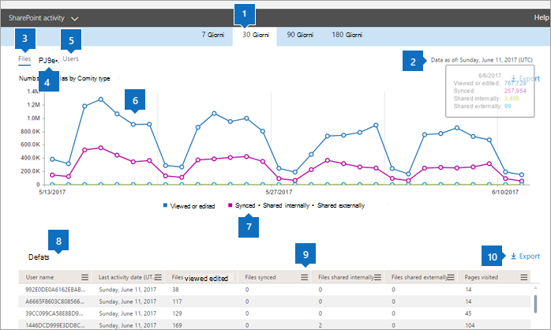
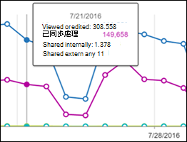

# Microsoft 365-rapporter i administrationscentret – SharePoint-aktivitet

Som Microsoft 365-administratör visar instrumentpanelen **Rapporter** aktivitetsöversikten för olika produkter i organisationen. Där kan du öka detaljnivån för att få bättre inblick i de aktiviteter som är specifika för varje produkt. Kolla in [aktivitetsrapporterna i administrationscentret för Microsoft 365](activity-reports.md).
  
Du kan till exempel få information om aktiviteten för varje användare som har en licens för att använda SharePoint genom att titta på deras interaktion med filer. Genom att titta på hur många filer som delas kan du även få hjälp med att förstå samarbetsnivån.
  
> [!NOTE]
> En del funktioner införs stegvis. Det innebär att du kanske inte ser den här funktionen än eller att den ser annorlunda ut jämfört med beskrivningen i hjälpartiklarna. Oroa dig inte - om den ännu inte syns till kommer den snart! 
  
Om du vill förstå mängden aktivitet på respektive SharePoint-webbplats och lagringsutnyttjandet kan du titta på [rapporten om SharePoint-webbplatsanvändning](sharepoint-site-usage.md).
  
> [!NOTE]
> Du måste vara en global administratör, global läsare eller rapporterar läsare i Microsoft 365 eller en Exchange-, SharePoint- eller Skype förföretag-administratör för att kunna se rapporter. 
 
## Hur kommer jag åt SharePoint-aktivitetsrapporten?

1. I administrationscentret går du till sidan **Rapporter** \> <a href="https://go.microsoft.com/fwlink/p/?linkid=2074756" target="_blank">Användning</a>.

    
2. Välj **SharePoint-aktivitet** \> **Activity**i listrutan **Välj en rapport** .
  
## Tolka rapporten om SharePoint-aktivitet

Du kan få information om SharePoint-aktivitet genom att titta på vyerna **Filer** och **Användare**.  
  
|||
|:-----|:-----|
|1.    |I **SharePoint-aktivitetsrapporten** kan du se trender under de senaste 7, 30, 90 eller 180 dagarna. Om du väljer en viss dag i rapporten visas dock data i tabellen (7) i upp till 28 dagar från det aktuella datumet (inte det datum då rapporten genererades).    |
|2.    |Uppgifterna i varje rapport täcker vanligtvis upp till de senaste 24 till 48 timmarna.    |
|3.    |Med vyn **Filer** kan du förstå det unika antalet licensierade användare som interagerar med filer som lagras på SharePoint-webbplatser.    |
|4.    |Vyn **Sidor** visar antalet unika sidor som besökts av användare.    |
|5.    |Vyn **Användare** hjälper dig att förstå trenden för antalet aktiva användare. En användare anses vara aktiv om han eller hon har genomfört en filaktivitet (spara, synkronisera, ändra eller dela) eller besökt en sida inom den angivna tidsperioden.    En filaktivitet kan inträffa flera gånger för en enda fil, men räknas bara som en aktiv fil. Du kan till exempel spara och synkronisera samma fil flera gånger under en viss tidsperiod, men den räknas bara som en enda aktiv fil och en enda synkroniserad fil i dina data           |
|6.    | På Y-axeln i diagrammet **Filer** visas antalet unika filer som en användare antingen har sparat, synkroniserat, ändrat eller delat.     På Y-axeln i diagrammet **Användare** visas antalet unika användare som har interagerat med en fil (sparat, synkroniserat, ändrat eller delat) på en webbplats.     I diagrammet **Sidor** är X-axeln antalet unika sidor som användarna besökt.     X-axeln i alla diagram är det valda datumintervallet för den här specifika rapporten.    |
|7.    |Du kan filtrera serien som visas i diagrammet genom att markera ett objekt i förklaringen. I **fildiagrammet** väljer du till exempel **Visad eller redigerad**, **Synkroniserad,** **Delad internt**eller **Delas externt** om du bara vill se informationen som är relaterad till var och en. När du ändrar det här valet ändras inte informationen i rutnätstabellen.    |
|8.    | Tabellen visar en uppdelning av aktiviteterna per webbplats.       **Användarnamn** är e-postadressen till den användare som utförde aktiviteten på SharePoint-webbplatsen.    **Datum för senaste aktivitet (UTC)** är det senaste datum då en filaktivitet utfördes eller en sida besöktes för det valda datumintervallet. Om du vill se aktivitet som inträffat på ett visst datum markerar du datumet direkt i diagrammet.       Detta filtrerar tabellen så att filaktivitetsdata endast visas för användare som utförde aktiviteten den specifika dagen.     **Visade eller redigerade filer** är antalet filer som användaren har laddat upp, laddat ned, ändrat eller visat.     **Filer som synkroniseras** är antalet filer som har synkroniserats från en användares lokala enhet till SharePoint-webbplatsen.     **Filer som delas internt** är antalet filer som har delats med användare inom organisationen eller med användare inom grupper (som kan inkludera externa användare).     **Filer som delats externt** är antalet filer som har delats med användare utanför organisationen.     **Besökta sidor** är användarens besök på unika sidor.     **Borttagen** anger att användarens licens har tagits bort.     **OBS:** Aktiviteten för en borttagen användare visas fortfarande i rapporten så länge han eller hon har licensierats någon gång under den valda tidsperioden. I kolumnen Borttagen får du information om att användaren inte längre är aktiv, men att han eller hon har bidragit till data i rapporten.    **Borttagningsdatum** är det datum då användarens licens togs bort.     **Produkten som tilldelas** är de Microsoft 365-produkter som är licensierade till användaren.    |
|9.    |Markera **Manage columns** ikonen  Hantera kolumner om du vill lägga till eller ta bort kolumner från rapporten.    |
|10.    |Du kan också exportera rapportdata till en CSV-fil i Excel genom att välja **länken Exportera.** Då exporteras data för alla användare och du kan göra enkel sortering och filtrering för vidare analys. Om du har mindre än 2000 användare kan du sortera och filtrera i tabellen i själva rapporten. Om du har fler än 2 000 användare måste du exportera data för att kunna filtrera och sortera.    |
|||
   

