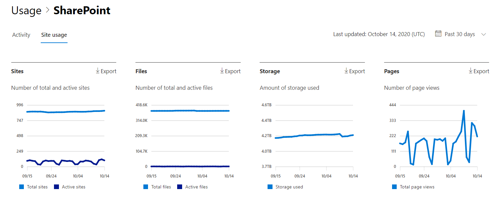

# Microsoft 365-rapporter i administrations centret – SharePoint-webbplatsens användningMicrosoft 365 Reports in the admin center - SharePoint site usage

Som Microsoft 365-administratör visar instrument panelen **rapporter** dig översikten över olika produkter i organisationen.As a Microsoft 365 admin, the **Reports** dashboard shows you the activity overview across various products in your organization. Där kan du öka detaljnivån för att få bättre inblick i de aktiviteter som är specifika för varje produkt.It enables you to drill in to get more granular insight about the activities specific to each product. Du kan till exempel få en överblick på hög nivå av det värde som du får från SharePoint som det totala antalet filer som användare lagrar på SharePoint-webbplatser, hur många filer som används aktivt och hur mycket lagring som används på alla dessa webbplatser.For example, you can get a high level view of the value you are getting from SharePoint in terms of the total number of files that users store in SharePoint sites, how many files are actively being used, and the storage consumed across all these sites. Du kan sedan öka detaljnivån på rapporten om SharePoint-webbplatsanvändningen för att förstå trenderna och information per webbplatsnivå för alla webbplatser.Then, you can drill into the SharePoint site usage report to understand the trends and per site level details for all sites. 
  
> [!NOTE]
> Du måste vara global administratör, global läsare eller rapport läsare i Microsoft 365 eller en Exchange-, SharePoint-, teams-tjänst, grupp kommunikation eller Skype för företag-administratör för att se rapporter.You must be a global administrator, global reader or reports reader in Microsoft 365 or an Exchange, SharePoint, Teams Service, Teams Communications, or Skype for Business administrator to see reports.
Microsoft 365-rapporter i administrations centret stöds inte för GCC-och DoD-klienter.Microsoft 365 Reports in the admin center is not supported for GCC High and DoD tenants.
 
## Så här kommer du till rapporten om SharePoint-webbplatsanvändningHow to get to the SharePoint site usage report

1. I administrationscentret går du till sidan **Rapporter** \> <a href="https://go.microsoft.com/fwlink/p/?linkid=2074756" target="_blank">Användning</a>.In the admin center, go to the **Reports** \> <a href="https://go.microsoft.com/fwlink/p/?linkid=2074756" target="_blank">Usage</a> page. 
2. Från instrument panelens start sida klickar du på knappen **Visa mer** på SharePoint-kortet.From the dashboard homepage, click on the **View more** button on the SharePoint card.
  
## Tolka rapport om SharePoint-webbplatsens användningInterpret the SharePoint site usage report

Du kan visa webbplats användningen i SharePoint-rapporten genom att välja fliken **webbplats användning** .You can view the site usage in the SharePoint report by choosing the **Site usage** tab. 

Välj **Välj kolumner** för att lägga till eller ta bort kolumner i rapporten.Select **Choose columns** to add or remove columns from the report.    

Du kan också exportera rapport data till en Excel. csv-fil genom att välja **Exportera** -länken.You can also export the report data into an Excel .csv file by selecting the **Export** link. Då exporteras data för alla användare och du kan göra enkel sortering och filtrering för vidare analys.This exports data of all users and enables you to do simple sorting and filtering for further analysis. Om du har mindre än 2 000 användare kan du sortera och filtrera i tabellen i själva rapporten.If you have less than 2000 users, you can sort and filter within the table in the report itself. Om du har fler än 2 000 användare måste du exportera data för att kunna filtrera och sortera.If you have more than 2000 users, in order to filter and sort, you will need to export the data. 
  
|ObjektItem|BeskrivningDescription|
|:-----|:-----|
|**Mät****Metric**|**Definition****Definition**|
|Webbplatsens URLSite URL    |Den fullständiga URL-adressen för webbplatsen.The full URL of the site.   |
|DeletedDeleted    |Borttagnings status för webbplatsen.The deletion status of the site. Det tar minst 7 dagar för webbplatser att markeras som borttagna.It takes at least 7 days for sites to be marked as deleted.    |
|Webbplats ägareSite owner    |Användar namnet på den primära ägaren av webbplatsen.The username of the primary owner of the site.     |
|Huvud namn för webbplats ägareSite owner principal name    |E-postadressen till ägaren till webbplatsen.The email address of the owner of the site.   |
|Datum för senaste aktivitet (UTC)Last activity date (UTC)    | Datumet för den senaste tids aktiviteten upptäcktes eller en sida visades på webbplatsen.The date of the last time file activity was detected or a page was viewed on the site.    |
|HjälpfilerFiles    |Antalet filer på webbplatsen.The number of files on the site.  |
|Aktiva filerActive files    | Antalet aktiva filer på webbplatsen.The number of active files on the site.  OBS! om filer togs bort under den angivna tids perioden för rapporten kan antalet aktiva filer som visas i rapporten vara större än det aktuella antalet filer på webbplatsen.NOTE: If files were removed during the specified time period for the report, the number of active files shown in the report may be larger than the current number of files on the site.    |
|Använt lagrings utrymme (MB)Storage used (MB)    |Mängden lagrings utrymme som används på webbplatsen.The amount of storage currently being used on the site.   |
|Allokerat lagrings utrymme (MB)Storage allocated (MB)    |Det högsta tillåtna lagrings utrymmet för webbplatsen.The maximum amount of storage allocated for the site.   |
|SidvyerPage views    |Antalet gånger som sidor visades på webbplatsen.The number of times pages were viewed on the site.   |
|Besökta sidorPages visited    |Antalet unika sidor som besökts på webbplatsen.The number of unique pages that were visited on the site.   |
|Rotmapp med rotRoot Web Template    |Den mall som används för att skapa webbplatsen.The template used for creating the site.    Obs! Om du vill filtrera data efter olika webbplats typer exporterar du dem och använder kolumnen rotmapp.NOTE: If you want to filter the data by different site types, then export the data and use the Root Web Template column. |
|||