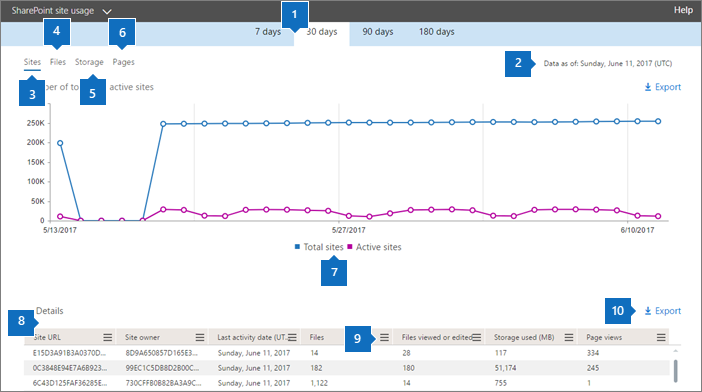

# Microsoft 365-rapporter i administrationscentret – Användning av SharePoint-webbplatser

Som Microsoft 365-administratör visar instrumentpanelen **Rapporter** aktivitetsöversikten för olika produkter i organisationen. Där kan du öka detaljnivån för att få bättre inblick i de aktiviteter som är specifika för varje produkt. Du kan till exempel få en överblick på hög nivå av det värde som du får från SharePoint som det totala antalet filer som användare lagrar på SharePoint-webbplatser, hur många filer som används aktivt och hur mycket lagring som används på alla dessa webbplatser. Du kan sedan öka detaljnivån på rapporten om SharePoint-webbplatsanvändningen för att förstå trenderna och information per webbplatsnivå för alla webbplatser. 
  
> [!NOTE]
> Du måste vara global administratör, global läsare eller rapportläsare i Microsoft 365 eller exchange-, SharePoint-, Teams-tjänst, Teams Communications eller Skype för företag-administratör för att kunna se rapporter.
Microsoft 365-rapporter i administrationscentret stöds inte för GCC High- och DoD-klienter.
 
## Så här kommer du till rapporten om SharePoint-webbplatsanvändning

1. I administrationscentret går du till sidan **Rapporter** \> <a href="https://go.microsoft.com/fwlink/p/?linkid=2074756" target="_blank">Användning</a>.

    
2. Välj Användning av **SharePoint-webbplats** i listrutan **Välj en rapport** \> **Site usage**.
  
## Tolka rapporten om SharePoint-webbplatsanvändning

  
|||
|:-----|:-----|
|1.    |I rapporten **SharePoint-webbplatsanvändning** kan du se trender under de senaste 7, 30, 90 eller 180 dagarna. Om du väljer en viss dag i rapporten visas data i tabellen (7) i upp till 28 dagar från det aktuella datumet (inte det datum då rapporten genererades).    |
|2.    |Uppgifterna i varje rapport omfattar vanligtvis upp till de senaste 24 till 48 timmarna.   |
|3.    |I diagrammet **Webbplatser** visas det totala antalet och antalet aktiva webbplatser. En webbplats där användare har visat, ändrat, laddat upp, laddat ned, delat eller synkroniserat en fil eller visat en sida inom rapporteringsperioden.    |
|4.    |I diagrammet **Filer** visas det totala antalet filer på alla webbplatser och antalet aktiva filer. I det totala antalet ingår både användar- och systemfiler. En fil anses vara aktiv om den har sparats, synkroniserats, ändrats eller delats inom en viss tidsperiod.    En filaktivitet kan inträffa flera gånger för en enskild fil, men räknas bara som en aktiv fil. Du kan till exempel spara och synkronisera samma fil flera gånger under en viss tidsperiod, men den räknas bara som en enda aktiv fil och en enda synkroniserad fil i dina data.           |
|5.    |I diagrammet **Lagring** visas trenden för lagringsutrymme som tilldelats och använts under rapporteringsperioden.    |
|6.    |I diagrammet **Sidor** visas antalet sidor som visats på alla webbplatser.    |
|7.    |Du kan filtrera diagram som du ser genom att markera ett objekt i förklaringen. Välj filer **eller** **Aktiva filer**i diagrammet **Filer** . I **diagrammet Platser** kan du välja **Totalt antal platser** eller Aktiva **webbplatser**. I **lagringsdiagrammet** kan du välja **Lagringsallokerad** eller **Lagring som förbrukas.** När du ändrar det här valet ändras inte informationen i rutnätstabellen.    |
|8.    | Tabellen visar en uppdelning av aktiviteterna per webbplats.                 **Webbplatsens URL** är den fullständiga URL-adressen för webbplatsen.    **Borttagna** är borttagningsstatusen för webbplatsen. Det tar minst 7 dagar för webbplatser att markeras som borttagna.    **Webbplatsägare** är användarnamnet på den primära ägaren av webbplatsen.   **Webbplatsens huvudnamn** är e-postadressen till webbplatsens ägare.    **Datum för senaste aktivitet (UTC)** är datumet för den senaste gången som filaktivitet upptäcktes eller en sida visades på webbplatsen.    **Filer** är antalet filer på webbplatsen.    **Aktiva filer** är antalet aktiva filer på webbplatsen. En fil anses vara aktiv om den har sparats, synkroniserats, ändrats eller delats inom en viss tidsperiod.    En filaktivitet kan inträffa flera gånger för en enskild fil, men räknas bara som en aktiv fil. Du kan till exempel spara och synkronisera samma fil flera gånger under en viss tidsperiod, men den räknas bara som en enda aktiv fil och en enda synkroniserad fil i dina data. >  Om du tog bort filer under tidsperioden som angetts för rapporten kan antalet aktiva filer som visas i rapporten vara större än det aktuella antalet filer på webbplatsen. **Använt lagringsutrymme (MB)** är mängden lagringsutrymme som för närvarande används på webbplatsen.    **Tilldelat lagringsutrymme (MB)** är den högsta mängden lagringsutrymme som tilldelats för webbplatsen.    **Visade sidor** är antalet gånger som sidor har visats på webbplatsen.    **Sidor som besökts** är antalet unika sidor som har besökts på webbplatsen.    **Rotwebbmall** är den mall som använts för att skapa webbplatsen.    Om du vill filtrera data efter olika platstyper exporterar du data och använder kolumnen Rotwebbmall.  Om organisationens principer hindrar dig från att visa rapporter där användarinformation kan identifieras kan du ändra sekretessinställningen för alla dessa rapporter. Kolla in avsnittet **Hur döljer jag information på användarnivå?** [Activity Reports in the Microsoft 365 admin center](activity-reports.md)    |
|9.    |Välj **Hantera kolumner**Hantera kolumner om du vill lägga till eller ta bort kolumner från  rapporten.      |
|10.    |Du kan också exportera rapportdata till en CSV-fil i Excel genom att välja länken **Exportera**  export. Då exporteras data för alla webbplatser och du kan göra enkel sortering och filtrering för vidare analys. Om du har mindre än 2 000 webbplatser kan du sortera och filtrera i tabellen i själva rapporten. Om du har fler än 2 000 webbplatser måste du exportera data för att kunna filtrera och sortera.    När data exporteras till en Excel-fil bör du tänka på att datumet då innehållsrapporten genererades återspeglas i filen i kolumnen **Data från** och med.          |
|||
   

