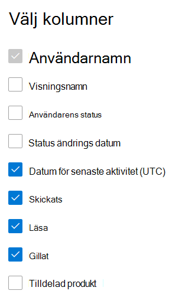

# Microsoft 365-rapporter i administrationscentret – Yammer-aktivitetsrapport

Som Microsoft 365-administratör kan **du i** instrumentpanelen Rapporter se data om användningen av produkter inom organisationen. Titta i [aktivitetsrapporter i administrationscentret](activity-reports.md). Med **Yammer-aktivitetsrapporten** får du förståelse för användningen av Yammer i organisationen genom att titta på antalet unika användare som använder Yammer för att publicera, gilla eller läsa ett meddelande och graden av aktivitet som skapas i organisationen. 
  
> [!NOTE]
> Du måste vara global administratör, global läsare eller rapportläsare i Microsoft 365 eller Exchange-, SharePoint-, Teams-tjänst, Teams Communications- eller Skype för företag-administratör för att kunna se rapporter.  
 
## Hur kommer jag åt Yammer-aktivitetsrapporten?

1. I administrationscentret går du till sidan **Rapporter** \> <a href="https://go.microsoft.com/fwlink/p/?linkid=2074756" target="_blank">Användning</a>. 
2. På startsidan för instrumentpanelen klickar du på **knappen Visa** mer på Yammer-kortet.

  
## Tolka Yammer-aktivitetsrapporten

Du kan visa aktiviteterna i Yammer-rapporten genom att välja **fliken** Aktivitet. 

Välj **Välj kolumner för** att lägga till eller ta bort kolumner i rapporten.    

Du kan också exportera rapportdata till en Excel-CSV-fil genom att välja **länken** Exportera. Då exporteras data för alla användare och du kan göra enkel sortering och filtrering för vidare analys. Om du har mindre än 2 000 användare kan du sortera och filtrera i tabellen i själva rapporten. Om du har fler än 2 000 användare måste du exportera data för att kunna filtrera och sortera. 
  
|Objekt|Beskrivning|
|:-----|:-----|
|**Metrisk**|**Definition**|
|Användarnamn    |Användarens e-postadress. Du kan visa den faktiska e-postadressen eller göra fältet anonymt. I det här rutnätet visas användare som loggat in på Yammer med Microsoft 365-kontot eller som loggat in på nätverket med enkel inloggning.   |
|Visningsnamn    |Användarens fullständiga namn. Du kan visa den faktiska e-postadressen eller göra fältet anonymt.    |
|Användartillstånd    |Ett av tre värden: Aktiverad, Borttagna eller Inaktiverade. De här rapporterna visar data för aktiva, inaktiverade och borttagna användare. De avspeglar inte väntande användare eftersom väntande användare inte kan publicera, läsa eller gilla ett meddelande.    |
|Datum för tillståndsändring (UTC)    |Datumet då användarens status ändrades i Yammer.    |
|Datum för senaste aktivitet (UTC)    | Det senaste datum då användaren publicerade, läste eller gillade ett meddelande.    |
|Publicerad    |Antalet meddelanden som användaren publicerat under den angivna tidsperioden.  |
|Läsa    |Antalet konversationer som användaren läst under den angivna tidsperioden.    |
|Gillade    |Antalet meddelanden som användaren gillat under den angivna tidsperioden.   |
|Tilldelad produkt    |Produkterna som är tilldelade till den här användaren.|
|||