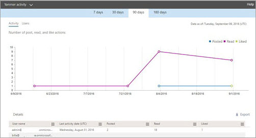
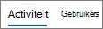
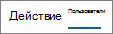

# Microsoft 365-rapporter i administrationscentret – Yammer-aktivitetsrapport

Som Microsoft 365-administratör kan **du i** instrumentpanelen Rapporter se data om användningen av produkter inom organisationen. Titta i [aktivitetsrapporter i administrationscentret](activity-reports.md). Med **Yammer-aktivitetsrapporten** får du förståelse för användningen av Yammer i organisationen genom att titta på antalet unika användare som använder Yammer för att publicera, gilla eller läsa ett meddelande och graden av aktivitet som skapas i organisationen. 
  
> [!NOTE]
> Du måste vara global administratör, global läsare eller rapportläsare i Microsoft 365 eller Exchange-, SharePoint-, Teams-tjänst, Teams Communications- eller Skype för företag-administratör för att kunna se rapporter. 
 
## Komma åt Yammer-aktivitetsrapporten

1. I administrationscentret går du till sidan **Rapporter** \> <a href="https://go.microsoft.com/fwlink/p/?linkid=2074756" target="_blank">Användning</a>.

    
2. I **listrutan Välj en** rapport väljer du **Yammer-aktivitet.** \> 
  
## Tolka Yammer-aktivitetsrapporten

Du kan få inblick i användarnas Yammer-aktivitet genom att titta på diagrammen Aktivitet och Användare.
  

  
Aktivitetsrapporten innehåller följande information.
  
- Använd dagflikarna för att visa **Yammer-aktivitetstrenderna** under de senaste 7, 30, 90 eller 180 dagarna. Men om du väljer en viss dag i rapporten visar tabellen data för de senaste 28 dagarna (inte från det datum då rapporten skapades). 
    
- Varje rapport har ett datum för när rapporten skapades. Rapporterna visar normalt 24 till 48 timmars fördröjning från aktivitetstiden.
    
- Du kan visa diagrammet **Aktivitet** för att bättre förstå trenden med hur mycket Yammer-aktivitet som pågår i organisationen. Du förstår fördelningen av meddelanden som publiceras, läses eller gillas. 
    
    
  
  - I diagrammet **Aktivitet** visar Y-axeln antalet aktiviteter av publicerade, lästa eller gillade meddelanden. 
    
- Du kan visa diagrammet **Användare** för att bättre förstå trenden med mängden unika användare som skapar Yammer-aktiviteter. Du kan titta på trenden av användare som publicerar, läser eller gillar Yammer-meddelanden. 
    
    
  
  - I diagrammet **Användare** visar Y-axeln användare som publicerat, läst eller gillat Yammer-meddelanden. 
    
  - X-axeln i båda diagrammen är det valda datumintervallet för den här specifika rapporten.
    
- Du kan filtrera serierna du ser i diagrammet genom att välja ett objekt i förklaringen. Exempel: I diagrammet **Aktivitet väljer** du **Publicerat**, Läst **eller** **Gillat** om du bara vill se den relaterade informationen. 
    
    
  
    När du ändrar det här valet ändras inte informationen i rutnätstabellen.
    
- Tabellen under diagrammet visar en uppdelning av Yammer-aktiviteter per användare.
    
    Du kan använda menyn till att filtrera och sortera data.
    
    
  
    Du kan också lägga till och ta bort kolumner. De tillgängliga kolumnerna är:
    
  - **Användarnamn** är användarens e-postadress. Du kan visa den faktiska e-postadressen eller göra fältet anonymt. 
    
    I det här rutnätet visas användare som loggat in på Yammer med Microsoft 365-kontot eller som loggat in på nätverket med enkel inloggning.
    
  - **Visningsnamn** är användarens fullständiga namn. Du kan visa den faktiska e-postadressen eller göra fältet anonymt. 
    
  - **Användartillstånd** är ett av tre värden: Aktiverad, Borttagen eller Inaktiverad. 
    
    De här rapporterna visar data för aktiva, inaktiverade och borttagna användare. De avspeglar inte väntande användare eftersom väntande användare inte kan publicera, läsa eller gilla ett meddelande.
    
  - **Datum för statusändring (UTC)** är datumet då användarens status ändrades i Yammer. 
    
  - **Datum för senaste aktivitet (UTC)** anger det senaste datumet då användaren publicerade, läste eller gillade ett meddelande. 
    
  - **Publicerat** är antalet meddelanden som användaren publicerat under den angivna tidsperioden. 
    
  - **Läst** är antalet konversationer som användaren läst under den angivna tidsperioden. 
    
  - **Gillat** är antalet meddelanden som användaren gillat under den angivna tidsperioden. 
    
  - **Tilldelad** produkt är de produkter som har tilldelats till användaren. 
    
    Om organisationens principer förhindrar dig att visa rapporter där användarinformationen är identifierbar kan du ändra sekretessinställningen för alla de här rapporterna. Mer information finns **i avsnittet Hur döljer jag information på användarnivå?** i [Aktivitetsrapporter i administrationscentret för Microsoft 365.](activity-reports.md)
    
- Du kan också exportera rapportdata till en CsV-fil för Excel genom att välja **länken** Exportera. Då exporteras data för alla användare och du kan göra enkel sortering och filtrering för vidare analys. Om du har mindre än 2 000 användare kan du sortera och filtrera i tabellen i själva rapporten. Om du har fler än 2 000 användare måste du exportera data för att kunna filtrera och sortera. 
    
## Vilka data ingår i de här rapporterna?

- **Alla klienter** De här rapporterna samlar data för alla klienter, t.ex. användning av Yammer i en webbläsare eller i en iOS- eller Android-app. 
    
- **Inga externa nätverksdata** Externa nätverksdata tas inte med i rapporterna. 
    
- **Aktiverade nätverk** De här rapporterna visar data för Yammer-nätverket som ingår i Microsoft 365-prenumerationen. Diagrammet sammanställer användningen för alla användare som loggat in på Yammer-nätverket, oavsett om de använde Microsoft 365 eller Yammer när de loggade in. 
    

