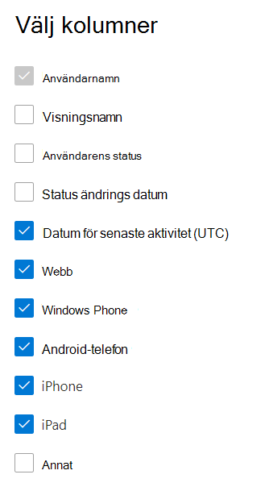

# Microsoft 365-rapporter i administrationscentret – Yammer-enhetsanvändning

På instrumentpanelen Rapporter **i** Microsoft 365 ser du en översikt över aktiviteter i organisationens produkter. Här kan du gå in på detaljnivå i rapporter för enskilda produkter för att få bättre insikter om aktiviteterna inom varje produkt. Ta en titt på [översiktsavsnittet för Rapporter](activity-reports.md).
  
I rapporten om användning av Yammer på enheter hittar du information om vilka enheter användarna använder Yammer på. Du kan visa antalet dagliga användare efter enhetstyp och antalet användare efter enhetstyp. Båda går att visa för en viss tidsperiod. Du kan också visa detaljerad information per användare.
  
> [!NOTE]
> Du måste vara global administratör, global läsare eller rapportläsare i Microsoft 365 eller Exchange-, SharePoint-, Teams-tjänst, Teams Communications- eller Skype för företag-administratör för att kunna se rapporter.  
 
## Hur får jag fram rapporten om användning av Yammer på enheter?

1. I administrationscentret går du till sidan **Rapporter** \> <a href="https://go.microsoft.com/fwlink/p/?linkid=2074756" target="_blank">Användning</a>. 
2. På startsidan för instrumentpanelen klickar du på **knappen Visa** mer på Yammer-kortet.
  
## Tolka rapporten om användning av Yammer på enheter

Du kan visa användningen i OneDrive-rapporten genom att välja **fliken Enhetsanvändning.** 

Välj **Välj kolumner för** att lägga till eller ta bort kolumner i rapporten.    

Du kan också exportera rapportdata till en Excel-CSV-fil genom att välja **länken** Exportera. Då exporteras data för alla användare och du kan göra enkel sortering och filtrering för vidare analys. Om du har mindre än 2 000 användare kan du sortera och filtrera i tabellen i själva rapporten. Om du har fler än 2 000 användare måste du exportera data för att kunna filtrera och sortera. 
  
|Objekt|Beskrivning|
|:-----|:-----|
|**Metrisk**|**Definition**|
|Användarnamn    |Användarens e-postadress. Du kan visa den faktiska e-postadressen eller göra fältet anonymt. I det här rutnätet visas användare som loggat in på Yammer med Microsoft 365-kontot eller som loggat in på nätverket med enkel inloggning.   |
|Visningsnamn    |Användarens fullständiga namn. Du kan visa den faktiska e-postadressen eller göra fältet anonymt.    |
|Användartillstånd    |Ett av tre värden: Aktiv, Borttagna eller Inaktiverad. De här rapporterna visar data för aktiva, inaktiverade och borttagna användare. De avspeglar inte väntande användare eftersom väntande användare inte kan publicera, läsa eller gilla ett meddelande.     |
|Datum för tillståndsändring (UTC)    |Datumet då användarens status ändrades i Yammer.    |
|Datum för senaste aktivitet (UTC)    |Det senaste datum (UTC) då användaren deltog i en Yammer-aktivitet.    |
|Webb    |Anger om användaren har använt Yammer på webben.    |
|Windows Phone    | Anger om användaren har använt Yammer på en Windows-telefon.    |
|Android-telefon    |Anger om användaren har använt Yammer på en Android-telefon.  |
|iphone   | Anger om användaren har använt Yammer på en iPhone.    |
|ipad    |Anger om användaren har använt Yammer på en iPad.  |
|annat    |Anger om användaren har använt Yammer på en annan enhet, inte tidigare.  |
|||