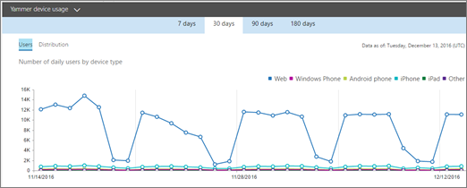
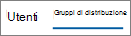
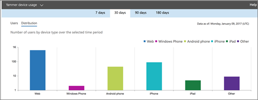

# Microsoft 365-rapporter i administrationscentret – användningsrapport för Yammer-enheterMicrosoft 365 Reports in the admin center - Yammer device usage report

Instrumentpanelen Microsoft 365 **Reports** visar aktivitetsöversikten för produkterna i organisationen.The Microsoft 365 **Reports** dashboard shows you the activity overview across the products in your organization. Här kan du gå in på detaljnivå i rapporter för enskilda produkter för att få bättre insikter om aktiviteterna inom varje produkt.It enables you to drill in to individual product level reports to give you more granular insight about the activities within each product. Ta en titt på [översiktsavsnittet för Rapporter](activity-reports.md).Check out [the Reports overview topic](activity-reports.md).
  
I rapporten om användning av Yammer på enheter hittar du information om vilka enheter användarna använder Yammer på. Du kan visa antalet dagliga användare efter enhetstyp och antalet användare efter enhetstyp. Båda går att visa för en viss tidsperiod. Du kan också visa detaljerad information per användare.The Yammer device usage reports give you information about which devices your users are using Yammer on. You can view the number of daily users by device type, and number of users by device type. You can view both over a selected time period. You can also view details per user.
  
> [!NOTE]
> Du måste vara global administratör, global läsare eller rapportläsare i Microsoft 365 eller exchange-, SharePoint-, Teams-tjänst, Teams Communications eller Skype för företag-administratör för att kunna se rapporter.You must be a global administrator, global reader or reports reader in Microsoft 365 or an Exchange, SharePoint, Teams Service, Teams Communications, or Skype for Business administrator to see reports. 
  
## Hur får jag fram rapporten om användning av Yammer på enheter?How do I get to the Yammer device usage report?

1. I administrationscentret går du till sidan **Rapporter** \> <a href="https://go.microsoft.com/fwlink/p/?linkid=2074756" target="_blank">Användning</a>.In the admin center, go to the **Reports** \> <a href="https://go.microsoft.com/fwlink/p/?linkid=2074756" target="_blank">Usage</a> page.

    
2. Välj Användning av **Yammer-enhet** \> **Device usage**i listrutan **Välj en rapport** .From the **Select a report** drop-down, select **Yammer** \> **Device usage**.
  
## Tolka Yammer-aktivitetsrapportenInterpret the Yammer activity report

Genom att titta på diagrammen **Användare** och **Fördelning** kan du få insyn i användarnas användning av Yammer på sina enheter.You can get a view into your users' Yammer device usage by looking at the **Users** and **Distribution** charts. 
  
Rapporten om användning av enhet innehåller följande information:The device usage report contains the following information.
  
- Använd dagflikarna för att visa aktivitetstrender för **användning av Yammer-enhet** under de senaste 7, 30, 90 eller 180 dagarna.Use the day tabs to view the **Yammer device usage** activity report trends over the last 7 days, 30 days, 90 days, or 180 days. Om du väljer en viss dag i rapporten visas data i upp till 28 dagar från det aktuella datumet (inte det datum då rapporten genererades).However, if you select a particular day in the report, the table will show data for up to 28 days from the current date (not the date the report was generated). 
    
- Varje rapport har ett datum för när rapporten skapades. Rapporterna visar normalt 24 till 48 timmars fördröjning från aktivitetstiden.Each report has a date for when the report was generated. The reports usually reflect a 24 to 48 hour latency from time of activity.
    
- Du kan visa diagrammet **Användare** för att se antalet dagliga användare efter enhetstyp.You can view the **Users** chart to see the number of daily users by device type.  
  
- Du kan visa diagrammet **Fördelning** för att se antalet användare efter enhetstyp.You can view the **Distribution** chart to see the number of users by device type.  
  
- Tabellen **Information** under diagrammet visar en uppdelning av användningen av Yammer på enheter per användare.The **Details** table under the graph shows you a breakdown of the Yammer device usage at the per-user level. 
    
    Du kan också lägga till och ta bort kolumner. De tillgängliga kolumnerna är:You can also add and remove columns. The available columns are:
    
  - **Användarnamn** är användarens e-postadress.**Username** is the email address of the user. Du kan visa den faktiska e-postadressen eller göra fältet anonymt.You can display the actual email address or make this field anonymous. 
    
    Det här rutnätet visar användare som har loggat in på Yammer med Microsoft 365-kontot eller som loggat in på nätverket med enkel inloggning.This grid shows users who logged into Yammer using the Microsoft 365 account or who logged into the network using single sign-on.
    
  - **Visningsnamn** är användarens fullständiga namn. Du kan visa den faktiska e-postadressen eller göra fältet anonymt.**Display name** is the full name of the user. You can display the actual email address or make this field anonymous. 
    
  - **Användartillstånd** är ett av tre värden: Aktiv, Borttagen eller Inaktiverad.**User state** is one of three values: Active, Deleted, or Suspended. 
    
    De här rapporterna visar data för aktiva, inaktiverade och borttagna användare. De avspeglar inte väntande användare eftersom väntande användare inte kan publicera, läsa eller gilla ett meddelande.These reports show data for active, suspended, and deleted users. They do not reflect pending users, because pending users cannot post, read, or like a message.
    
  - **Webben** anger om användaren har använt Yammer på webben.**Web** indicates if the user has used Yammer on the web. 
    
  - **Windows-telefon** anger om användaren har använt Yammer på en Windows-telefon.**Windows phone** indicates if the user has used Yammer on a Windows phone 
    
  - **Android-telefon** anger om användaren har använt Yammer på en Android-telefon.**Android phone** indicates if the user has used Yammer on an Android phone. 
    
  - **iPhone** anger om användaren har använt Yammer på en iPhone.**iPhone** indicates if the user has used Yammer on an iPhone. 
    
  - **iPad** anger om användaren har använt Yammer på en iPad.**iPad** indicates if the user has used Yammer on an iPad. 
    
  - **Annan** anger om användaren har använt Yammer på en annan enhet än ovan.**Other** indicates if the user has used Yammer on another device, not listed previously. 
    
    Om organisationens principer förhindrar dig att visa rapporter där användarinformationen är identifierbar kan du ändra sekretessinställningen för alla de här rapporterna.If your organization's policies prevents you from viewing reports where user information is identifiable, you can change the privacy setting for all these reports. Kolla in avsnittet **Hur döljer jag information på användarnivå?** [Activity Reports in the Microsoft 365 admin center](activity-reports.md)Check out the **How do I hide user level details?** section in the [Activity Reports in the Microsoft 365 admin center](activity-reports.md).
    
- Du kan också exportera rapportdata till en CSV-fil i Excel genom att välja länken **Exportera.**You can also export the report data into an Excel .csv file, by selecting the **Export** link. Då exporteras data för alla användare och du kan göra enkel sortering och filtrering för vidare analys.This exports data of all users and enables you to do simple sorting and filtering for further analysis. Om du har mindre än 2 000 användare kan du sortera och filtrera i tabellen i själva rapporten.If you have less than 2000 users, you can sort and filter within the table in the report itself. Om du har fler än 2 000 användare måste du exportera data för att kunna filtrera och sortera.If you have more than 2000 users, in order to filter and sort, you will need to export the data. 
    

