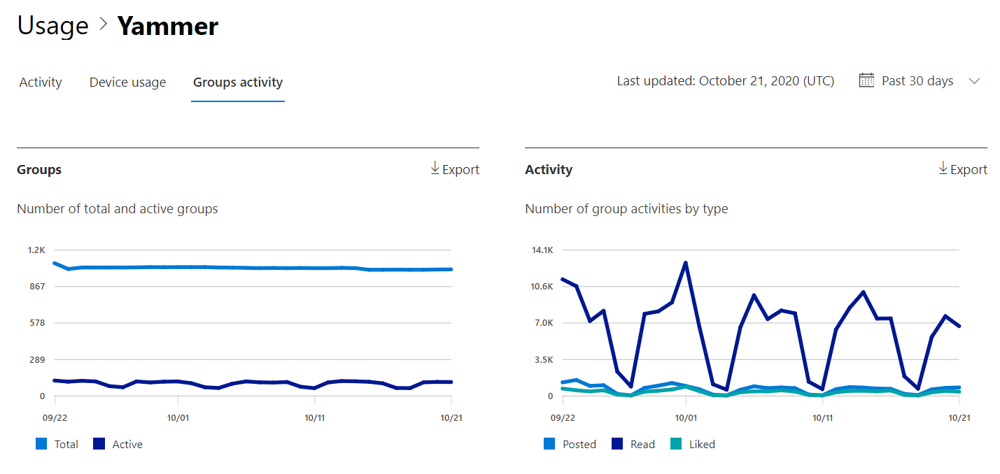

# Microsoft 365-rapporter i administrations Center – aktivitets rapport för Yammer-grupperMicrosoft 365 Reports in the admin center - Yammer groups activity report

Instrument panelen för Microsoft 365- **rapporter** visar en översikt över produkterna i organisationen.The Microsoft 365 **Reports** dashboard shows you the activity overview across the products in your organization. Här kan du gå in på detaljnivå i rapporter för enskilda produkter för att få bättre insikter om aktiviteterna inom varje produkt.It enables you to drill in to individual product level reports to give you more granular insight about the activities within each product. Ta en titt på [översiktsavsnittet för Rapporter](activity-reports.md).Check out [the Reports overview topic](activity-reports.md). I rapporten Aktivitet i Yammer-grupper får du inblick i aktiviteten i Yammer-grupperna i organisationen och du kan se hur många Yammer-grupper som används.In the Yammer groups activity report, you can gain insights into the activity of Yammer groups in your organization and see how many Yammer groups are being created and used.
  
> [!NOTE]
> Du måste vara global administratör, global läsare eller rapport läsare i Microsoft 365 eller en Exchange-, SharePoint-, teams-tjänst, grupp kommunikation eller Skype för företag-administratör för att se rapporter.You must be a global administrator, global reader or reports reader in Microsoft 365 or an Exchange, SharePoint, Teams Service, Teams Communications, or Skype for Business administrator to see reports.  
 
## Hur kommer jag till aktivitets rapporten för Yammer-grupper?How do I get to the Yammer groups activity report?

1. I administrationscentret går du till sidan **Rapporter** \> <a href="https://go.microsoft.com/fwlink/p/?linkid=2074756" target="_blank">Användning</a>.In the admin center, go to the **Reports** \> <a href="https://go.microsoft.com/fwlink/p/?linkid=2074756" target="_blank">Usage</a> page. 
2. Från instrument panelens start sida klickar du på knappen **Visa mer** på Yammer-kortet.From the dashboard homepage, click on the **View more** button on the Yammer card.

  
## Tolka rapporten Aktivitet i Yammer-grupperInterpret the Yammer groups activity report

Du kan visa grupp aktiviteterna i Yammer-rapporten genom att välja fliken **grupper aktivitet** .You can view the groups activities in the Yammer report by choosing the **Groups activity** tab. 

Välj **Välj kolumner** för att lägga till eller ta bort kolumner i rapporten.Select **Choose columns** to add or remove columns from the report.    

Du kan också exportera rapport data till en Excel. csv-fil genom att välja **Exportera** -länken.You can also export the report data into an Excel .csv file by selecting the **Export** link. Då exporteras data för alla användare och du kan göra enkel sortering och filtrering för vidare analys.This exports data of all users and enables you to do simple sorting and filtering for further analysis. Om du har mindre än 2 000 användare kan du sortera och filtrera i tabellen i själva rapporten.If you have less than 2000 users, you can sort and filter within the table in the report itself. Om du har fler än 2 000 användare måste du exportera data för att kunna filtrera och sortera.If you have more than 2000 users, in order to filter and sort, you will need to export the data. 
  
|ObjektItem|BeskrivningDescription|
|:-----|:-----|
|**Mät****Metric**|**Definition****Definition**|
|Grupp namnGroup name    |Namnet på gruppen.The name of the group.   |
|Grupp administratörGroup admin    |Namnet på grupp administratören eller ägaren.The name of the group administrator, or owner.    |
|DeletedDeleted    |Antalet borttagna Yammer-grupper.The number of deleted Yammer groups. Om gruppen tagits bort, men uppvisade aktivitet under rapporteringsperioden visas det i tabellen om här flaggan är satt till sant.If the group is deleted, but had activity in the reporting period it will show up in the grid with this flag set to true.    |
|SkrivType    |Grupp, offentlig eller privat.The type of group, public or private.   |
|Ansluten till Office 365Connected to Office 365    |Anger om Yammer-gruppen också är en Microsoft 365-grupp.Indicates whether the Yammer group is also an Microsoft 365 group.   |
|Datum för senaste aktivitet (UTC)Last activity date (UTC)    | Det senaste datumet som ett meddelande lästes eller gillats av gruppen.The latest date a message was read, posted or liked by the group.    |
|GruppenMembers    | Antalet medlemmar i gruppen.The number of members in the group.    |
|SkickatsPosted    |Antalet meddelanden som publicerats i Yammer-gruppen under rapporterings perioden.The number of messages posted in the Yammer group over the reporting period.  |
|LäsaRead    |Antalet konversationer som lästs i Yammer-gruppen under rapporterings perioden.The number of conversations read in the Yammer group over the reporting period.    |
|GillatLiked    |Antalet meddelanden som gillats i Yammer-gruppen under rapporterings perioden.The number of messages liked in the Yammer group over the reporting period.  |
|Nätverks namnNetwork name    |Det fullständiga namnet på det nätverk som gruppen tillhör.The full name of the network that the group belongs to. |
|||