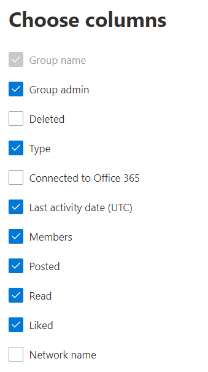

# Microsoft 365-rapporter i administrationscentret – Aktivitet i Yammer-grupper

På instrumentpanelen Rapporter **i** Microsoft 365 ser du en översikt över aktiviteter i organisationens produkter. Här kan du gå in på detaljnivå i rapporter för enskilda produkter för att få bättre insikter om aktiviteterna inom varje produkt. Ta en titt på [översiktsavsnittet för Rapporter](activity-reports.md). I rapporten Aktivitet i Yammer-grupper får du inblick i aktiviteten i Yammer-grupperna i organisationen och du kan se hur många Yammer-grupper som används.
  
> [!NOTE]
> Du måste vara global administratör, global läsare eller rapportläsare i Microsoft 365 eller Exchange-, SharePoint-, Teams-tjänst, Teams Communications- eller Skype för företag-administratör för att kunna se rapporter.  
 
## Hur kommer jag åt rapporten Aktivitet i Yammer-grupper?

1. I administrationscentret går du till sidan **Rapporter** \> <a href="https://go.microsoft.com/fwlink/p/?linkid=2074756" target="_blank">Användning</a>. 
2. På startsidan för instrumentpanelen klickar du på **knappen Visa** mer på Yammer-kortet.

  
## Tolka rapporten Aktivitet i Yammer-grupper

Du kan visa gruppaktiviteterna i Yammer-rapporten genom att välja **fliken Gruppaktivitet.** 

Välj **Välj kolumner för** att lägga till eller ta bort kolumner i rapporten.    

Du kan också exportera rapportdata till en Excel-CSV-fil genom att välja **länken** Exportera. Då exporteras data för alla användare och du kan göra enkel sortering och filtrering för vidare analys. Om du har mindre än 2 000 användare kan du sortera och filtrera i tabellen i själva rapporten. Om du har fler än 2 000 användare måste du exportera data för att kunna filtrera och sortera. 
  
|Objekt|Beskrivning|
|:-----|:-----|
|**Metrisk**|**Definition**|
|Gruppnamn    |Namnet på gruppen.   |
|Gruppadministratör    |Namnet på gruppadministratören eller ägaren.    |
|Borttagen    |Antalet borttagna Yammer-grupper. Om gruppen tagits bort, men uppvisade aktivitet under rapporteringsperioden visas det i tabellen om här flaggan är satt till sant.    |
|Skriv    |Typ av grupp, offentlig eller privat.   |
|Ansluten till Office 365    |Anger om Yammer-gruppen också är en Microsoft 365-grupp.   |
|Datum för senaste aktivitet (UTC)    | Det senaste datumet då ett meddelande lästs, publicerats eller gillats av gruppen.    |
|Medlemmar    | Antalet medlemmar i gruppen.    |
|Publicerad    |Antalet meddelanden som publicerats i Yammer-gruppen under rapporteringsperioden.  |
|Läsa    |Antalet konversationer som lästs i Yammer-gruppen under rapporteringsperioden.    |
|Gillade    |Antalet meddelanden som gillats i Yammer-gruppen under rapporteringsperioden.  |
|Nätverksnamn    |Det fullständiga namnet på nätverket som gruppen tillhör. |
|||