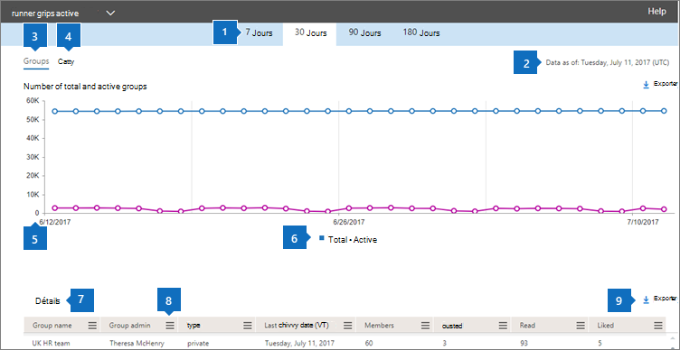
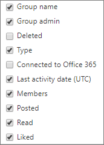

# Microsoft 365-rapporter i administrations Center – aktivitets rapport för Yammer-grupper

Instrument panelen för Microsoft 365- **rapporter** visar en översikt över produkterna i organisationen. Här kan du gå in på detaljnivå i rapporter för enskilda produkter för att få bättre insikter om aktiviteterna inom varje produkt. Ta en titt på [översiktsavsnittet för Rapporter](activity-reports.md). I rapporten Aktivitet i Yammer-grupper får du inblick i aktiviteten i Yammer-grupperna i organisationen och du kan se hur många Yammer-grupper som används.
  
> [!NOTE]
> Du måste vara global administratör, global läsare eller rapport läsare i Microsoft 365 eller en Exchange-, SharePoint-, teams-tjänst, grupp kommunikation eller Skype för företag-administratör för att se rapporter.  

## Komma åt rapporten Aktivitet i Yammer-grupper

1. I administrationscentret går du till sidan **Rapporter** \> <a href="https://go.microsoft.com/fwlink/p/?linkid=2074756" target="_blank">Användning</a>.

    
2. I list rutan **Välj en rapport** väljer du aktivitet i **Yammer** - \> **grupper**.
  
## Tolka rapporten Aktivitet i Yammer-grupper

Du kan få en överblick över aktiviteten i Yammer-grupper genom att titta på diagrammen **Grupper** och **Aktivitet**. 
  
|Objekt|Beskrivning|
|:-----|:-----|
|1.    |I rapporten **Aktivitet i Yammer-grupper** kan du se trender under de senaste 7, 30, 90 eller 180 dagarna. Om du väljer en viss dag i rapporten visar tabellen (7) data för upp till 28 dagar från det aktuella datumet (inte det datum då rapporten genererades).    |
|2.    |Informationen i varje rapport täcker vanligt vis upp till de senaste 24 till 48 timmar.   |
|3.    |I vyn **Grupper** visas det totala antalet grupper som finns och hur många gruppkonversationsaktiviteter som utförts.    |
|4.    |I vyn **Aktivitet** visas hur många Yammer-meddelanden som har publicerats och gillats i grupper.    |
|5.    | I diagrammet **Grupper** är Y-axeln antalet grupper, totalt eller aktiva.     I diagrammet **Aktivitet** är Y-axeln antalet för den angivna aktiviteten för Yammer-grupper.     X-axeln i alla tre diagram är det valda datumintervallet för den specifika rapporten.    |
|18.6.    |Du kan filtrera serien som visas i diagrammet genom att markera ett objekt i förklaringen. I diagrammet **grupper** väljer du till exempel **Summa** eller **aktiv**  för att endast visa den information som är relaterad till var och en.   När du ändrar det här valet ändras inte informationen i rutnätstabellen.    |
|borttagning.    | Listan över grupper som visas bestäms av totala uppsättningen grupper som fanns (inte togs bort) under den längst (180 dagar) rapporterade tidsperioden. Antal meddelanden (mottagna meddelanden) är olika beroende på vilka datum som väljs.    Obs! Du kanske inte ser alla objekt i listan nedan i kolumnerna förrän du lägger till dem. **Gruppnamn** är namnet på gruppen.    **Gruppadministratör** är namnet på gruppadministratören eller ägaren.    **Borttagna** är antalet borttagna Yammer-grupper. Om gruppen tagits bort, men uppvisade aktivitet under rapporteringsperioden visas det i tabellen om här flaggan är satt till sant.    **Typ** är typen av grupp, offentlig eller privat.    **Ansluten till Office 365** anger om Yammer-gruppen också är en Microsoft 365-grupp.    **Datum för senaste aktivitet** är det senaste datumet som ett meddelande lästs, publicerats eller gillats av gruppen.    **Medlemmar** är antalet medlemmar i gruppen.    **Publicerade** är antalet meddelanden som publicerats i Yammer-gruppen under rapporteringsperioden.    **Lästa** är antalet konversationer som lästs i Yammer-gruppen under rapporteringsperioden.    **Gillade** är antalet meddelanden som gillats i Yammer-gruppen under rapporteringsperioden.     Om organisationens principer förhindrar dig att visa rapporter där användarinformationen är identifierbar kan du ändra sekretessinställningen för alla de här rapporterna. Kolla in **hur du döljer användar nivå informationen?** i [aktivitets rapporter i administrations centret för Microsoft 365](activity-reports.md).    |
|8.2.    |Välj **kolumner** för att lägga till eller ta bort kolumner i rapporten.    |
|9.    |Du kan också exportera rapport data till en Excel. csv-fil genom att välja **Exportera** -länken. Då exporteras data för alla användare och du kan göra enkel sortering och filtrering för vidare analys. Om du har mindre än 2 000 användare kan du sortera och filtrera i tabellen i själva rapporten. Om du har fler än 2 000 användare måste du exportera data för att kunna filtrera och sortera.    |
|||
   

