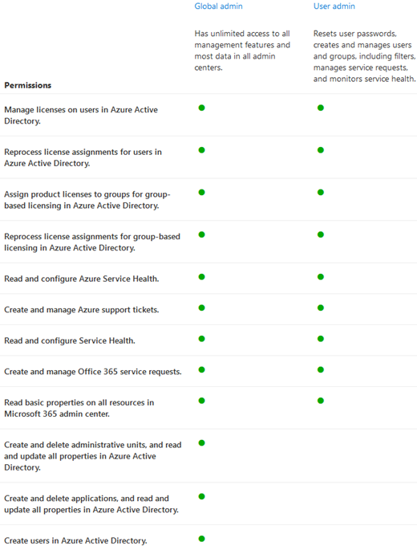

# Komma igång med sidan RollerGet started with the roles page

På sidan Roller kan du ge användare behörighet att utföra uppgifter i administrationscentret.On the Roles page, you can give users permissions to do tasks in the admin centers. Detta hjälper din organisation sprida uppgifter till rätt personer och hjälper till att skydda dina data.This helps your organization spread tasks to the appropriate people and helps keep your data secure.

> [!TIP]
> Letar du efter de detaljerade rollbeskrivningarna?Looking for the detailed role descriptions? Läs mer [i Behörigheter för administratörsroller Azure Active Directory](/azure/active-directory/users-groups-roles/directory-assign-admin-roles#available-roles) Om [administratörsroller.](/microsoft-365/admin/add-users/about-admin-roles)Check out [Administrator role permissions in Azure Active Directory](/azure/active-directory/users-groups-roles/directory-assign-admin-roles#available-roles) and [About admin roles](/microsoft-365/admin/add-users/about-admin-roles).

## Om sidan administratörsrollerAbout the admin roles page

Du kan exportera administratörslistan samt söka och filtrera efter roll.You can export the admin list as well as search and filter by role.

|||
|:-----|:-----|
|    |Använd **exportadministratörslistan** för att få en fullständig lista över alla administratörsanvändare i organisationen.Use **Export admin list** to get a full list of all the admin users in your organization. Listan lagras i en Excel .csv fil.The list is stored in an Excel .csv file.     |
|    |Använd **Sök** för att söka efter en administratörsroll och se vilka användare som har tilldelats den rollen.Use **Search** to search for an admin role and see your users who are assigned to that role.     |
|    |Använd **Filter för** att ändra vyn för visade administratörsroller.Use **Filter** to change your view of displayed admin roles.     |

## Få ut mesta av rollernaGet the most out of the roles

Läs innehållet nedan för mer information om de olika administratörsrollerna och vilka uppgifter rollerna kan utföra i din organisation.Read the content below to learn about the different admin roles and what tasks the roles can perform in your organization.

> [!NOTE]
Det här är inte en uttömmande lista över alla behörigheter som de här rollerna har.This isn't an exhaustive list of all the permissions that these roles have. Klicka på **länken Läs** mer om du vill ha mer information om varje roll.Select the **Learn more** link for more information about each role.

### Exchange-administratörExchange admin

Tilldela rollen Exchange administratör till användare som behöver visa och hantera användarnas e-postlådor, skapa Microsoft 365 och Exchange Online.Assign the Exchange admin role to users who need to view and manage your user's email mailboxes, Microsoft 365 groups and Exchange Online. De kan också öppna och hantera tjänstförfrågningar till Microsoft Support.They can also open and manage service requests to Microsoft support. [Läs merLearn more](/microsoft-365/admin/add-users/about-exchange-online-admin-role)

### Global administratörGlobal admin

Tilldela den globala administratörsrollen till användare som behöver global åtkomst till de flesta hanteringsfunktioner och data i Microsofts onlinetjänster.Assign the global admin role to users who need global access to most management features and data across Microsoft online services. Att ge för många användare global åtkomst är en säkerhetsrisk och vi rekommenderar att du har mellan två och fyra globala administratörer.Giving too many users global access is a security risk and we recommend that you have between 2 and 4 Global admins. Endast globala administratörer kan återställa lösenord för alla användare och lägga till och hantera domäner.Only global admins can reset passwords for all user and add and manage domains. De kan också öppna och hantera tjänstförfrågningar till Microsoft Support.They can also open and manage service requests to Microsoft support . Den person som har registrerat sig för Microsofts onlinetjänster blir automatiskt global administratör. [Läs mer](/microsoft-365/admin/add-users/about-admin-roles#roles-available-in-the-microsoft-365-admin-center)The person who signed up for Microsoft online services automatically becomes a global admin. [Learn more](/microsoft-365/admin/add-users/about-admin-roles#roles-available-in-the-microsoft-365-admin-center)

### Global läsareGlobal reader

Tilldela den globala läsaradministratörsrollen till den användare som behöver visa administratörsfunktioner och inställningar i alla administrationscenter som den globala administratören kan visa.Assign the global reader admin role to user's who need to view admin features and settings in all admin centers that the global admin can view. Den globala läsarens administratörsroll kan inte redigera några inställningar.The global reader admin role can't edit any settings. [Läs merLearn more](/microsoft-365/admin/add-users/about-admin-roles#roles-available-in-the-microsoft-365-admin-center)

### SupportadministratörHelpdesk admin

Tilldela rollen Helpdesk-administratör till användare som vill återställa lösenord, tvinga användarna att logga ut för eventuella säkerhetsproblem.Assign the Helpdesk admin role to users who want to reset passwords, force users to sign out for any security issues. De kan också öppna och hantera tjänstförfrågningar till Microsoft Support.They can also open and manage service requests to Microsoft support. Supportadministratören kan endast hjälpa användare som inte är administratörer och användare som har tilldelats dessa roller: katalogläsare, gäst inbjudare, supportadministratör, läsare av meddelandecenter och läsare av rapporter.The Helpdesk admin can only help non-admin users and users assigned these roles: Directory reader, Guest inviter, Helpdesk admin, Message center reader, and Reports reader. [Läs merLearn more](/microsoft-365/admin/add-users/about-admin-roles#roles-available-in-the-microsoft-365-admin-center)

### TjänstadministratörService admin

Tilldela tjänstadministratörsrollen till användare som behöver skapa tjänstförfrågningar för Azure, Microsoft 365 och Office 365 tjänster.Assign the service admin role to users who need to create service requests for Azure, Microsoft 365, and Office 365 services. [Läs merLearn more](/microsoft-365/admin/add-users/about-admin-roles#roles-available-in-the-microsoft-365-admin-center)

### SharePoint-administratörSharePoint admin

När du köper Microsoft 365 prenumeration skapas en gruppwebbplats automatiskt och den globala administratören anges som primär administratör för webbplatssamlingen.When you purchase a Microsoft 365 subscription, a team site is automatically created, and the global admin is set as the primary site collection administrator. Tilldela rollen SharePoint administratör till användare som du vill ha åtkomst till SharePoint administrationscentret.Assign the SharePoint admin role to users who you want to access to the SharePoint admin center. Användare med rollen SharePoint kan skapa och hantera webbplatssamlingar, utse administratörer för webbplatssamlingar och hantera användarprofiler.Users with the SharePoint admin role can create and manage site collections, designate site collection administrators and manage user profiles. Användare med rollen SharePoint också hantera grupper Microsoft 365 öppna tjänstförfrågningar via Microsoft Support.Users with the SharePoint admin role can also manage Microsoft 365 groups and open service requests through Microsoft support. [Läs merLearn more](/sharepoint/sharepoint-admin-role)

### Teams-tjänstadministratörTeams service admin

Tilldela rollen Teams administratör till användare som du vill komma åt och hantera Teams & Skype administrationscentret.Assign the Teams admin role to users who you want to access and manage the Teams & Skype admin center. Användare med administratörsrollen Teams också hantera grupper Microsoft 365 öppna tjänstförfrågningar via Microsoft Support.Users with the Teams admin role can also manage Microsoft 365 groups and open service requests through Microsoft support. [Läs merLearn more](/MicrosoftTeams/using-admin-roles)

### AnvändaradministratörUser admin

Tilldela användaradministratörsrollen till användare som du vill få åtkomst till och hantera återställningar av användarlösenord samt hantera användare och grupper.Assign the user admin role to users who you want to access and manage user password resets and manage users and groups. De kan också öppna och hantera tjänstförfrågningar till Microsoft Support.They can also open and manage service requests to Microsoft support. [Läs merLearn more](/microsoft-365/admin/add-users/about-admin-roles#roles-available-in-the-microsoft-365-admin-center)

## Jämföra rollerCompare roles

Nu kan du jämföra behörigheter för upp till 3 roller i taget så att du kan hitta den minst tillåtande rollen att tilldela.You can now compare permissions for up to 3 roles at a time so you can find the least permissive role to assign.

I administrationscentret:In the admin center:

- Välj upp till 3 roller och välj **Jämför roller för** att se vilka behörigheter varje roll har.Select up to 3 roles and choose **Compare roles** to see the permissions each role has.

## Relaterat innehållRelated content

[Om Microsoft 365 administratörsroller](about-admin-roles.md) (artikel)[About Microsoft 365 admin roles](about-admin-roles.md) (article)\
[Tilldela administratörsroller](assign-admin-roles.md) (artikel)[Assign admin roles](assign-admin-roles.md) (article)