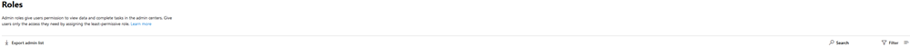

# Komma igång med sidan roller

På sidan roller kan du ge användare behörighet att utföra uppgifter i administrations centret. Det hjälper organisationen att sprida uppgifter till rätt personer och skydda dina data.

> [!TIP]
> Letar du efter de detaljerade rollbeskrivningarna? Läs [behörigheter för administratörs roller i Azure Active Directory](https://docs.microsoft.com/azure/active-directory/users-groups-roles/directory-assign-admin-roles#available-roles) och [om administratörs roller](https://docs.microsoft.com/office365/admin/add-users/about-admin-roles).

## Om sidan administratörs roller

Du kan exportera administratörs listan och söka och filtrera efter rollen.

|||
|:-----|:-----|
|    |Använd **Exportera administratörs lista** för att få en fullständig lista över alla administratörs användare i organisationen. Listan lagras i en Excel. csv-fil.     |
|    |Använd **Sök** funktionen för att söka efter en administratörs roll och se vilka användare som har tilldelats den rollen.     |
|    |Använd **filter** för att ändra din vy av de roller som visas.     |

## Få ut mesta möjliga av dina roller

Läs innehållet nedan för att få mer information om de olika administratörs rollerna och vilka uppgifter som rollerna kan utföra i organisationen.

> [!NOTE]
Det här är inte en fullständig lista över alla behörigheter som de här rollerna har. Välj länken **Läs mer** om du vill ha mer information om varje roll.

### Exchange-administratör

Tilldela rollen Exchange-administratör till användare som behöver visa och hantera din användares e-postpost lådor, Microsoft 365-grupper och Exchange Online. De kan också öppna och hantera tjänst förfrågningar till Microsoft support. [Läs mer](https://docs.microsoft.com/office365/admin/add-users/about-exchange-online-admin-role)

### Global administratör

Tilldela den globala administratörs rollen till användare som behöver global åtkomst till de flesta av Microsofts online tjänster. Att ge för många användare global åtkomst är en säkerhetsrisk och vi rekommenderar att du har mellan två och fyra globala administratörer. Endast globala administratörer kan återställa lösen ord för alla användare och lägga till och hantera domäner. De kan också öppna och hantera tjänst förfrågningar till Microsoft support. Personen som registrerade Microsoft Online-tjänster blir automatiskt global administratör. [Läs mer](https://docs.microsoft.com/office365/admin/add-users/about-admin-roles#roles-available-in-the-microsoft-365-admin-center)

### Global läsare

Koppla rollen som global läsare administratör till användarens vem som behöver Visa administratörs funktioner och-inställningar i alla administratörs Center som den globala administratören kan se. Rollen som global läsare-administratör kan inte redigera några inställningar. [Läs mer](https://docs.microsoft.com/office365/admin/add-users/about-admin-roles#roles-available-in-the-microsoft-365-admin-center)

### Supportadministratör

Tilldela rollen helpdesk-administratör till användare som vill återställa lösen ord, tvinga användare att logga ut vid eventuella säkerhets problem. De kan också öppna och hantera tjänst förfrågningar till Microsoft support. Administratören för supportavdelningen kan bara hjälpa användare som inte är administratörer och användare som har tilldelats dessa roller: Katalog läsare, gäst inbjudningar, helpdesk-administratör, meddelande Center läsare och rapport läsare. [Läs mer](https://docs.microsoft.com/office365/admin/add-users/about-admin-roles#roles-available-in-the-microsoft-365-admin-center)

### Tjänstadministratör

Tilldela tjänst administratörs rollen till användare som behöver skapa tjänst förfrågningar för Azure, Microsoft 365 och Office 365-tjänster. [Läs mer](https://docs.microsoft.com/office365/admin/add-users/about-admin-roles#roles-available-in-the-microsoft-365-admin-center)

### SharePoint-administratör

När du köper en Microsoft 365-prenumeration skapas en grupp webbplats automatiskt och den globala administratören anges som primär administratör för webbplats samlingen. Tilldela administratörs rollen för SharePoint till användare som du vill komma åt i administrations centret för SharePoint. Användare med administratörs rollen för SharePoint kan skapa och hantera webbplats samlingar, ange administratörer för webbplats samlingar och hantera användar profiler. Användare med administratörs rollen för SharePoint kan även hantera Microsoft 365-grupper och öppna service förfrågningar via Microsoft support. [Läs mer](https://docs.microsoft.com/sharepoint/sharepoint-admin-role)

### Teams-tjänstadministratör

Tilldela team administratörs rollen till användare som du vill komma åt och hantera team & administrations centret för Skype. Användare med administratörs rollen team kan även hantera Microsoft 365-grupper och öppna service förfrågningar via Microsoft support. [Läs mer](https://docs.microsoft.com/MicrosoftTeams/using-admin-roles)

### Användaradministratör

Tilldela användar administratörs rollen till användare som du vill komma åt och hantera användar lösen ord för att återställa och hantera användare och grupper. De kan också öppna och hantera tjänst förfrågningar till Microsoft support. [Läs mer](https://docs.microsoft.com/office365/admin/add-users/about-admin-roles#roles-available-in-the-microsoft-365-admin-center)

::: moniker range="o365-worldwide"

## Jämför roller

Du kan nu jämföra behörigheter för upp till 3 roller åt gången så att du kan hitta den minst tillåtna rollen att tilldela.

I Admin Center:

- Välj upp till 3 roller och välj **Jämför roller** för att se de behörigheter som varje roll har.

::: moniker-end

## Relaterade ämnen

[Om administratörsroller i Microsoft 365](about-admin-roles.md)

[Tilldela administratörsroller](assign-admin-roles.md)