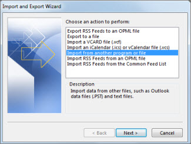

# Få åtkomst till och säkerhetskopiera en tidigare anställds användardata.Get access to and back up a former user's data

När en medarbetare lämnar organisationen vill du förmodligen komma åt deras data (dokument och e-postmeddelanden) och antingen granska dem, säkerhetskopiera den eller ge den till en ny medarbetare.When an employee leaves your organization, you probably want to access their data (documents and emails) and either review it, back it up, or give it to a new employee.
  
    
## Komma åt en tidigare användares OneDrive-dokumentAccess a former user's OneDrive documents

Om du tar bort en användares licens men inte tar bort kontot kan du ge dig själv åtkomst till innehållet på användarens OneDrive.If you remove a user's license but don't delete the account, you can give yourself access to the content in the user's OneDrive. Om du tar bort användarens konto har du 30 dagar som standard att komma åt den tidigare användarens OneDrive-data.If you delete the user's account, you have 30 days by default to access the former user's OneDrive data. [Lär dig hur du ställer in OneDrive-kvarhållningen för borttagna användare](/onedrive/set-retention).[Learn how to set the OneDrive retention for deleted users](/onedrive/set-retention). Om du inte [återställer ett användarkonto](/office365/admin/add-users/restore-user) inom den här tiden tas deras OneDrive-innehåll bort.If you don't [restore a user account](/office365/admin/add-users/restore-user) within this time, their OneDrive content is deleted. 

Om du vill bevara en tidigare användares OneDrive-filer ger du dig först åtkomst till deras OneDrive och flyttar sedan de filer du vill behålla.To preserve a former user's OneDrive files, first give yourself access to their OneDrive, and then move the files you want to keep. 

::: moniker range="o365-worldwide"

1. I administrationscentret går du till sidan **Användare** \> <a href="https://go.microsoft.com/fwlink/p/?linkid=834822" target="_blank">Aktiva användare</a>.In the admin center, go to the **Users** \> <a href="https://go.microsoft.com/fwlink/p/?linkid=834822" target="_blank">Active users</a> page.  
    
2. Välj en användare.Select a user.

3. Välj **OneDrive**i den högra rutan .In the right pane, select **OneDrive**. Under **Hämta åtkomst till filer**väljer du Skapa länk till **filer**.Under **Get access to files**, select **Create link to files**.

4. Välj länken för att öppna filplatsen.Select the link to open the file location. Hämta filerna till datorn eller välj **Flytta till** eller Kopiera **för att** flytta eller kopiera dem till din egen OneDrive eller till ett delat bibliotek.Download the files to your computer, or select **Move to** or **Copy to** to move or copy them to your own OneDrive or to a shared library. 

> [!NOTE]
> Du kan flytta eller kopiera upp till 500 MB filer och mappar åt gången.You can move or copy up to 500 MB of files and folders at a time. 
> När du flyttar eller kopierar dokument som har versionshistorik flyttas bara den senaste versionen.When you move or copy documents that have version history, only the latest version is moved.  

::: moniker-end

::: moniker range="o365-germany"

1. I administrationscentret går du till sidan **Användare** \> <a href="https://go.microsoft.com/fwlink/p/?linkid=847686" target="_blank">Aktiva användare</a>.In the admin center, go to the **Users** \> <a href="https://go.microsoft.com/fwlink/p/?linkid=847686" target="_blank">Active users</a> page.  

2. Välj en användare.Select a user.

3. Expandera **OneDrive-inställningar i**den högra rutan och välj sedan **Access-filer bredvid** **Access**.In the right pane, expand **OneDrive Settings**, and then next to **Access**, select **Access files**.

4. Välj länken för att öppna filplatsen.Select the link to open the file location. Hämta filerna till datorn eller välj **Flytta till** eller Kopiera **för att** flytta eller kopiera dem till din egen OneDrive eller till ett delat bibliotek.Download the files to your computer, or select **Move to** or **Copy to** to move or copy them to your own OneDrive or to a shared library. 

> [!NOTE]
> Du kan flytta eller kopiera upp till 500 MB filer och mappar åt gången.You can move or copy up to 500 MB of files and folders at a time. 
> När du flyttar eller kopierar dokument som har versionshistorik flyttas bara den senaste versionen.When you move or copy documents that have version history, only the latest version is moved.  

::: moniker-end

::: moniker range="o365-21vianet"

1. I administrationscentret går du till sidan **Användare** \> <a href="https://go.microsoft.com/fwlink/p/?linkid=850628" target="_blank">Aktiva användare</a>.In the admin center, go to the **Users** \> <a href="https://go.microsoft.com/fwlink/p/?linkid=850628" target="_blank">Active users</a> page. 

2. Välj en användare.Select a user.

3. Expandera **OneDrive-inställningar i**den högra rutan och välj sedan **Access-filer bredvid** **Access**.In the right pane, expand **OneDrive Settings**, and then next to **Access**, select **Access files**.

4. Välj länken för att öppna filplatsen.Select the link to open the file location. Hämta filerna till datorn eller välj **Flytta till** eller Kopiera **för att** flytta eller kopiera dem till din egen OneDrive eller till ett delat bibliotek.Download the files to your computer, or select **Move to** or **Copy to** to move or copy them to your own OneDrive or to a shared library.  

> [!NOTE]
> Du kan flytta eller kopiera upp till 500 MB filer och mappar åt gången.You can move or copy up to 500 MB of files and folders at a time. 
> När du flyttar eller kopierar dokument som har versionshistorik flyttas bara den senaste versionen.When you move or copy documents that have version history, only the latest version is moved.  

::: moniker-end
    

## Återkalla administratörsåtkomst till en användares OneDriveRevoke admin access to a user's OneDrive

Som global administratör kan du ge dig själv tillgång till innehållet på en användares OneDrive, men du kanske vill ta bort din åtkomst när du inte längre behöver det.As global admin, you can give yourself access to the content in a user's OneDrive, but you may want to remove your access when you no longer need it. 

::: moniker range="o365-worldwide"

1. Logga in på <a href="https://go.microsoft.com/fwlink/p/?linkid=2024339" target="_blank">administrationscentret</a> som global administratör eller SharePoint-administratör.Sign in to the <a href="https://go.microsoft.com/fwlink/p/?linkid=2024339" target="_blank">admin center</a> as a global admin or SharePoint admin. 

    Om du får ett meddelande om att du inte har behörighet att komma åt administrationscentret har du inte administratörsbehörighet i organisationen.If you get a message that you don't have permission to access the admin center, then you don't have administrator permissions in your organization.

::: moniker-end

::: moniker range="o365-germany"

1. Logga in på <a href="https://go.microsoft.com/fwlink/p/?linkid=848041" target="_blank">administrationscentret</a> som global administratör eller SharePoint-administratör.Sign in to the <a href="https://go.microsoft.com/fwlink/p/?linkid=848041" target="_blank">admin center</a> as a global admin or SharePoint admin.

    Om du får ett meddelande om att du inte har behörighet att komma åt administrationscentret har du inte administratörsbehörighet i organisationen.If you get a message that you don't have permission to access the admin center, then you don't have administrator permissions in your organization.

::: moniker-end

::: moniker range="o365-21vianet"

1. Logga in på <a href="https://go.microsoft.com/fwlink/p/?linkid=850627" target="_blank">administrationscentret</a> som global administratör eller SharePoint-administratör.Sign in to the <a href="https://go.microsoft.com/fwlink/p/?linkid=850627" target="_blank">admin center</a> as a global admin or SharePoint admin.

    Om du får ett meddelande om att du inte har behörighet att komma åt administrationscentret har du inte administratörsbehörighet i organisationen.If you get a message that you don't have permission to access the admin center, then you don't have administrator permissions in your organization.

::: moniker-end

2. Välj **Administrationscenter** \> **SharePoint**i den vänstra rutan .In the left pane, select **Admin centers** \> **SharePoint**. (Du kan behöva välja **Visa alla** för att se listan över administrationscenter.)(You might need to select **Show all** to see the list of admin centers.)

3. Om det klassiska Administrationscentret för SharePoint visas väljer du **Öppna det högst** upp på sidan för att öppna administrationscentret för SharePoint.If the classic SharePoint admin center appears, select **Open it now** at the top of the page to open the SharePoint admin center.

4. Välj **Fler funktioner**i den vänstra rutan .In the left pane, select **More features**.

5. Under **Användarprofiler**väljer du **Öppna**.Under **User profiles**, select **Open**.

6. Under **Kontakter**väljer du **Hantera användarprofiler**.Under **People**, select **Manage User Profiles**.

7. Ange användarens namn och välj **Sök**.Enter the user's name and select **Find**.

8. Högerklicka på användaren och välj sedan **Hantera webbplatssamlingsägare**.Right-click the user, and then choose **Manage site collection owners**.

9. Ta bort personen som inte längre behöver åtkomst till användarens data och välj sedan **OK**.Remove the person who no longer needs access to the user's data, and then select **OK**.

    
## Komma åt Outlook-data för en tidigare användareAccess the Outlook data of a former user

Om du vill spara e-postmeddelanden, kalender, uppgifter och kontakter för den tidigare medarbetaren exporterar du informationen till en Outlook-datafil (.pst).To save the email messages, calendar, tasks, and contacts of the former employee, export the information to an Outlook Data File (.pst).
  
1. [Lägg till den tidigare anställdes e-post](https://support.microsoft.com/office/6e27792a-9267-4aa4-8bb6-c84ef146101b) i Outlook (Om du [återställer användarens lösenord](reset-passwords.md)kan du ställa in det till något som bara du vet.)[Add the former employee's email](https://support.microsoft.com/office/6e27792a-9267-4aa4-8bb6-c84ef146101b) to your Outlook (If you [reset the user's password](reset-passwords.md), you can set it to something only you know.)
    
2. Välj **Arkiv**i Outlook .In Outlook, select **File**.
    
    
  
3. Välj **Öppna &amp; Exportera** \> **import/export**.Select **Open &amp; Export** \> **Import/Export**.
    
    
  
4. Välj **Exportera till en fil**och välj sedan **Nästa**.Select **Export to a file**, and then select **Next**.
    
    
  
5. Välj **Outlook-datafil (.pst)** och välj sedan **Nästa**.Select **Outlook Data File (.pst)**, and then select **Next**.
    
6. Välj det konto som du vill exportera genom att välja namn eller e-postadress, till exempel Brevlåda - Anne Weiler eller anne@contoso.com.Select the account you want to export by selecting the name or email address, such as Mailbox - Anne Weiler or anne@contoso.com. Om du vill exportera allt i ditt konto, inklusive e-post, kalender, kontakter, uppgifter och anteckningar, kontrollerar du att kryssrutan **Inkludera undermappar** är markerad.If you want to export everything in your account, including mail, calendar, contacts, tasks, and notes, make sure the **Include subfolders** check box is selected. 
    
    > [!NOTE]
    > Du kan exportera ett konto i taget.You can export one account at a time. Om du vill exportera flera konton upprepar du dessa steg när ett konto har exporterats.If you want to export multiple accounts, after one account is exported, repeat these steps. 
  
    
  
7. Välj **Nästa**.Select **Next**.
    
8. Välj **Bläddra** för att välja var Outlook-datafilen (.pst) ska sparas.Select **Browse** to select where to save the Outlook Data File (.pst). Skriv ett *filnamn*och välj sedan **OK** för att fortsätta.Type a  *file name*, and then select **OK** to continue. 
    
    > [!NOTE]
    > Om du har exporterat tidigare visas den förra mappsökvägen och filnamnet.If you've used export before, the previous folder location and file name appear. Skriv ett *annat filnamn* innan du väljer **OK**.Type a  *different file name*  before selecting **OK**. 
  
9. Om du exporterar till en befintlig Outlook-datafil (.pst) anger du vad du vill göra under **Alternativ** när du exporterar objekt som redan finns i filen.If you are exporting to an existing Outlook Data File (.pst), under **Options**, specify what to do when exporting items that already exist in the file.
    
10. Välj **Slutför**.Select **Finish**.
    
Outlook påbörjar exporten direkt om du inte skapar en ny Outlook-datafil (.pst) eller använder en lösenordskyddad fil.Outlook begins the export immediately unless a new Outlook Data File (.pst) is created or a password-protected file is used.
  
   - Om du skapar en Outlook-datafil (.pst) kan du skydda filen med ett lösenord.If you're creating an Outlook Data File (.pst), an optional password can help protect the file. När dialogrutan **Skapa Outlook-datafil** visas skriver du *lösenordet* i rutorna **Lösenord** och **Verifiera lösenord** och väljer sedan **OK**.When the **Create Outlook Data File** dialog box appears, type the  *password*  in the **Password** and **Verify Password** boxes, and then select **OK**. Skriv *lösenordet*i dialogrutan **Lösenord för Outlook-datafil** och välj sedan **OK**.In the **Outlook Data File Password** dialog box, type the  *password*, and then select **OK**.
    
  - Om du exporterar till en befintlig Outlook-datafil (.pst) som är lösenordsskyddad skriver du *lösenordet*i dialogrutan **Lösenord för Outlook-datafil** och väljer sedan **OK**.If you're exporting to an existing Outlook Data File (.pst) that is password protected, in the **Outlook Data File Password** dialog box, type the  *password*, and then select **OK**.
    
Lär dig hur du [exporterar eller säkerhetskopierar e-post, kontakter och kalender till en PST-fil](https://support.microsoft.com/office/14252b52-3075-4e9b-be4e-ff9ef1068f91) i Outlook 2010.See how to [Export or backup email, contacts, and calendar to an Outlook .pst file](https://support.microsoft.com/office/14252b52-3075-4e9b-be4e-ff9ef1068f91) in Outlook 2010. 
  
  
  > [!NOTE]
  > Som standard är din e-post tillgänglig offline under en period av 12 månader.By default, your email is available offline for a period of 12 months. Om det behövs kan du se hur du [ökar tillgängliga data offline](Https://docs.microsoft.com/outlook/troubleshoot/mailboxes/only-subset-items-synchronized).If required, see how to [increase the data available offline](Https://docs.microsoft.com/outlook/troubleshoot/mailboxes/only-subset-items-synchronized).
 
## Ge en annan användare åtkomst till en tidigare användares e-postadressGive another user access to a former user's email 

Om du vill ge åtkomst till den tidigare medarbetarens e-postmeddelanden, kalender, uppgifter och kontakter till en annan medarbetare importerar du informationen till en annan medarbetares Outlook-inkorg.To give access to the email messages, calendar, tasks, and contacts of the former employee to another employee, import the information to another employee's Outlook inbox.

> [!NOTE]
> Du kan också [konvertera den tidigare användarens postlåda till en delad postlåda](https://docs.microsoft.com/office365/admin/email/convert-user-mailbox-to-shared-mailbox) eller [vidarebefordra en tidigare anställds e-post till en annan anställd](https://docs.microsoft.com/office365/admin/add-users/remove-former-employee#forward-a-former-employees-email-to-another-employee-or-convert-to-a-shared-mailbox).You can also [convert the former user's mailbox to a shared mailbox](https://docs.microsoft.com/office365/admin/email/convert-user-mailbox-to-shared-mailbox) or [forward a former employee's email to another employee](https://docs.microsoft.com/office365/admin/add-users/remove-former-employee#forward-a-former-employees-email-to-another-employee-or-convert-to-a-shared-mailbox).

  
1. Gå till **File** \> \*\* &amp; Filöppnad\*\* \> **exportimport/export**i Outlook .In Outlook, go to **File** \> **Open &amp; Export** \> **Import/Export**.
    
    När du gör det startas Import-/exportguiden.This starts the Import and Export Wizard.
    
2. Välj **Importera från ett annat program eller en annan fil**och välj sedan **Nästa**.Select **Import from another program or file**, and then select **Next**.
    
    
  
3. Välj **Outlook-datafil (.pst)** och välj **Nästa**.Select **Outlook Data File (.pst)**, and select **Next**.
    
4. Bläddra till .pst-filen som du vill importera.Browse to the .pst file you want to import.
    
5. Under **Alternativ**väljer du hur du vill hantera dubbletterUnder **Options**, choose how you want to deal with duplicates
    
6. Välj **Nästa**.Select **Next**.
    
7. Om ett lösenord har tilldelats Outlook-datafilen (.pst) anger du lösenordet och väljer sedan **OK**.If a password was assigned to the Outlook Data File (.pst), enter the password, and then select **OK**.
    
8. Ange alternativen för importen av objekten.Set the options for importing items. Vanligtvis behöver du inte ändra standardinställningarna.The default settings usually don't need to be changed.
    
9. Välj **Slutför**.Select **Finish**.

> [!NOTE]
> Stegen förblir desamma för åtkomst till en befintlig användares OneDrive- och e-postdata.The steps remain the same for accessing an existing user's OneDrive and email data.
    
> [!TIP]
> Om du bara vill importera eller återställa ett fåtal objekt från en Outlook-datafil (.pst) kan du öppna Outlook-datafilen.If you want to import or restore only a few items from an Outlook Data File (.pst), you can open the Outlook Data File. Dra sedan objekten från Outlook-datafilsmappar till befintliga Outlook-mappar i navigeringsfönstret.Then, in the navigation pane, drag the items from Outlook Data File folders to your existing Outlook folders. 
  
  
## Relaterade artiklarRelated articles
[Ta bort en tidigare anställd från Office 365Remove a former employee from Office 365](remove-former-employee.md)

[Lägga till och ta bort administratörer på ett OneDrive-kontoAdd and remove admins on a OneDrive account](/sharepoint/manage-user-profiles#add-and-remove-admins-for-a-users-onedrive)

[Återställa en borttagen OneDriveRestore a deleted OneDrive](/onedrive/restore-deleted-onedrive)
  
[Bevarande och borttagning av OneDriveOneDrive retention and deletion](/onedrive/retention-and-deletion)
  
