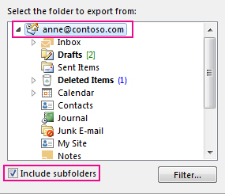

# Steg 4 – Ge en annan anställd tillgång OneDrive och Outlook data

När en anställd lämnar organisationen ska du komma åt deras OneDrive och Outlook-data, backa dem och välja om du vill ge dem till en annan anställd.
  
## Komma åt en tidigare anställds OneDrive dokument

Om du tar bort en användares licens men inte tar bort kontot kan du ge dig själv åtkomst till innehållet i användarens OneDrive. Om du tar bort användarens konto har du som standard 30 dagar på dig att få åtkomst till den tidigare användarens OneDrive data. [Lär dig hur du OneDrive bevarande för borttagna användare.](/onedrive/set-retention) Om du inte återställer [ett användarkonto inom den](/office365/admin/add-users/restore-user) tiden tas OneDrive bort användarens innehåll.

Om du vill bevara en tidigare OneDrive måste du först ge dig själv åtkomst till deras OneDrive och sedan flytta de filer du vill behålla.

1. I administrationscentret går du till sidan **Användare** \> <a href="https://go.microsoft.com/fwlink/p/?linkid=834822" target="_blank">Aktiva användare</a>.  

2. Välj en användare.

3. I det högra fönstret väljer **du OneDrive**. Under **Få åtkomst till filer** väljer du Skapa länk till **filer**.

4. Klicka på länken för att öppna filens plats. Ladda ned filerna till datorn  eller  välj Flytta till eller Kopiera för att flytta eller kopiera dem till din egen OneDrive eller till ett delat bibliotek.

> [!NOTE]
> Du kan flytta eller kopiera upp till 500 MB filer och mappar i taget. 
> När du flyttar eller kopierar dokument som har versionshistorik flyttas bara den senaste versionen.  

### Återkalla administratörsåtkomst till en användares OneDrive

Du kan ge dig själv åtkomst till innehållet i en användares OneDrive, men du kanske vill ta bort åtkomsten när du inte längre behöver den.

1. Logga in i <a href="https://go.microsoft.com/fwlink/p/?linkid=2024339" target="_blank">administrationscentret som</a> global administratör eller SharePoint administratör.

    Om du får ett meddelande om att du inte har behörighet att komma åt administrationscentret har du inte administratörsbehörighet i din organisation.

2. I den vänstra rutan väljer du **Administrationscenter** \> **SharePoint**. (Eventuellt måste du välja **Visa alla för** att listan över administrationscenter ska visas.)

3. Om det klassiska SharePoint administrationscentret visas väljer du **Öppna nu** högst upp på sidan för att SharePoint administrationscentret.

4. I det vänstra fönstret väljer du **Fler funktioner.**

5. Under **Användarprofiler** väljer du **Öppna**.

6. Under **Personer** väljer du **Hantera användarprofiler.**

7. Ange användarens namn och välj **Sök**.

8. Högerklicka på användaren och välj sedan Hantera **webbplatssamlingens ägare.**

9. Ta bort den person som inte längre behöver åtkomst till användarens data och välj sedan **OK.**

## Komma åt Outlook för en tidigare användare

Om du vill spara den tidigare anställdas e-postmeddelanden, kalender, uppgifter och kontakter exporterar du informationen till en Outlook (.pst).
  
1. [Lägg till den tidigare anställdas](https://support.microsoft.com/office/6e27792a-9267-4aa4-8bb6-c84ef146101b) e-postadress i ditt Outlook (Om du återställer användarens lösenord kan du ställa in det på något som bara du känner till.)

2. I Outlook väljer du **Arkiv**.

    
  
3. Välj **Öppna &amp; export** \> **Import/Export**.

    
  
4. Välj **Exportera till en fil** och välj sedan **Nästa.**

    
  
5. Välj **Outlook (.pst) och** välj sedan **Nästa**.

6. Välj det konto som du vill exportera genom att välja namn eller e-postadress, till exempel Postlåda – Anna Weiler eller anne@contoso.com. Om du vill exportera allt på ditt konto, inklusive e-post, kalender, kontakter, uppgifter och anteckningar markerar du kryssrutan Inkludera undermappar. 

    > [!NOTE]
    > Du kan exportera ett konto i taget. Om du vill exportera flera konton upprepar du stegen efter att ett konto exporterats.
  
    
  
7. Välj **Nästa**.

8. Välj **Bläddra** och välj var du vill spara Outlook datafilen (.pst). Skriv ett  *filnamn och* välj sedan **OK för** att fortsätta.

    > [!NOTE]
    > Om du har exporterat tidigare visas den förra mappsökvägen och filnamnet. Skriv in *ett annat filnamn innan* du väljer **OK.**
  
9. Om du exporterar till en befintlig Outlook-datafil (.pst) anger du vad du vill göra under **Alternativ** när du exporterar objekt som redan finns i filen.

10. Välj **Slutför**.

Outlook påbörjar exporten direkt om du inte skapar en ny Outlook-datafil (.pst) eller använder en lösenordskyddad fil.
  
- Om du skapar en Outlook-datafil (.pst) kan du skydda filen med ett lösenord. När dialogrutan **Outlook datafil** visas anger du  lösenordet i  rutorna Lösenord och Bekräfta lösenord och väljer sedan  **OK.** Skriv **lösenordet Outlook i dialogrutan** Ändra datafilslösenord *och* välj sedan **OK.**

- Om du exporterar till en befintlig Outlook-datafil (.pst) som är lösenordsskyddad skriver du lösenordet i dialogrutan lösenord för **Outlook-datafil** och väljer sedan **OK.**

Se hur du [exporterar eller säkerhetskopierar e-post,](https://support.microsoft.com/office/14252b52-3075-4e9b-be4e-ff9ef1068f91) kontakter och kalender till Outlook .pst-fil i Outlook 2010.

  > [!NOTE]
  > Som standard är din e-post tillgänglig offline under en period på 12 månader. Om det behövs kan du se hur [du kan öka de data som är tillgängliga offline](/outlook/troubleshoot/mailboxes/only-subset-items-synchronized).

### Ge en annan användare åtkomst till en tidigare anställds e-post

Om du vill ge åtkomst till e-postmeddelanden, kalender, uppgifter och kontakter hos den tidigare anställde till en annan anställd importerar du informationen till en annan anställds e-Outlook inkorg.

> [!NOTE]
> Du kan också [konvertera den tidigare användarens postlåda till en](/office365/admin/email/convert-user-mailbox-to-shared-mailbox) delad postlåda eller vidarebefordra en tidigare [anställds e-post till en annan anställd.](/office365/admin/add-users/remove-former-employee#forward-a-former-employees-email-to-another-employee-or-convert-to-a-shared-mailbox)

1. Gå Outlook öppna Öppna **export i** \> **&amp; Import/Export** \> .

    När du gör det startas Import-/exportguiden.

2. Välj **Importera från ett annat program eller en** fil och välj sedan **Nästa.**

    
  
3. Välj **Outlook (.pst) och** välj **Nästa**.

4. Bläddra till .pst-filen som du vill importera.

5. Välj **hur** dubbletter ska hanteras under Alternativ

6. Välj **Nästa**.

7. Om datafilen (.pst) har tilldelats Outlook ett lösenord anger du lösenordet och väljer **sedan OK.**

8. Ange alternativen för importen av objekten. Vanligtvis behöver du inte ändra standardinställningarna.

9. Välj **Slutför**.

> [!NOTE]
> Stegen förblir desamma för åtkomst till en befintlig användares e-OneDrive och e-postdata.

> [!TIP]
> Om du bara vill importera eller återställa ett fåtal objekt från en Outlook-datafil (.pst) kan du öppna den Outlook datafilen. I navigeringsfönstret drar du sedan objekten från mapparna Outlook datafil till dina befintliga Outlook mappar. 

## Relaterade artiklar

[Lägga till och ta bort administratörer på ett OneDrive konto](/sharepoint/manage-user-profiles#add-and-remove-admins-for-a-users-onedrive)

[Återställa en borttagna OneDrive](/onedrive/restore-deleted-onedrive)
  
[OneDrive och ta bort](/onedrive/retention-and-deletion)
