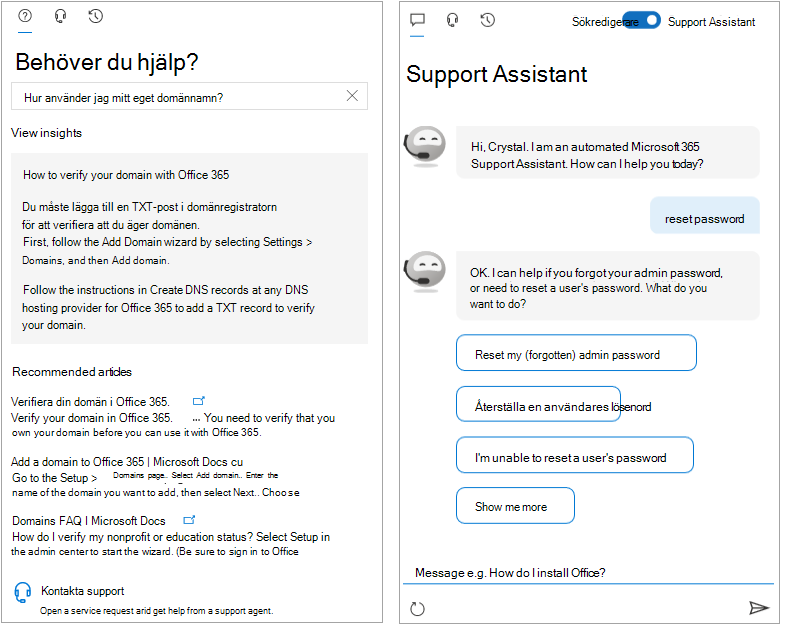

<!-- The following is just placeholder text from Madhura's mail. We need to add images/examples of each -->

# Få hjälp i administrationscentret för Microsoft 365How to get help in the Microsoft 365 admin center

Om du är administratör kan [admin.microsoft.com](https://admin.microsoft.com) att hantera och få ut mesta av Microsoft 365-prenumerationen.If you're an admin, [admin.microsoft.com](https://admin.microsoft.com) is your go-to place to manage and make the most of your Microsoft 365 subscription. Ibland kanske du inte hittar rätt aktivitet, behöver mer kontext innan du tar dig an ett aktivitetsflöde eller så är du helt enkelt osäker på omfattningen och effekten av dina åtgärder som administratör. För att hantera dessa situationer tillhandahåller vi modern hjälp och intelligent hjälp i administrationscentret för Microsoft 365 på följande sätt:Sometimes you might not find the right task, need more context before embarking on a task flow, or simply might not be sure of the scope and impact of your actions as an admin. To cover those situations, we provide modern help and intelligent assistance throughout the Microsoft 365 admin center in these ways:

* **Integrerad hjälp** – hjälp i administrationscentret**Integrated help** - help in the admin center

* **Intelligent hjälp** – självhjälp som drivs av AI**Intelligent assistance** - self-help powered by AI

* **Guider och artiklar** – omfattande innehåll på webben**Guides and articles** - comprehensive content on the web

## Integrerad hjälpIntegrated help

Hjälpen är integrerad i administrationscentret så den finns där när du behöver den.Help is integrated throughout the admin center, so it's right there when you need it. Längst upp på många sidor hittar du direkt hjälptext som ger en informationsöversikt över den handbaserade uppgiften, samt länkar till artiklar som gör att du snabbt kan hitta officiell dokumentation för mer ingående inlärning.At the top of many pages, you'll find inline help text that provides an informational overview of the task at hand, as well as links to articles that let you quickly find official documentation for more in-depth learning.

## Modern självhjälp som drivs av AIModern self-help powered by AI

Om du vill öppna den moderna självhjälpsupplevelsen som  drivs av artificiell intelligens väljer du knappen Behöver hjälp i administrationscentret för Microsoft 365.To open our modern self-help experience that’s powered by artificial intelligence, select the **Need Help** button in the Microsoft 365 admin center. Om du till exempel söker efter "verifiera min domän" får du de steg och ett par artiklar som vi tror kan hjälpa dig.For example, if you search for "verify my domain", you'll get the steps plus a few articles that we think will help you. Vi använder maskininlärning för att ta fram den närmaste lösningen som har hjälpte andra administratörer som har angett liknande frågor.We use machine learning to surface the closest solution that has helped other admins who have entered similar queries.

Eller använd Supportassistenten för de tillfällen då du inte riktigt vet hur du ska få något gjort i din specifika situation.Or, for those times when you don't quite know how to get something done in your specific situation, use the Support Assistant. För närvarande är den här versionen endast tillgänglig på engelska.Currently, this experience is available only in English. Om du vill aktivera supportassistenten använder du växlingsknappen högst upp i **fönstret Behöver** hjälp.To turn on Support Assistant, just use the toggle at the top of the **Need Help** pane. Supportassistenten har ett konversationsgränssnitt som kan hjälpa dig.The Support Assistant provides a conversational interface to help you. När du har matat in frågan ställer chattboten förtydligande frågor för att du ska få rätt svar för din specifika situation.After you enter your query, the chatbot asks clarifying questions to get you to the right answer for your specific situation. Se det som din virtuella hjälp att hitta lösningar och utföra uppgifter.Think of it as your virtual helper to discover solutions and complete tasks.

Ibland besvaras förstås frågor bäst av människor.Of course, sometimes questions are best answered by humans. Om vår moderna självhjälp inte har svaret kan du alltid kontakta vår supportagent.If our modern self-help doesn't have the answer, you always have the option to contact our support agents.

## Guider och artiklarGuides and articles

Om du dessutom letar efter omfattande distributionsguider, snabba steg-för-steg-procedurer eller PowerShell-cmdlets kan du slå upp oss på webben.Additionally, if you're looking for comprehensive deployment guides, quick step-by-step procedures, or PowerShell cmdlets, look us up on the web. Vi uppdaterar innehåll ofta och försöker ge dig den senaste informationen.We update content frequently and try to provide you with the latest information. Kolla in våra artiklar och guider på webbplatsen [för dokumentation för Microsoft 365.](../../index.yml)Check out our articles and guides on the [Microsoft 365 Documentation](../../index.yml) site.