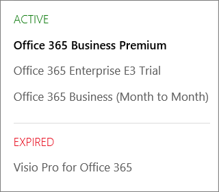

# Vilken prenumeration har jag?What subscription do I have?

Om du är administratör kan du kontrol lera vilka prenumerationer din organisation har genom att gå till administrations centret.If you're an admin, you can verify which subscriptions your organization has by going to the admin center.
  
 **Är du inte administratör?****Not an admin?** Se [vilken Microsoft 365 för företag-produkt eller-licens har jag?](https://support.microsoft.com/office/f8ab5e25-bf3f-4a47-b264-174b1ee925fd)See [What Microsoft 365 for business product or license do I have?](https://support.microsoft.com/office/f8ab5e25-bf3f-4a47-b264-174b1ee925fd)

::: moniker range="o365-worldwide"

1. I administrationscentret går du till sidan **Fakturering** \> <a href="https://go.microsoft.com/fwlink/p/?linkid=842054" target="_blank">Dina produkter</a>.In the admin center, go to the **Billing** \> <a href="https://go.microsoft.com/fwlink/p/?linkid=842054" target="_blank">Your products</a> page.
2. På fliken **produkter** ser du alla dina abonnemang.On the **Products** tab, you see all your subscriptions. Varje abonnemangs rad innehåller information om licenser, prenumerations status och fakturering.Each subscription line includes information about licenses, subscription status, and billing.
3. Om du vill ändra kolumnerna som visas i listan väljer du **Välj kolumner**.If you want to change the columns that appear in the list, select **Choose columns**. Ändra kolumn markeringen och välj sedan **Spara**.Change the selection of columns, then select **Save**.
4. Om du vill visa mer information om en enda prenumeration väljer du den prenumerationen.To see more details for a single subscription, select that subscription.

::: moniker-end
  
::: moniker range="o365-germany"

1. Gå till sidan **faktura** \> <a href="https://go.microsoft.com/fwlink/p/?linkid=847745" target="_blank">prenumerationer</a> i administrations centret.  In the admin center, go to the **Billing** \>  <a href="https://go.microsoft.com/fwlink/p/?linkid=847745" target="_blank">Subscriptions</a> page.

2. Om du bara har en prenumeration visas den på sidan **Prenumerationer** tillsammans med namnet på prenumerationen, information om prenumerationen och dess status.If you have only one subscription, it will be displayed on the **Subscriptions** page, along with the subscription name, information about the subscription, and its status. I följande skärm bild ser du att jag har en Microsoft 365-app för företag-prenumeration.In the following screenshot, you can see that I have an Microsoft 365 Apps for business subscription.

    
  
3. Om du har flera prenumerationer ser du en kolumn bredvid den detaljerade prenumerationsinformationen med en lista över de prenumerationer som har köpts, liksom alla utvärderingsprenumerationer. Prenumerationen högst upp i listan är markerad automatiskt, och detaljerad information för prenumerationen visas.If you have multiple subscriptions, you'll see a column next to the detailed subscription information that lists the subscriptions that have been purchased, as well as any trial subscriptions. By default, the subscription at the top of the list is automatically selected, and the detailed information for that subscription is shown.

    Om du har flera prenumerationer väljer du den som du vill visa detaljerad information för.If you have multiple subscriptions, choose the one for which you want to see detailed information. Prenumerationskortet uppdateras med information om prenumerationen.The subscription card will update with information about that subscription.

    
  
    > [!NOTE]
    > Om du har prenumerationer som har upphört att gälla eller har inaktiverats visas de baserat på deras aktuella status.If you have subscriptions that have expired or have been disabled, they'll be listed based on their current state.

::: moniker-end

::: moniker range="o365-21vianet"

1. Gå till sidan **faktura** \> <a href="https://go.microsoft.com/fwlink/p/?linkid=850626" target="_blank">prenumerationer</a> i administrations centret.  In the admin center, go to the **Billing** \>  <a href="https://go.microsoft.com/fwlink/p/?linkid=850626" target="_blank">Subscriptions</a> page.

2. Om du bara har en prenumeration visas den på sidan **Prenumerationer** tillsammans med namnet på prenumerationen, information om prenumerationen och dess status.If you have only one subscription, it will be displayed on the **Subscriptions** page, along with the subscription name, information about the subscription, and its status. I följande skärm bild ser du att jag har en Microsoft 365-app för företag-prenumeration.In the following screenshot, you can see that I have an Microsoft 365 Apps for business subscription.

    
  
3. Om du har flera prenumerationer ser du en kolumn bredvid den detaljerade prenumerationsinformationen med en lista över de prenumerationer som har köpts, liksom alla utvärderingsprenumerationer. Prenumerationen högst upp i listan är markerad automatiskt, och detaljerad information för prenumerationen visas.If you have multiple subscriptions, you'll see a column next to the detailed subscription information that lists the subscriptions that have been purchased, as well as any trial subscriptions. By default, the subscription at the top of the list is automatically selected, and the detailed information for that subscription is shown.

    Om du har flera prenumerationer väljer du den som du vill visa detaljerad information för.If you have multiple subscriptions, choose the one for which you want to see detailed information. Prenumerationskortet uppdateras med information om prenumerationen.The subscription card will update with information about that subscription.

    
  
    > [!NOTE]
    > Om du har prenumerationer som har upphört att gälla eller har inaktiverats visas de baserat på deras aktuella status.If you have subscriptions that have expired or have been disabled, they'll be listed based on their current state.

::: moniker-end

## Relaterade artiklarRelated articles
  
[Prenumerationer och faktureringSubscriptions and billing](../../commerce/index.yml)