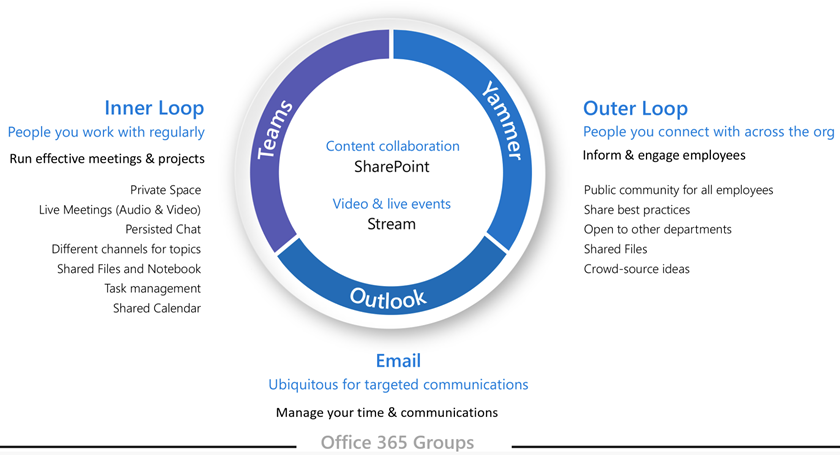

# Planera för styrning i gruppPlan for governance in groups

Microsoft 365 Groups har en omfattande uppsättning verktyg för att implementera alla styrningsfunktioner som din organisation kan behöva.Microsoft 365 Groups has a rich set of tools to implement any governance capabilities your organization might require. Den här artikeln hjälper IT-proffs att ställa rätt frågor för att avgöra deras krav på styrning och hur de ska uppfyllas baserat på deras organisationsprofil.This article guides IT Pros to ask the right questions to determine their requirements for governance and how to meet them based on their organizational profile.

## Varför Microsoft 365-grupper?Why Microsoft 365 Groups?

Vi vet att organisationer idag använder en mångsidig verktygsuppsättning.We know that organizations today are using a diverse toolset. Det finns ett team av utvecklare som använder teamchatt, chefer som skickar e-post och hela organisationen som ansluter till företagets sociala.There's the team of developers using team chat, the executives sending email, and the entire organization connecting over enterprise social. Flera samarbetsverktyg används eftersom varje grupp är unik och har sina egna funktionella behov och arbetsstil.Multiple collaboration tools are in use because every group is unique and has their own functional needs and workstyle. Vissa kommer endast att använda e-post medan andra kommer att bo främst i chatten.Some will use only email while others will live primarily in chat. 

Om användarna anser att it-verktygen inte passar deras behov, kommer de sannolikt att ladda ner sin favorit konsument app som stöder deras scenarier.If users feel the IT-provided tools do not fit their needs, they will likely download their favorite consumer app which supports their scenarios. Även om den här processen tillåter användare att komma igång snabbt, leder det till en frustrerande användarupplevelse i hela organisationen med flera inloggningar, svårigheter att dela och ingen enskild plats att visa innehåll.Although this process allows users to get started quickly, it leads to a frustrating user experience across the organization with multiple logins, difficulty sharing, and no single place to view content. Detta begrepp kallas "Shadow IT" och utgör en betydande risk för organisationer.This concept is referred to as "Shadow IT" and poses a significant risk to organizations. Det minskar möjligheten att hantera användaråtkomst på ett enhetligt sätt, säkerställa säkerhet och behov av tjänstefterlevnad.It reduces the ability to uniformly manage user access, ensure security, and service compliance needs.

Microsoft 365 Groups ger användarna möjlighet och minskar risken för skugg-IT genom att i ett enda steg tillhandahålla många av de verktyg som behövs för att samarbeta.Microsoft 365 Groups empowers users and reduces the risk of shadow IT by providing in a single step many of the tools needed to collaborate. Med Microsoft 365 Groups kan du välja en uppsättning personer som du vill samarbeta med och enkelt skapa en samling resurser som dessa personer kan dela.Microsoft 365 Groups lets you choose a set of people with whom you wish to collaborate, and easily set up a collection of resources for those people to share. Att manuellt tilldela behörigheter till resurser är ett förr som ett förflutet eftersom det automatiskt ger alla resurser som gruppen tillhandahåller om du lägger till medlemmar i gruppen.Manually assigning permissions to resources is a thing of the past as adding members to the group automatically grants the needed permissions to all assets provided by the group.

## Teknisk arkitekturTechnical Architecture

Det finns tre huvudsakliga kommunikationsmetoder som stöds av Microsoft 365 Groups.There are three main communication methods supported by Microsoft 365 Groups. Grupper kan skapas i dessa upplevelser och användas i Microsoft 365:Groups can be created within these experiences and used across Microsoft 365:
- Outlook: samarbete via e-post med en delad grupp inkorg och kalenderOutlook: collaboration through email with a shared group inbox and calendar
- Microsoft Teams: en beständig chattbaserad arbetsyta där du kan ha informella konversationer i realtid kring en mängd olika ämnen som organiseras av specifika undergrupperMicrosoft Teams: a persistent-chat-based workspace where you can have informal, real-time, conversations around a variety of topics, organized by specific sub-groups
- Yammer: social erfarenhet av företag för samarbeteYammer: enterprise social experience for collaboration

> [!NOTE]
> Genom att skapa en ny grupp via andra teamwork-program – till exempel SharePoint, Planner eller Stream – skapas en grupp med en Outlook-inkorg och möjligheten att ansluta till Microsoft Teams.Creating a new group via other teamwork applications - such as SharePoint, Planner or Stream - will create a group with an Outlook inbox and the ability to connect to Microsoft Teams.

Beroende på var en grupp skapas etableras vissa resurser automatiskt, till exempel:Depending on where a group is created, certain resources are provisioned automatically, such as:
- [Inkorg](https://support.microsoft.com/en-us/office/have-a-group-conversation-in-outlook-a0482e24-a769-4e39-a5ba-a7c56e828b22) - För e-postkonversationer mellan gruppmedlemmar.[Inbox](https://support.microsoft.com/en-us/office/have-a-group-conversation-in-outlook-a0482e24-a769-4e39-a5ba-a7c56e828b22) - For email conversations between group members. Den här inkorgen har en e-postadress och kan ställas in för att acceptera meddelanden från personer utanför gruppen och även utanför organisationen, ungefär som en traditionell distributionslista.This inbox has an email address and can be set to accept messages from people outside the group and even outside your organization, much like a traditional distribution list.
 - [Kalender](https://support.office.com/article/schedule-a-meeting-on-a-group-calendar-in-outlook-0cf1ad68-1034-4306-b367-d75e9818376a) – För schemaläggning av händelser relaterade till gruppen[Calendar](https://support.office.com/article/schedule-a-meeting-on-a-group-calendar-in-outlook-0cf1ad68-1034-4306-b367-d75e9818376a) – For scheduling events related to the group
- [SharePoint-gruppwebbplats](https://support.office.com/article/what-is-a-sharepoint-team-site-75545757-36c3-46a7-beed-0aaa74f0401e) – En central databas för information, länkar och innehåll som rör din grupp[SharePoint team site](https://support.office.com/article/what-is-a-sharepoint-team-site-75545757-36c3-46a7-beed-0aaa74f0401e) – A central repository for information, links and content relating to your group
- [SharePoint-dokumentbibliotek](https://support.microsoft.com/en-us/office/share-group-files-in-outlook-749bc73b-90c9-4760-9b6f-9aa1cf01b403) – En central plats för gruppen att lagra och dela filer[SharePoint document library](https://support.microsoft.com/en-us/office/share-group-files-in-outlook-749bc73b-90c9-4760-9b6f-9aa1cf01b403) – A central place for the group to store and share files
- [OneNote-anteckningsbok](https://support.office.com/article/get-started-with-onenote-e768fafa-8f9b-4eac-8600-65aa10b2fe97) – För att samla in idéer, forskning och information[OneNote notebook](https://support.office.com/article/get-started-with-onenote-e768fafa-8f9b-4eac-8600-65aa10b2fe97) – For gathering ideas, research, and information
- [Planerare](https://support.office.com/article/microsoft-planner-help-4a9a13c6-3adf-4a60-a6fc-15c0b15e16fc) – För att tilldela och hantera projektaktiviteter bland gruppmedlemmarna[Planner](https://support.office.com/article/microsoft-planner-help-4a9a13c6-3adf-4a60-a6fc-15c0b15e16fc) – For assigning and managing project tasks among your group members
- [Yammer-gruppen](https://support.office.com/article/Learn-about-Office-365-groups-b565caa1-5c40-40ef-9915-60fdb2d97fa2) – En vanlig plats att föra konversationer och dela information[Yammer group](https://support.office.com/article/Learn-about-Office-365-groups-b565caa1-5c40-40ef-9915-60fdb2d97fa2) – A common place to have conversations and share information
- Microsoft Teams – En chattbaserad arbetsyta i Microsoft 365Microsoft Teams – A chat-based workspace in Microsoft 365

Mer information om vilka resurser som skapas för varje grupp finns i [Lär dig mer om Microsoft 365 Groups](https://support.office.com/article/learn-about-office-365-groups-b565caa1-5c40-40ef-9915-60fdb2d97fa2).To learn more about which resources are created for each group, visit [Learn about Microsoft 365 Groups](https://support.office.com/article/learn-about-office-365-groups-b565caa1-5c40-40ef-9915-60fdb2d97fa2).

> [!NOTE]
> När en ny Microsoft 365-grupp skapas via Yammer eller Teams visas inte gruppen i Outlook eller adressboken eftersom den primära kommunikationen mellan dessa användare sker i deras respektive klienter.When a new Microsoft 365 group is created via Yammer or Teams, the group isn't visible in Outlook or the address book because the primary communication between those users happens in their respective clients. Yammer-grupper kan inte anslutas till Microsoft Teams.Yammer groups cannot be connected to Microsoft Teams.

## Var du ska starta en konversationWhere to start a conversation
Det finns flera platser där du kan föra en konversation i Microsoft 365.There are multiple places to have a conversation within Microsoft 365. Att förstå var en konversation ska starta kan hjälpa organisationer att definiera en strategi för kommunikation.Understanding where to start a conversation can help organizations define a strategy for communication.

- Team: chattbaserad arbetsyta (samarbete med hög hastighet) – inre slingaTeams: chat-based workspace (high velocity collaboration) – inner loop
   - Byggd för samarbete med de människor du arbetar med varje dagBuilt for collaboration with the people you work with every day
  - Sätter information till användarnas fingertoppar i en enda upplevelsePuts information at the fingertips of users in a single experience
  - Lägga till flikar, kopplingar och robotarAdd tabs, connectors and bots
  - Livechatt, ljud-/videokonferenser, inspelade mötenLive chat, audio/video conferencing, recorded meetings

- Yammer: anslut över org (företag social) - yttre slingaYammer: connect across the org (enterprise social) – outer loop
  - Praktiska grupper av människor som delar ett gemensamt intresse eller sakkunskap men som inte nödvändigtvis arbetar tillsammans varje dagCommunities of practice - Cross-functional groups of people who share a common interest or expertise but are not necessarily working together on a day-to-day basis
  - Ledarskapsanslutning, lärande samhällen, rollbaserade samhällenLeadership connection, learning communities, role-based communities

- Outlook-grupper: modern DL (e-postbaserat samarbete)Outlook groups: modern DL (email-based collaboration)
  - Allestädes närvarande för riktad kommunikationUbiquitous for targeted communication
  - Uppgradera DLs till Microsoft 365-grupper – [Varför ska du uppgradera?](https://support.microsoft.com/office/why-you-should-upgrade-your-distribution-lists-to-groups-in-outlook-7fb3d880-593b-4909-aafa-950dd50ce188)Upgrade DLs to Microsoft 365 Groups – [Why you should upgrade?](https://support.microsoft.com/office/why-you-should-upgrade-your-distribution-lists-to-groups-in-outlook-7fb3d880-593b-4909-aafa-950dd50ce188)

- SharePoint – Core-innehållssamarbete för alla Microsoft 365-grupperSharePoint – Core content collaboration experience for all Microsoft 365 groups
  - Varje grupp får en ansluten SharePoint-gruppwebbplatsEvery group gets a connected SharePoint team site
  - Dela innehåll, skapa anpassade sidor och skapa författarnyheterShare content, create customized pages and author news
  - [Ansluta](https://docs.microsoft.com/sharepoint/dev/features/groupify/groupify-overview) befintliga SharePoint-gruppwebbplatser till nya Microsoft 365-grupper[Connect](https://docs.microsoft.com/sharepoint/dev/features/groupify/groupify-overview) existing SharePoint team sites to new Microsoft 365 groups

##  Hantera och styra Microsoft 365 i stor skalaManaging and governing Microsoft 365 at scale

Microsoft 365 Groups har en omfattande uppsättning verktyg för att implementera alla styrningsfunktioner som din organisation kan behöva.Microsoft 365 Groups has a rich set of tools to implement any governance capabilities your organization might require. I följande avsnitt beskrivs funktionerna, rekommenderar bästa praxis och vägledning för att ställa rätt frågor för att fastställa kraven för styrning och hur de ska uppfyllas.The following section describes the capabilities, recommends best practices, and provides guidance to ask the right questions to determine the requirements for governance, and how to meet them.

**I detta avsnitt:****In this section**:
- [Styra vem som kan skapa Microsoft 365-grupperControl who can create Microsoft 365 groups](https://docs.microsoft.com/office365/admin/create-groups/plan-for-groups-governance#control-who-can-create-office-365-groups)
- [Gruppera mjuk borttagning och återställningGroup soft delete and restore](https://docs.microsoft.com/office365/admin/create-groups/plan-for-groups-governance#group-soft-delete-and-restore)
- [GruppnamngivningsprincipGroup naming policy](https://docs.microsoft.com/office365/admin/create-groups/plan-for-groups-governance#group-naming-policy)
- [Policy för gruppförfallodatumGroup expiration policy](https://docs.microsoft.com/office365/admin/create-groups/plan-for-groups-governance#group-expiration-policy)
- [Grupp gäståtkomstGroup guest access](https://docs.microsoft.com/office365/admin/create-groups/plan-for-groups-governance#group-guest-access)
- [Grupprinciper & informationsskyddGroup policies & information protection](https://docs.microsoft.com/office365/admin/create-groups/plan-for-groups-governance#group-policies--information-protection)
- [Uppgradera traditionella samarbetsverktygUpgrade traditional collaboration tools](https://docs.microsoft.com/office365/admin/create-groups/plan-for-groups-governance#upgrade-traditional-collaboration-tools)
- [Rapporter från grupperGroups reporting](https://docs.microsoft.com/office365/admin/create-groups/plan-for-groups-governance#groups-reporting)

### Styra vem som kan skapa Microsoft 365-grupperControl who can create Microsoft 365 groups
Grupper kan skapas av slutanvändare från flera slutpunkter, inklusive Outlook, SharePoint, Teams och andra miljöer.Groups can be created by end-users from multiple end-points including Outlook, SharePoint, Teams, and other environments.

> [!Tip]
>- Starkt överväga självbetjäning för att ge gruppägare.Strongly consider self-service to empower group owners.
>- Dokumentera och kommunicera hur du begär en grupp.Document and communicate how to request a group.
>- Gå tillbaka till vem som kan skapa grupper under molnresan.Revisit who can create groups during your cloud journey.
>- Överväg att använda dynamiskt medlemskap för att konfigurera säkerhetsgruppens medlemmar för att kontrollera gruppskapande.Consider using dynamic membership to configure security group's members to control group creation.
>- Utvärdera vilka grupper scenarier kan hanteras via ett dynamiskt medlemskap och tillåta självbetjäning för resten.Assess which groups scenarios can be managed via a dynamic membership and allow self-service for the rest.

Det finns tre primära modeller för etablering i grupper: öppna, IT-ledda och kontrollerade.There are three primary models of provisioning in groups: open, IT-led, and controlled. I följande tabell beskrivs fördelarna med varje modell.The following table describes the advantages of each model.

| ModellModel          | FördelarAdvantages                                                   |
| -------------- | ------------------------------------------------------------ |
| Öppna (standard)Open (default) | Användare kan skapa sina egna grupper efter behov utan att behöva vänta på, eller bry sig om IT.Users can create their own groups as needed without needing to wait for, or bother IT. |
| IT-leddaIT-led         | Användare begär en grupp från IT.Users request a group from IT. IT kan vägleda dem i valet av de bästa samarbetsverktygen för deras behov.IT can guide them in selecting the best collaboration tools for their needs. |
| KontrolleradeControlled     | Gruppskapande begränsat till specifika personer, team eller tjänster.Group creation restricted to specific people, teams or services. Mer information finns i [Hantera vem som kan skapa Microsoft 365-grupper](https://docs.microsoft.com/microsoft-365/admin/create-groups/manage-creation-of-groups).To learn more, see [Manage who can create Microsoft 365 groups](https://docs.microsoft.com/microsoft-365/admin/create-groups/manage-creation-of-groups). |

Din organisation kan ha särskilda krav för att implementera strikta kontroller för vem som kan skapa grupper.Your organization might have specific requirements to implement strict controls on who can create groups. Använd följande tabell för att fatta beslut om vilken etableringsmodell som passar din organisation.Use the following table to help make the decision on which provisioning model fits your organization.

|         |         |         |
|---------|---------|---------|
||BeslutspunkterDecision points|<ul><li>Vilken etableringsmodell passar organisationens krav?Which provisioning model fits your organization requirements?</li><li>Kräver din organisation att gruppen begränsar gruppskapandet till administratörer?Does your organization require limiting group creation to administrators?</li><li>Kräver din organisation att gruppen begränsar gruppskapandet till medlemmar i säkerhetsgruppen?Does your organization require limiting group creation to security group members?</li><li>Kräver din organisation att vissa grupper skapas dynamiskt baserat på användarattribut, till exempel avdelning?Does your organization require some groups to be created dynamically based on user attributes, such as department?</li></ul>|
||Nästa stegNext steps|<ul><li>Dokumentera organisationens krav för att skapa grupper och team.Document your organization's requirements for group and team creation.</li><li>Planera att implementera dessa krav som en del av grupputrullningen.Plan to implement these requirements as a part of your groups rollout.</li><li>Kommunicera och publicera dina policyer för att informera användarna om det beteende de kan förvänta sigCommunicate and publish your policies to inform users of the behavior they can expect</li><li>Planera att implementera dynamiskt medlemskap där så är tillämpligt.Plan to implement dynamic membership where applicable.</li></ul>|

> [!Important]
> Begränsa grupp- och teamskapande kan minska användarnas produktivitet eftersom många Microsoft 365-tjänster kräver att grupper skapas för att tjänsten ska fungera.Limiting group and team creation can slow users productivity because many Microsoft 365 services require that groups be created for the service to function. Mer information finns i [Varför styra vem som skapar Microsoft 365-grupper?](https://docs.microsoft.com/office365/admin/create-groups/manage-creation-of-groups?view=o365-worldwide%23why-control-who-creates-office-365-groups)To learn more, see [Why control who creates Microsoft 365 groups?](https://docs.microsoft.com/office365/admin/create-groups/manage-creation-of-groups?view=o365-worldwide%23why-control-who-creates-office-365-groups)

#### *Resurser**Resources*
- [Hantera vem som kan skapa Microsoft 365-grupperManage who can create Microsoft 365 groups](https://docs.microsoft.com/office365/admin/create-groups/manage-creation-of-groups?view=o365-worldwide)
- [Fylla i grupper dynamiskt baserat på objektattributPopulate groups dynamically based on object attributes](https://docs.microsoft.com/azure/active-directory/active-directory-accessmanagement-groups-with-advanced-rules)
- [Så här ändrar du standardinställningen för Microsoft 365 Groups for Outlook, till offentliga eller privataHow to change the default setting of Microsoft 365 Groups for Outlook, to public or private](https://support.office.com/article/office-365-groups-in-outlook-private-by-default-36236e39-26d3-420b-b0ac-8072d2d2bedc)
- [Synkronisera säkerhetsgrupper med gruppmedlemskapSyncing Security Groups with team membership ](https://techcommunity.microsoft.com/t5/Microsoft-Teams-Blog/Syncing-Security-Groups-with-team-membership/ba-p/241959)

### Gruppera mjuk borttagning och återställningGroup soft delete and restore
Om du har tagit bort en Microsoft 365-grupp har den som standard behållits i 30 dagar.If you've deleted an Microsoft 365 group, by default it's retained for 30 days. Den här 30-dagarsperioden kallas "mjuk borttagning" eftersom du fortfarande kan återställa gruppen.This 30-day period is called "soft-delete" because you can still restore the group. Efter 30 dagar tas gruppen och det tillhörande innehållet bort permanent och kan inte återställas.After 30 days, the group and associated content is permanently deleted and cannot be restored.

> [!Tip]
>- Kommunicera återställningsprocessen till användarna.Communicate the restore process to your users.
>- Träna ditt helpdesk-team.Train your helpdesk team.
>- Spåra kommande grupper som tas bort med PowerShell-skriptet.Track upcoming groups that will be deleted using PowerShell script.

|         |         |         |
|---------|---------|---------|
||BeslutspunkterDecision points|<ul><li>Kräver du att vissa tillgångar ska arkiveras för långsiktig lagring?Do you require that certain assets to be archived for long term storage?</li><li>Har du vissa lagringskrav för din organisation?Do you have certain retention requirements for your organization?</li></ul>|
||Nästa stegNext steps|<ul><li>Kommunicera och publicera principer för borttagning och återställning för att informera användarna om det beteende de kan förvänta sigCommunicate and publish the delete and restore policies to inform users of the behavior they can expect </li><li> Dokumentera organisationens krav för övervakning av borttagna grupper.Document your organizations requirements for monitoring deleted groups.</li><li>Planera att implementera dessa krav som en del av grupputrullningen.Plan to implement these requirements as part of your groups rollout.</li></ul>|

> [!Important]
>Om en användare försöker komma åt webbplatsen under perioden "mjuk borttagning" får de ett meddelande med 403 - Förbjudet. Om användaren försöker komma åt webbplatsen efter den här perioden får de ett meddelande med 404 - Hittades inteDuring the "soft-delete" period if a user tries to access the site they will get a 403 forbidden message. After this period if the user tries to access the site they will get a 404 not found message.

#### *Resurser**Resources*
- [Återställa en borttagen Microsoft 365-gruppRestore a deleted Microsoft 365 group](https://docs.microsoft.com/microsoft-365/admin/create-groups/restore-deleted-group?ui=en-US&rs=en-001&ad=US)
- [Återställa en borttagen Microsoft 365-grupp i Azure Active DirectoryRestore a deleted Microsoft 365 group in Azure Active Directory](https://docs.microsoft.com/azure/active-directory/users-groups-roles/groups-restore-deleted)
- [Ta bort grupper med hjälp av cmdleten Remove-UnifiedGroupDelete groups using the Remove-UnifiedGroup cmdlet](https://technet.microsoft.com/library/mt238270%28v=exchg.160%29.aspx)

### GruppnamngivningsprincipGroup naming policy
En namngivningsprincip kan hjälpa dig och dina användare att identifiera funktionen för gruppen, medlemskap, geografisk region eller vem som skapade gruppen.A naming policy can help you and your users identify the function of the group, membership, geographic region, or who created the group. Namngivningsprincipen kan också hjälpa till att kategorisera grupper i adressboken.The naming policy can also help categorize groups in the address book. Du kan använda principen för att blockera specifika ord från att användas i gruppnamn och alias.You can use the policy to block specific words from being used in group names and aliases.

> [!Tip]
> - Använd korta strängar som suffix.Use short strings as suffix.
> - Använd attribut med värden.Use attributes with values.
> - Var inte för kreativ, total namnlängd har högst 264 tecken.Don't be too creative, total name length has a maximum of 264 characters.
> - Ladda upp organisationens specifika blockerade ord för att begränsa användningen.Upload your organization specific blocked words to restrict usage.

|         |         |         |
|---------|---------|---------|
||BeslutspunkterDecision points|<ul><li>Kräver din organisation en särskild namngivningskonvention för grupper?Does your organization require a specific naming convention for groups?</li><li>Kräver din organisation namngivningskonventionen för alla arbetsbelastningar?Does your organization require the naming convention across all workloads?</li><li>Har din organisation specifika ord som du vill hindra användare från att använda?Does your organization have specific words that you want to prevent users from using?</li></ul>|
||Nästa stegNext steps|<ul><li>Dokumentera organisationens krav för namngivningsgrupper.Document your organization's requirements for naming groups. </li><li> Planera att implementera dessa krav som en del av grupputrullningen.Plan to implement these requirements as part of your groups rollout.</li><li> Kommunicera och publicera namngivningsprinciper och standarder för att informera användarna.Communicate and publish the naming policies and standards to inform users.</li></ul>|

> [!Important]
>Namngivningsprincipen tillämpas på grupper som skapas i alla grupparbetsbelastningar (som Outlook, Microsoft Teams, SharePoint, Planner, Yammer osv.).The naming policy is applied to groups that are created across all groups workloads (like Outlook, Microsoft Teams, SharePoint, Planner, Yammer, etc). Den tillämpas på både gruppnamnet och gruppaliaset.It gets applied to both the group name and group alias. Den tillämpas när en användare skapar en grupp och när gruppnamn eller alias redigeras för en befintlig grupp.It gets applied when a user creates a group and when group name or alias is edited for an existing group.

#### *Resurser**Resources*
- [Namngivningsprincip för Microsoft 365-grupperMicrosoft 365 Groups naming policy](https://docs.microsoft.com/office365/admin/create-groups/groups-naming-policy)
- [Framtvinga en namngivningsprincip för Microsoft 365-grupper i Azure Active DirectoryEnforce a naming policy for Microsoft 365 Groups in Azure Active Directory](https://go.microsoft.com/fwlink/?linkid=868340)
- [Azure Active Directory-cmdletar för att konfigurera gruppinställningarAzure Active Directory cmdlets for configuring group settings](https://go.microsoft.com/fwlink/?linkid=868341)
- [Förhandsgranska funktioner för gruppnamngivningPreview Features for Group Naming](https://portal.azure.com/#blade/Microsoft_AAD_IAM/GroupsManagementMenuBlade/NamingPolicy)

### Policy för gruppförfallodatumGroup expiration policy
Administratörer kan ange en förfalloperiod och alla grupper som når slutet av den perioden och som inte förnyas tas bort.Administrators can specify an expiration period and any group that reaches the end of that period, and is not renewed, will be deleted. Förfallotiden börjar när gruppen skapas eller på det datum då den senast förnyades.The expiration period begins when the group is created, or on the date it was last renewed. Gruppägare skickas automatiskt ett e-postmeddelande före utgången som gör att de kan förnya gruppen för ett annat utgångsdatum.Group owners will automatically be sent an email before the expiration that allows them to renew the group for another expiration interval. Aktiva grupper förnyas automatiskt.Active groups renew automatically.

När du har angett att en grupp ska upphöra att gälla:Once you set a group to expire:
- Ägare av gruppen meddelas att förnya gruppen som utgångsdatum närmar sigOwners of the group are notified to renew the group as the expiration nears
- Alla grupper som inte förnyas tas bortAny group that is not renewed is deleted
- Alla grupper som tas bort kan återställas inom 30 dagar av gruppägarna eller administratörenAny group that is deleted can be restored within 30 days by the group owners or the administrator

> [!Tip]
> - Pilot med specifika grupper från början.Pilot with specific groups initially.
> - Välj inaktiva grupper baserat på aktivitetsrapporten i Microsoft 365 administrationscenter.Choose inactive groups based on the activity report in Microsoft 365 admin center.
> - Kommunicera förnyelseprocess till gruppägare.Communicate renewal process to group owners.
> - Ombord på ditt helpdesk-team.Onboard your helpdesk team.
> - Se till att grupper har flera ägare och konfigurera e-post för överblivna grupper.Ensure groups have multiple owners and configure email for orphan groups.

|         |         |         |
|---------|---------|---------|
||BeslutspunkterDecision points|<ul><li>Kräver din organisation att du anger ett utgångsdatum för team?Does your organization require specifying an expiration date for teams?</li><li>Bestäm strategin för att hantera överblivna grupper.Determine the strategy for dealing with orphan groups.</li></ul>|
||Nästa stegNext steps|<ul><li>Dokumentera organisationens krav på gruppens förfallodatum, datalagring och arkivering.Document your organization's requirements for group expiration, data retention, and archiving.</li><li>Planera att implementera dessa krav som en del av grupputrullningen.Plan to implement these requirements as part of your groups rollout.</li><li>Planera att implementera ett anpassat jobb för att rapportera om grupper som har enskilda ägare eller är ägarlösa.Plan to implement a custom job to report on groups that have single owners or are ownerless. </li></ul>|

> [!Important]
>När du ändrar förfalloprincipen beräknas tjänsten om förfallodatumet för varje grupp.When you change the expiration policy, the service recalculates the expiration date for each group. Den börjar alltid räkna från det datum då gruppen skapades och tillämpar sedan den nya förfalloprincipen.It always starts counting from the date when the group was created, and then applies the new expiration policy.

#### *Resurser**Resources*
- [Förfalloprincip för Microsoft 365-grupperMicrosoft 365 group Expiration Policy](https://support.office.com/article/Office-365-Group-Expiration-Policy-8d253fe5-0e09-4b3c-8b5e-f48def064733?ui=en-US&rs=en-US&ad=US)
- [Konfigurera principen för förfallodatum för Microsoft 365-grupperConfigure the expiration policy for Microsoft 365 Groups](https://docs.microsoft.com/azure/active-directory/users-groups-roles/groups-lifecycle)

### Grupp gäståtkomstGroup guest access
Administratörer kan styra om gäståtkomst till Microsoft 365-grupper ska tillåtas för hela organisationen eller för enskilda Microsoft 365-grupper.Admins can control whether to allow guest access to Microsoft 365 Groups for their whole organization or for individual Microsoft 365 groups. De kan också styra vem som kan tillåta att gästerna läggs till i grupper.They can also control who can allow guests to be added to groups.
>[!Tip]
>- Aktivera gäståtkomst på klientnivå.Enable guest access at the tenant level. Blockera vid behov för specifika grupper.If needed, block for specific groups.
>- Styr med hjälp av tillåt/blockera gästdomäner, gästombjudarroll, åtkomstgranskningar, användarvillkor.Govern using allow/block guest domains, guest inviter role, access reviews, terms of use.
>- Spåra gästanvändaraktivitet via granskningsloggar.Track guest user activity via audit logs.

|         |         |         |
|---------|---------|---------|
||BeslutspunkterDecision points|<ul><li>Behöver du begränsa möjligheten att lägga till gäster i lag per grupp?Do you need to restrict the ability to add guests to teams on a per-group basis?</li><li> Kräver din organisation att du lägger fram relevanta ansvarsfriskrivningar för juridiska krav eller efterlevnadskrav?Does your organization require to present relevant disclaimers for legal or compliance requirements?</li><li>Har din organisation behov av att minska den administrativa överhuvudet för att lägga till och ta bort användare?Does your organization have the need to reduce administrative over-head of adding and removing users?</li><li>Förväntar sig din organisation granskningskontroller för gäst/extern åtkomst?Does your organization expect audit controls for guest/external access?</li></ul>|
||Nästa stegNext steps|<ul><li>Dokumentkrav för gäst/extern åtkomst för vissa klassificerade grupper, inklusive kvarhållningsperiod och förekomst.Document requirements for guest/external access for certain classified groups including the retention period and occurrence.</li><li>Dokumentorganisationens krav för vilka grupper som kräver användningsvillkor och åtkomstgranskning.Document organization's requirements for which groups will require terms of use and access review. </li><li>Utför recensioner för att effektivt hantera gruppmedlemskap för både interna användare och gästanvändare.Perform reviews to efficiently manage group memberships for both internal and guest users.</li></ul>|

#### *Resurser**Resources*
- [Samarbeta med personer utanför organisationenCollaborating with people outside your organization](https://docs.microsoft.com/microsoft-365/solutions/collaborate-with-people-outside-your-organization)
- [Hantera gäståtkomst i Microsoft 365-grupperManage guest access in Microsoft 365 groups](https://docs.microsoft.com/office365/admin/create-groups/manage-guest-access-in-groups)
- [Gäståtkomst i Microsoft 365-grupperGuest access in Microsoft 365 Groups](https://support.office.com/article/Guest-access-in-Office-365-Groups-bfc7a840-868f-4fd6-a390-f347bf51aff6)
- [Azure AD-åtkomstgranskningarAzure AD access reviews](https://docs.microsoft.com/azure/active-directory/active-directory-azure-ad-controls-perform-access-review)
- [Funktionen Användningsvillkor för Azure Active DirectoryAzure Active Directory Terms of Use feature](https://docs.microsoft.com/azure/active-directory/active-directory-tou)
- [Google FederationGoogle Federation  ](https://docs.microsoft.com/azure/active-directory/b2b/google-federation)

### Grupprinciper & informationsskyddGroup policies & information protection
Microsoft 365 Groups bygger på de avancerade säkerhets- och efterlevnadsfunktionerna i Microsoft 365 och stöder klassificeringar, granskning och rapportering, efterlevnadsinnehållssökning, e-identifiering, legal hold och bevarandeprinciper.Microsoft 365 Groups is built on the advanced security and compliance capabilities of Microsoft 365 and supports classifications, auditing and reporting, compliance content search, e-discovery, Legal Hold, and retention policies.
>[!Tip]
>- Konfigurera klassificering, användningsriktlinjer och etiketter som är anpassade till organisationens behov.Configure classification, usage guidelines, and labels aligned with your organization's needs.
>- Bevarandeprinciper kan definieras oberoende av etiketter.Retention policies can be defined independently of labels.
>- Revisionsgrupper verksamhet: skapande, radering, etc.Audit groups activities: creation, deletion, etc.
>- Hantera gruppsekretess och gäståtkomst baserat på klassificering.Manage group privacy and guest access based on classification.

|         |         |         |
|---------|---------|---------|
||BeslutspunkterDecision points|<ul><li>Har din organisation specifika användningskrav som måste meddelas alla användare?Does your organization have specific usage requirements that need to be communicated to all users?</li><li>Kräver din organisation klassificeringar av allt innehåll?Does your organization require the classifications of all content?</li><li>Kräver din organisation att innehåll ska behållas under en viss tidsperiod?Does your organization require content to be retained for a specific period of time?</li><li>Kräver din organisation att specifika principer för datalagring tillämpas på grupper?Does your organization require specific data retention policies be applied to groups?</li><li>Förväntar sig din organisation att kräva möjligheten att arkivera inaktiva grupper för att bevara innehållet?Does your organization expect to require the ability to archive inactive groups to preserve the content?</li><li>Behöver gruppskapare möjlighet att tilldela organisationsspecifika klassificeringar till team?Do group creators need the ability to assign organization-specific classifications to teams?</li></ul>|
||Nästa stegNext steps|<ul><li>Dokumentera organisationens användningsriktlinjer för grupperDocument your organization's usage guidelines for Groups</li><li>Dokumentera organisationens krav för klassificering.Document your organization's requirements for classification.</li><li>Bestäm de principer som ska tillämpas baserat på klassificeringen t.ex.Determine the policies to be enforced based on the classification e.g. sensitivity, retention, guest access.</li><li>Definiera känslighetsetiketterna för din organisation och vilka skyddsinställningar du vill ska associeras.Define the sensitivity labels for your organization and what protection settings you want associated.</li><li>Definiera en etikettprincip för att styra vilka användare och grupper som ser dessa etiketter.Define a label policy to control which users and groups see those labels.</li><li>Konfigurera [förhandsgranskningen av känslighetsetiketten för grupper](https://docs.microsoft.com/microsoft-365/compliance/sensitivity-labels-teams-groups-sites) och börja klassificera grupperna i organisationen.Configure the [Groups sensitivity label preview](https://docs.microsoft.com/microsoft-365/compliance/sensitivity-labels-teams-groups-sites) and start classifying the groups in your organization.</li><li>Planera att implementera dessa krav som en del av grupputrullningen.Plan to implement these requirements as a part of your groups rollout.</li></ul>|

#### *Resurser**Resources*
- [Länka till användningsriktlinjerna för Microsoft 365-grupperLink to your Microsoft 365 Groups usage guidelines](https://docs.microsoft.com/office365/enterprise/manage-office-365-groups-with-powershell#link-to-your-office-365-groups-usage-guidelines)
- [Skapa klassificeringar för Office-grupper i organisationenCreate classifications for Office groups in your organization](https://docs.microsoft.com/office365/enterprise/manage-office-365-groups-with-powershell#create-classifications-for-office-groups-in-your-organization)
- [Konfigurera gruppinställningarConfigure Group settings](https://docs.microsoft.com/azure/active-directory/active-directory-accessmanagement-groups-settings-cmdlets)
- [Översikt över bevarandeprinciperOverview of retention policies](https://docs.microsoft.com/microsoft-365/compliance/retention-policies)
- [Översikt över känslighetsetiketterOverview of sensitivity labels](https://docs.microsoft.com/microsoft-365/compliance/sensitivity-labels)
- [Översikt över etiketterOverview of labels](https://docs.microsoft.com/microsoft-365/compliance/labels)
- [Söka i granskningsloggenSearch the audit log](https://docs.microsoft.com/microsoft-365/compliance/search-the-audit-log-in-security-and-compliance)
- [Skapa eller ta bort en juridisk spärr på platsCreate or remove an in-place legal hold](https://docs.microsoft.com/exchange/security-and-compliance/create-or-remove-in-place-holds)
- [Skapa en bevarandeprincipCreate a preservation policy](https://docs.microsoft.com/microsoft-365/compliance/retention-policies)
- [Köra en innehållssökning i Security & Compliance CenterRun a Content Search in the Security & Compliance Center](https://docs.microsoft.com/microsoft-365/compliance/content-search)
- [Mass skapa och publicera kvarhållningsetiketter med hjälp av PowerShellBulk create and publish retention labels by using PowerShell](https://docs.microsoft.com/microsoft-365/compliance/bulk-create-publish-labels-using-powershell)

### Uppgradera traditionella samarbetsverktygUpgrade traditional collaboration tools
I åratal har organisationer förlitat sig på distributionsgrupper för att kommunicera och samarbeta med grupper av människor både inom och utanför företaget.For years organizations have relied on distribution groups to communicate and collaborate with groups of people both inside and outside the company. Nu erbjuder dock Microsoft 365 Groups i Outlook en mer kraftfull lösning för samarbete.Now, however, Microsoft 365 Groups in Outlook offer a more powerful solution for collaboration. Dessutom är det viktigt att kunna ansluta en Microsoft 365-grupp till en befintlig SharePoint-webbplats om du vill modernisera webbplatsen.In addition, being able to connect a Microsoft 365 group to an existing SharePoint site is important if you want to modernize that site.

>[!Tip]
>- Uppgradera enkelt alla dina kvalificerade distributionslistor på några sekunder via Administrationscentret för Exchange eller med PowerShell-cmdletar.Easily upgrade all your eligible distribution lists in seconds via the Exchange admin center, or using PowerShell cmdlets.
>- Anslut befintliga SharePoint-gruppwebbplatser till nya Microsoft 365-grupper.Connect existing SharePoint team sites to new Microsoft 365 Groups.

|         |         |         |
|---------|---------|---------|
||BeslutspunkterDecision points|<ul><li>Har din organisation distributionslistor som inte är [berättigade till](https://docs.microsoft.com/office365/admin/manage/upgrade-distribution-lists#how-do-i-check-which-dls-are-eligible-for-upgrade) uppgradering?Does your organization have distribution lists that are [not eligible](https://docs.microsoft.com/office365/admin/manage/upgrade-distribution-lists#how-do-i-check-which-dls-are-eligible-for-upgrade) for upgrade?<li>Bestäm vilken typ av grupp som är den distributionslista som bäst migreras till.Determine which type of group is the distribution list best migrated to.</li></ul>|
||Nästa stegNext steps|<ul><li>Identifiera vilka distributionslistor som skulle vara kandidater för uppgradering till Microsoft 365-grupper.Identify which distribution lists would be candidates for upgrading to Microsoft 365 Groups.</li><li>Analysera dina befintliga SharePoint-gruppwebbplatser för att se vilka webbplatser som är redo att vara gruppanslutna.Analyze your existing SharePoint team sites to see which sites are ready to be group-connected.</li><li>Låt andra team i ditt företag veta att du uppgraderade din distributionsgrupp och vilka åtgärder du tog för att göra det framgångsrikt!Let other teams in your company know that you upgraded your distribution group and what steps you took to make it successful!</li></ul>|

#### *Resurser**Resources*
- [Uppgradera distributionslistor (DL) till grupper i OutlookUpgrade Distribution Lists (DL) to groups in Outlook](https://aka.ms/whyupgradedls)
- Uppgradera med ett klick via Administrationscenter för Exchange eller via [PowerShell-skript](https://docs.microsoft.com/microsoft-365/admin/manage/upgrade-distribution-lists)Upgrade with one click via Exchange admin center or via [PowerShell scripts](https://docs.microsoft.com/microsoft-365/admin/manage/upgrade-distribution-lists)
- [Migrera distributionslistor till Microsoft 365-grupper – hjälp med administratörerMigrate distribution lists to Microsoft 365 Groups - Admin help](https://docs.microsoft.com/office365/admin/manage/upgrade-distribution-lists)
- [Ansluta befintliga SharePoint-webbplatser till Microsoft 365-grupper:Connect existing SharePoint sites to Microsoft 365 Groups:](https://docs.microsoft.com/sharepoint/dev/transform/modernize-connect-to-office365-group)
- [Analysera och använda skannerdataAnalyze and use the scanner data](https://docs.microsoft.com/sharepoint/dev/transform/modernize-connect-to-office365-group-scanner)
- [Moderniseringsskanner för SharePoint](https://github.com/SharePoint/sp-dev-modernization/tree/master/Tools/SharePoint.Modernization) (ett verktyg som finns på GitHub)[SharePoint Modernization Scanner](https://github.com/SharePoint/sp-dev-modernization/tree/master/Tools/SharePoint.Modernization) (a tool located on GitHub)

### Rapporter från grupperGroups reporting
Instrumentpanelen Microsoft 365 Reports visar aktivitetsöversikten för Microsoft-produkter i organisationen.The Microsoft 365 Reports dashboard shows you the activity overview across the Microsoft products in your organization. Här kan du gå in på detaljnivå i rapporter för enskilda produkter för att få bättre insikter om aktiviteterna inom varje produkt.It enables you to drill in to individual product level reports to give you more granular insight about the activities within each product.
> [!TIP]
>- Du kan använda grupprapporterna för att få insikter om aktiviteten i Microsoft 365-grupper i organisationen och se hur många grupper som skapas och används.You can use the Groups reports to gain insights into the activity of Microsoft 365 groups in your organization and see how many groups are being created and used.
>-Microsoft 365 Groups rapport kan ses för trender under de senaste 7 dagarna, 30 dagar, 90 dagar eller 180 dagar.-The Microsoft 365 Groups report can be viewed for trends over the last 7 days, 30 days, 90 days, or 180 days.
>- Övervaka gruppaktivitet över grupppostlörlådekonversationer, gruppwebbplats/filaktivitet, information om gruppmedlemskap inklusive externa medlemsantal.Monitor group activity across group mailbox conversations, group site/files activity, details around group membership including external member counts.
>- Övervaka regelbundet för att nå ut till gruppägare i aktiva grupper för att lära sig använder ärenden och förstärker dem internt.Monitor regularly to reach out to group owners of active groups to learn uses cases and amplify them internally.
>- Utnyttja Power BI-innehållspaket för ytterligare insikter.Leverage Power BI content packs for additional insights.

|         |         |         |
|---------|---------|---------|
||BeslutspunkterDecision points|<ul><li>Kräver din organisation regelbundna rapporter för att förstå användningen av Microsoft 365-grupper?Does your organization require regular reports to understand usage of Microsoft 365 groups?<li>Kräver din organisation rapportering om alla grupper som har externa medlemmar?Does your organization require reporting on all groups that have external members?</li></ul>|
||Nästa stegNext steps|<ul><li>Dokumentera organisationens krav för att regelbundet granska gruppers aktivitetsrapporter.Document your organization's requirements for regularly review groups activity reports.</li></ul>|

#### *Resurser**Resources*
- [Microsoft 365-rapporter i administrationscentretMicrosoft 365 Reports in the admin center](https://docs.microsoft.com/microsoft-365/admin/activity-reports/office-365-groups)
- [Innehållspaket för office 365-införandeOffice 365 Adoption content pack](https://docs.microsoft.com/microsoft-365/admin/usage-analytics/usage-analytics)
- [Innehållspaket för Azure ADAzure AD content pack](https://docs.microsoft.com/azure/active-directory/active-directory-reporting-power-bi-content-pack-how-to)
- [Aktivitets-API för Microsoft Graph-grupperMicrosoft Graph groups activity API](https://developer.microsoft.com/graph/docs/api-reference/v1.0/resources/office_365_groups_activity_reports)
- [Microsoft 365 Groups-rapport (enhetliga grupper)Microsoft 365 Groups Report (Unified Groups)](https://gallery.technet.microsoft.com/office/Office-365-Groups-Report-7e3e161b)
- [Granskningsaktivitetsrapporter i Azure Active Directory-portalenAudit activity reports in the Azure Active Directory portal](https://docs.microsoft.com/azure/active-directory/reports-monitoring/concept-audit-logs)
- [Microsoft Graph - Använd deltafråga för att spåra ändringarMicrosoft Graph - Use delta query to track changes](https://docs.microsoft.com/graph/delta-query-overview)

## Komma igång baserat på din resa för införande i molnetGetting started based on your cloud adoption journey

Microsoft 365 Groups tillhandahåller en omfattande uppsättning styrningsfunktioner som din organisation kan behöva.Microsoft 365 Groups provides a rich set of governance capabilities your organization might require. Tänk på följande organisationsprofiler som vägledning för att förstå bästa praxis, ställa rätt frågor för att fastställa kraven för styrning och hur de ska uppfyllas.Consider the following organization profiles as guidance to understand best practices, ask the right questions to determine the requirements for governance, and how to meet them.

**Tänk på följande organisationsprofiler:****Consider the following organization profiles:**
- SmåföretagSmall business
- Medelstora företagMedium-sized business
- Reglerat eller företagandeRegulated or enterprise

### SmåföretagSmall business
Tänk dig en organisation som har distribuerat Microsoft 365 med minst Exchange Online- och SharePoint Online-licenser som innehåller Business Essentials- och Business Premium-abonnemangen och Enterprise E1-, E3- och E5-abonnemangen utan Azure Active Director Premium-licensiering.Consider an organization that has deployed Microsoft 365 with at least Exchange Online and SharePoint Online licenses that includes the Business Essentials and Business Premium plans, and the Enterprise E1, E3 and E5 plans with no Azure Active Director Premium licensing.

| ScenenStage | BeskrivningDescription |
| --------------- | ------------------------------------------------------------ |
| VägledningGuidance |<ul><li>Överväg en etableringsmodell för självbetjäning.Consider a self-service provisioning model.</li><li> Grupper i Outlook & SharePoint-webbplatser är [privata som standard](https://techcommunity.microsoft.com/t5/Office-365-Groups/Groups-in-Outlook-and-Group-connected-team-sites-are-now-private/m-p/186395).Groups in Outlook & SharePoint sites are [private by default](https://techcommunity.microsoft.com/t5/Office-365-Groups/Groups-in-Outlook-and-Group-connected-team-sites-are-now-private/m-p/186395).</li><li> Grupper kan skapas genom att uppgradera befintliga distributionslistor (DLs) antingen en efter en eller i grupp via PowerShell.Groups can be created by upgrading existing distribution lists (DLs) either one-by-one or in bulk via PowerShell. Se [Uppgradera distributionslistor till Microsoft 365 Groups](https://docs.microsoft.com/microsoft-365/admin/manage/upgrade-distribution-lists).See [Upgrade distribution lists to Microsoft 365 Groups](https://docs.microsoft.com/microsoft-365/admin/manage/upgrade-distribution-lists).</li><li> Aktivera gäståtkomst men styr med hjälp av tillåt/blockera gästdomäner.Enable guest access but govern using allow/block guest domains.</li><li> Använd grupprapportering för att få insikter om hur användare använder grupper.Use group reporting to gain insights on how users are using groups.</li><li> Överväg att skapa ett Microsoft Teams-team för hela organisationen som ett sätt för alla att vara en del av ett enda team för samarbete.Consider creating an org-wide team Microsoft Teams team as a way for everyone to be a part of a single team for collaboration. </li></ul>|
| Nästa stegNext Steps      |<ul><li>Överväg att använda [platsdesign och platsskript](https://docs.microsoft.com/sharepoint/dev/declarative-customization/site-design-overview) för att definiera standarddesignen för kontroller med hjälp av de åtgärder som definierats i [JSON-schemareferensen](https://docs.microsoft.com/sharepoint/dev/declarative-customization/site-design-json-schema).Consider using [site designs and site scripts](https://docs.microsoft.com/sharepoint/dev/declarative-customization/site-design-overview) to define the default design to controls using the actions defined within the [JSON schema reference](https://docs.microsoft.com/sharepoint/dev/declarative-customization/site-design-json-schema).</li><li>Granska [grupper som rapporterar](https://docs.microsoft.com/microsoft-365/admin/activity-reports/office-365-groups).Review [groups reporting](https://docs.microsoft.com/microsoft-365/admin/activity-reports/office-365-groups).</li><li>Spåra totala grupper och inaktiva/aktiva grupper.Track total groups and inactive/active groups.</li><li>Spåra både Exchange- och SharePoint-lagring som används.Track both Exchange and SharePoint storage used.</li><li>Visa gruppaktivitet över grupppostlådkonversationer, gruppwebbplats/filaktivitet osv.View group activity across group mailbox conversations, group site/files activity, etc.</li></ul> |

### Medelstora företagMedium-sized business
Utöver ovanstående rekommendationer bör följande gäller för medelstora företag som har distribuerat Microsoft 365 med minst en Enterprise E3/E5 med Azure Active Directory Premium P1-licenser.In addition to the above recommendations consider the following for medium-sized business who has deployed Microsoft 365 with at least an Enterprise E3/E5 with Azure Active Directory Premium P1 licenses.

| ScenenStage | BeskrivningDescription |
| --------------- | ------------------------------------------------------------ |
| VägledningGuidance |<ul><li>Besluta om en öppen eller IT-ledd etableringsmodell.Decide on an Open or IT-led provisioning model.</li><li> Överväg att skapa vissa grupper som är knutna till [dynamiska medlemskapsregler](https://docs.microsoft.com/azure/active-directory/users-groups-roles/groups-dynamic-membership) baserat på Azure AD-attribut som AvdelningConsider creating certain groups tied to [dynamic memberships rules](https://docs.microsoft.com/azure/active-directory/users-groups-roles/groups-dynamic-membership) based on Azure AD attributes like Department</li><li> Definiera klassificeringar inom din organisation t.ex.Define classifications within your organization e.g., Highly Confidential, Confidential (default), General.</li><li>  Definiera principerna baserat på klassificering, till exempel kvarhållning och känslighet.Define the policies based on classification such as retention and sensitivity.</li><li> SharePoint är innehållstjänsten för varje Microsoft 365-grupp.SharePoint is the content service for every Microsoft 365 group. Överväg att utforma och [distribuera SharePoint Online-webbplatser för tre skyddsnivåer](https://docs.microsoft.com/office365/enterprise/deploy-sharepoint-online-sites-for-three-tiers-of-protection) (baslinje, känslig och mycket konfidentiell).Consider designing and [Deploying SharePoint Online sites for three tiers of protection](https://docs.microsoft.com/office365/enterprise/deploy-sharepoint-online-sites-for-three-tiers-of-protection) (baseline, sensitive, and highly confidential). Mer information om dessa tre skyddsnivåer finns i Webbplatser och filer för [Säker SharePoint Online](https://docs.microsoft.com/office365/enterprise/secure-sharepoint-online-sites-and-files).For more information about these three tiers of protection, see [Secure SharePoint Online sites and files](https://docs.microsoft.com/office365/enterprise/secure-sharepoint-online-sites-and-files).</li><li> Både offentliga och privata grupper visas som standard i GAL.Both public and private groups are listed in the GAL by default. Bestäm vilka grupper du vill ska visas i gal-grupper som skapats utanför Microsoft Teams.Determine which groups you want to appear in the GAL specifically groups created outside of Microsoft Teams.  Använd [cmdleten Set-UnifiedGroup](https://technet.microsoft.com/library/mt238274(v=exchg.160).aspx) för att dölja specifika grupper.Use the [Set-UnifiedGroup](https://technet.microsoft.com/library/mt238274(v=exchg.160).aspx) cmdlet's "HiddenFromAddressListsEnabled" or "HidefromExchangeClients" to hide specific groups.</li></ul> |
| Nästa stegNext Steps      |<ul><li>Definiera riktlinjer för [användning](https://docs.microsoft.com/azure/active-directory/active-directory-accessmanagement-groups-settings-cmdlets) för att utbilda användarna om metodtips som hjälper till att hålla deras grupper effektiva och utbilda dem i interna innehållsprinciper.Define [Usage guidelines](https://docs.microsoft.com/azure/active-directory/active-directory-accessmanagement-groups-settings-cmdlets) to educate your users about best practices that help keep their groups effective, and educate them on internal content policies. Till exempel förstå klassificeringar, principer och procedurer.For example, understanding classifications, policies and procedures. </li><li>Definiera grupplivscykelperioden som grupper måste förnyas eller tas bort - förfalloprincip.Define group lifecycle period that groups must be renewed or will be deleted - expiry policy.</li><li>Överväg att skapa följande anpassade jobb för att implementera principer baserat på klassificeringar.Consider creating the following custom jobs to implement policies based on classifications.</li><li>Ställ in sekretess till privat.Set Privacy to Private.</li><li>Inaktivera externt medlemskap/delning.Disable external membership/sharing. </li><li>E-postmeddelanden för att meddela gruppmedlemmar för grupper [utan ägare](https://support.office.com/article/Assign-a-new-owner-to-an-orphaned-group-86bb3db6-8857-45d1-95c8-f6d540e45732).Emails to notify group members for groups with [no owner](https://support.office.com/article/Assign-a-new-owner-to-an-orphaned-group-86bb3db6-8857-45d1-95c8-f6d540e45732).</li><li>Genomdriva ägarpolicy (min. 2 ägare).Enforce ownership policy (min. 2 owners).</li><li> Definiera bevarandeprinciper för grupper baserat på klassificering.Define retention policies for groups based on classification. </li><li>Översikt över bevarandeprinciper.Overview of retention policies.</li><li>Använda Powershell för att identifiera grupper med en klassificering och [Set-RetentionCompliancePolicy](https://docs.microsoft.com/powershell/module/exchange/set-retentioncompliancepolicy?view=exchange-ps).Using Powershell to identify groups with a classification and [Set-RetentionCompliancePolicy](https://docs.microsoft.com/powershell/module/exchange/set-retentioncompliancepolicy?view=exchange-ps).</li><li>Överväg att använda platsdesign och platsskript för att definiera kontrollerna med hjälp av de åtgärder som definierats i [JSON-schemareferensen](https://docs.microsoft.com/sharepoint/dev/declarative-customization/site-design-json-schema).Consider using site designs and site scripts to define the controls using the actions defined within the [JSON schema reference](https://docs.microsoft.com/sharepoint/dev/declarative-customization/site-design-json-schema).</li><li>Överväg att skapa [en enkel platskatalog med hjälp av en webbplatsdesign](https://docs.microsoft.com/sharepoint/dev/declarative-customization/site-design-trigger-flow-tutorial) och Microsoft Flow.Consider building [a simple site directory using a site design](https://docs.microsoft.com/sharepoint/dev/declarative-customization/site-design-trigger-flow-tutorial) and Microsoft Flow. När en webbplats skapas med hjälp av den här webbplatsens design, fångas information om webbplatsen och skrivs till en lista.Whenever a site is created using this site design, details of the site are captured and written to a list. </li></ul>|

### Reglerat eller företagandeRegulated or enterprise
Utöver ovanstående rekommendationer överväga följande för starkt reglerade eller stora företag som myndigheter, finansiella tjänster eller hälso-och sjukvård som har distribuerat Office 365 med minst en Enterprise E3/E5 med Azure Active Directory Premium P1/P2 licenser.In addition to the above recommendations consider the following for highly regulated or large enter-prises such as government, financial services, or healthcare who has deployed Office 365 with at least an Enterprise E3/E5 with Azure Active Directory Premium P1/P2 licenses.

| ScenenStage | BeskrivningDescription |
| --------------- | ------------------------------------------------------------ |
| VägledningGuidance |<ul><li> Definiera principer för datastyrning av Den SharePoint-webbplats som är associerad med gruppen baserat på klassificering.Define policies for data governance of the SharePoint site associated to the group based on classification.</li><li>[Skydda SharePoint Online-filer med etiketter och DLP](https://docs.microsoft.com/office365/enterprise/protect-sharepoint-online-files-with-office-365-labels-and-dlp).[Protect SharePoint Online files with labels and DLP](https://docs.microsoft.com/office365/enterprise/protect-sharepoint-online-files-with-office-365-labels-and-dlp).</li><li>[Skydda SharePoint Online-filer med Azure Information Protection](https://docs.microsoft.com/office365/enterprise/protect-sharepoint-online-files-with-azure-information-protection).[Protect SharePoint Online files with Azure Information Protection](https://docs.microsoft.com/office365/enterprise/protect-sharepoint-online-files-with-azure-information-protection).</li><li> Gruppplatsetablerade i regionen som är knuten till användarens önskade dataplats ([multi-geo](https://docs.microsoft.com/office365/enterprise/multi-geo-capabilities-in-onedrive-and-sharepoint-online-in-office-365)).Group site provisioned in region tied to user's Preferred Data Location ([multi-geo](https://docs.microsoft.com/office365/enterprise/multi-geo-capabilities-in-onedrive-and-sharepoint-online-in-office-365)).</li><li> Medlemskap recensioner för grupper med externa medlemmar ([tillgång recensioner](https://docs.microsoft.com/azure/active-directory/active-directory-azure-ad-controls-access-reviews-overview)).Membership reviews for groups with external members ([access reviews](https://docs.microsoft.com/azure/active-directory/active-directory-azure-ad-controls-access-reviews-overview)).</li><li>Se till att anställda eller gästanvändare ser relevanta ansvarsfriskrivningar för juridiska krav eller efterlevnadskrav innan de får åtkomst.Ensure employees or guest users see relevant disclaimers for legal or compliance requirements before getting access. [(användarvillkor).](https://docs.microsoft.com/azure/active-directory/governance/active-directory-tou)([terms of use](https://docs.microsoft.com/azure/active-directory/governance/active-directory-tou)).</li><li>Identifiera och rapportera om Microsoft 365-grupper med en viss [klassificering som också har externa användare](https://techcommunity.microsoft.com/t5/Office-365-Groups/Sample-Powershell-to-identify-groups-with-HBI-classification-and/m-p/215561).Identify and report on Microsoft 365 groups with a certain [classification that also have external users](https://techcommunity.microsoft.com/t5/Office-365-Groups/Sample-Powershell-to-identify-groups-with-HBI-classification-and/m-p/215561).</li><li>Hemliga grupper där medlemskap måste döljas måste skapas med cmdleten [New-UnifiedGroup](https://technet.microsoft.com/library/mt219359(v=exchg.160).aspx) (med växeln HiddenGroup-MembershipEnabled) när gruppen skapas.Secret groups where memberships needed to be hidden must be created using the [New-UnifiedGroup](https://technet.microsoft.com/library/mt219359(v=exchg.160).aspx) cmdlet (using the HiddenGroup-MembershipEnabled switch) on Group creation.</li><li>Definiera [känslighetsetiketterna](https://docs.microsoft.com/microsoft-365/compliance/sensitivity-labels) för organisationen för att [begränsa åtkomsten till innehåll genom att använda kryptering](https://docs.microsoft.com/microsoft-365/compliance/encryption-sensitivity-labels) och publicera till specifika Microsoft 365-grupper.Define the [sensitivity labels](https://docs.microsoft.com/microsoft-365/compliance/sensitivity-labels) for the organization to [Restrict access to content by using encryption](https://docs.microsoft.com/microsoft-365/compliance/encryption-sensitivity-labels) and publish to specific Microsoft 365 groups.</li><li>Förhindra att känsligt innehåll lämnar organisationen på enheter som kör Windows med [känslighetsetiketter med Windows Informationsskydd](https://docs.microsoft.com/windows/security/information-protection/windows-information-protection/how-wip-works-with-labels?branch=vsts17546553).Prevent sensitive content from leaving your organization on devices running Windows using [sensitivity labels with Windows Information Protection](https://docs.microsoft.com/windows/security/information-protection/windows-information-protection/how-wip-works-with-labels?branch=vsts17546553). |
| Nästa stegNext Steps      | <ul><li> Använd webbplatsdesign och platsskript för att definiera de [standardåtgärder](https://developer.microsoft.com/office/blogs/site-scripts-site-designs-summer-2018-update/) som inträffar när en ny plats skapas.Use site design and site scripts to define the default [actions](https://developer.microsoft.com/office/blogs/site-scripts-site-designs-summer-2018-update/) that occur when a new site is created. Konfigurera till exempel [inställningen för extern delning](https://github.com/SharePoint/sp-dev-site-scripts/tree/master/samples/site-apply-external-sharing-setting) eller [utlösa ett Microsoft Flow för att anropa en Azure-funktion](https://github.com/SharePoint/sp-dev-site-scripts/tree/master/samples/site-azure-function) för att tillämpa konfigurationer som inte stöds internt.For example, [configure external sharing setting](https://github.com/SharePoint/sp-dev-site-scripts/tree/master/samples/site-apply-external-sharing-setting) or [trigger a Microsoft Flow to call an Azure function](https://github.com/SharePoint/sp-dev-site-scripts/tree/master/samples/site-azure-function) to apply configurations that are not supported natively. </li><li> Dokumentkrav för att [skydda SharePoint Online-filer med etiketter och DLP](https://docs.microsoft.com/office365/enterprise/protect-sharepoint-online-files-with-office-365-labels-and-dlp) till webbplatser som är associerade till Microsoft 365-grupper.Document requirements to [Protect SharePoint Online files with labels and DLP](https://docs.microsoft.com/office365/enterprise/protect-sharepoint-online-files-with-office-365-labels-and-dlp) to sites associated to Microsoft 365 Groups.</li><li>Dokumentera organisationens krav på [säkra SharePoint Online-webbplatser och filer](https://docs.microsoft.com/microsoft-365/security/office-365-security/secure-sharepoint-online-sites-and-files) som är anslutna till Microsoft 365-grupper.Document organization requirements to [Secure SharePoint Online sites and files](https://docs.microsoft.com/microsoft-365/security/office-365-security/secure-sharepoint-online-sites-and-files) that are connected to Microsoft 365 groups. </li><li>Dokumentera organisationens krav på att publicera [känslighetsetiketter](hhttps://docs.microsoft.com/microsoft-365/compliance/sensitivity-labels) till specifika användare eller grupper för att skydda innehåll.Document organization requirements to publish [sensitivity labels](hhttps://docs.microsoft.com/microsoft-365/compliance/sensitivity-labels) to specific users or groups to protect content.</li></ul> |

## Checklista för planering av funktioner för grupphanteringGroups Management Capability Planning Checklist

Ett antal grupprelaterade kontroller kan administreras via Azure Active Directory.A number of groups-related controls can be administered through Azure Active Directory. Mer information om hur du konfigurerar gruppinställningar finns i [Azure Active Directory-cmdletar för att konfigurera gruppinställningar](https://docs.microsoft.com/azure/active-directory/users-groups-roles/groups-settings-cmdlets).To learn more about configuring group settings, see [Azure Active Directory cmdlets for configuring group settings](https://docs.microsoft.com/azure/active-directory/users-groups-roles/groups-settings-cmdlets).

Använd följande tabell för att avgöra vilka funktioner du behöver för att distribuera dina organisationers krav.Use the following table to determine which capabilities you will need to deploy your organizations requirements. Det hjälper dig att avgöra vilka licenser du behöver så att du kan planera i förväg.It will help you determine which licenses you need so you can plan ahead.

| **Kapacitet****Capability**      | **Information****Details**                                    | **Azure AD Premium-licens krävs****Azure AD Premium license required** | **Beslut****Decision** |
| ------------------- | ---------------------------------------------- | ------------------------------------- | ------------ |
| GruppnamngivningsprincipGroup naming policy | Använd Prefix-Suffix-baserade, anpassade blockerade ord.Use Prefix-Suffix–based, Custom Blocked Words. | P1 (S1)P1                                    |      TbdTBD     |
| GruppklassificeringGroup classification | Tilldela klassificeringar till team.Assign classifications to teams. | P1 (S1)P1                                    |   TbdTBD        |
| Grupp gäståtkomstGroup guest access | Tillåt eller förhindra att gäster läggs till i grupper.Allow or prevent guests from being added to groups. | NejNo                                    |  TbdTBD        |
| Skapa grupperGroup creation | Begränsa gruppskapandet till administratörer.Limit team creation to administrators. | NejNo                                    |   TbdTBD        |
| Skapa grupperGroup creation | Begränsa gruppskapandet till medlemmar i säkerhetsgruppen.Limit team creation to security group members. | P1 (S1)P1                                    |     TbdTBD      |
| Riktlinjer för gruppanvändningGroup usage guidelines | Ange en länk till riktlinjerna för gruppanvändning som ska visas på alla slutpunkter för gruppskapande.Set a link the Group Usage Guidelines which will be visible on all group creation endpoints. | P1 (S1)P1                                    |   TbdTBD        |
| Dolt medlemskapHidden membership | Dölja medlemmarna i Microsoft 365-gruppen för användare som inte är medlemmar i gruppenHide the members of the Microsoft 365 group from users who aren't members of the group | NejNo                                    |   TbdTBD        |
| Princip för förfallodatumExpiration policy | Hantera livscykeln för Microsoft 365-grupper genom att ange en förfalloprincip.Manage the lifecycle of Microsoft 365 groups by setting an expiration policy. | P1 (S1)P1                                    |  TbdTBD        |
| GruppaktivitetsrapporterGroup activity reports | Få insikter om aktiviteten i Microsoft 365-grupper i organisationen och se hur många Microsoft 365-grupper som skapas och används.Gain insights into the activity of Microsoft 365 groups in your organization and see how many Microsoft 365 groups are being created and used. | NejNo                                    |    TbdTBD       |
| LoggperiodsprincipRetention policy | Spara eller ta bort data under en viss tidsperiod genom att ange bevarandeprinciper för Microsoft 365-grupper i Security & Compliance Center.Retain or delete data for a specific time period by setting retention policies for Microsoft 365 groups in the Security & Compliance Center. **Anm.:** För att använda den här funktionen krävs licensiering av Office 365 Enterprise E3 eller senare.**Note:** Using this feature requires licensing of Office 365 Enterprise E3 or above. | NejNo                                    |    TbdTBD       |
| Policy för förebyggande av dataförlustData loss prevention policy | Identifiera känslig information på microsoft 365-gruppanslutna webbplatser och förhindra oavsiktlig delning.Identify sensitive information across Microsoft 365 group connected sites and prevent the accidental sharing. **Anm.:** För att använda den här funktionen krävs licensiering av Office 365 Enterprise E3 eller senare.**Note:** Using this feature requires licensing of Office 365 Enterprise E3 or above. | NejNo                                    |     TbdTBD      |
| Arkivera och återställaArchive and restore | Arkivera ett team när det inte längre är aktivt men du vill behålla det som referens eller återaktivera i framtiden.Archive a team when it's no longer active but you want to keep it around for reference or to reactivate in the future. | NejNo                                    |   TbdTBD        |
| Access RecensionerAccess Reviews | Utföra recensioner för att effektivt hantera gruppmedlemskap för både interna användare och gästanvändarePerform reviews to efficiently manage group memberships for both internal and guest users | P2 (S2)P2                                    |   TbdTBD       |
| AnvändarvillkorTerms of Use | En enkel metod som organisationer kan använda för att presentera information för slutanvändare.A simple method that organizations can use to present information to end users. Den här presentationen säkerställer att användarna ser relevanta ansvarsfriskrivningar för juridiska krav eller efterlevnadskrav.This presentation ensures users see relevant disclaimers for legal or compliance requirements. | P1 (S1)P1                                    |         TbdTBD  |

