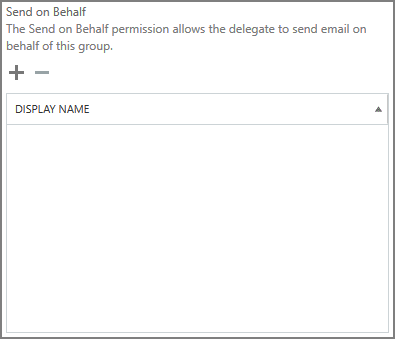

# Tillåt medlemmar att skicka som eller skicka för en grupp

En medlem i en Microsoft 365-grupp som har beviljats **send as** eller **Skicka för räkning** kan skicka e-post som grupp eller för gruppens räkning. I det här avsnittet beskrivs hur en administratör kan ange dessa behörigheter.
  
Om Megan Bowen till exempel ingår i gruppen **Utbildning** Microsoft 365 och har **Skicka som** behörigheter för gruppen, om hon skickar ett e-postmeddelande som grupp, ser det ut som att gruppen **Utbildning** har skickat e-postmeddelandet. 
  
Med behörigheten **Skicka för räkning** kan en användare skicka e-post för en Microsoft 365-grupp. Om Alex Wilber till exempel ingår i gruppen **Marknadsföring** av Microsoft 365 och har behörigheter **för skicka för räkning** och skickar ett e-postmeddelande som grupp, ser e-postmeddelandet ut som om det skickades av Alex **Wilber för marknadsföring**.

> [!IMPORTANT]
> Du kan konfigurera **Skicka som** eller **Skicka för** en viss användare, men inte båda. Om du konfigurerar båda, kommer det att standard **skicka som**.

> [!TIP]
> Se [Skicka e-post från eller på uppdrag av en Microsoft 365-grupp](https://support.office.com/article/0f4964af-aec6-484b-a65c-0434df8cdb6b.aspx) om du vill lära dig hur du använder Outlook och Outlook på webben för att skicka e-post från en grupp.
    
## Tillåt medlemmar att skicka e-post som en grupp

I det här avsnittet beskrivs hur du tillåter användare att skicka e-post som en grupp i [Administrationscenter](https://go.microsoft.com/fwlink/p/?linkid=2059104) för Exchange (EAC) i Exchange Online.
  
1. Gå till Mottagare grupper i **administrationscentret för** <a href="https://go.microsoft.com/fwlink/p/?linkid=2059104" target="_blank">Exchange</a> \> **Groups**.
    
2. Välj **Ikonen Redigera**redigera grupp i gruppen som du vill tillåta användare att skicka  som.   
    
3. Välj **gruppdelegering**.
    
4. I avsnittet **Skicka som** markerar du **+** tecknet för att lägga till de användare som du vill skicka som grupp. 
    
    
  
5. Sök efter eller välj en användare i listan. Välj **OK** och **Spara**.
    
    
  
## Tillåt medlemmar att skicka e-post för en grupp

I det här avsnittet beskrivs hur du tillåter användare att skicka e-post för en grupp i Administrationscenter för Exchange (EAC) i Exchange Online.
  
1. Gå till Mottagare grupper i **administrationscentret för** <a href="https://go.microsoft.com/fwlink/p/?linkid=2059104" target="_blank">Exchange</a> \> **Groups**.
    
2. Välj **Edit**  skicka som. 
    
3. Välj **gruppdelegering**.
    
4. I avsnittet Skicka för räkning väljer du **+** tecknet för att lägga till de användare som du vill skicka som grupp. 
    
    
  
5. Sök efter eller välj en användare i listan. Välj **OK** och **Spara**.
    
    

## Relaterade artiklar

[Läs mer om Microsoft 365-grupper](https://support.office.com/article/learn-about-office-365-groups-b565caa1-5c40-40ef-9915-60fdb2d97fa2)

[TilläggstilläggPrebehörigheter](https://go.microsoft.com/fwlink/p/?LinkId=723960)

[Set-UnifiedGroup](https://go.microsoft.com/fwlink/p/?LinkId=616189)
