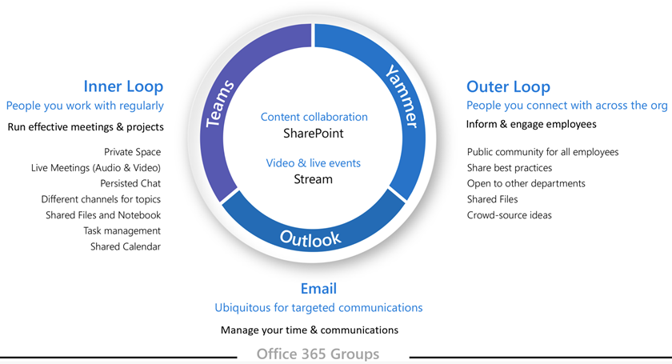

# Förklara Microsoft 365 grupper för användarna

Microsoft 365 Med grupper kan du konfigurera en samling resurser att dela, till exempel en delad postlåda och en kalender, en SharePoint-webbplats med en OneNote-anteckningsbok och en Microsoft Planner bland andra. Microsoft Teams kan också inkluderas när du skapar en grupp eller så kan den läggas till senare. Resurser i behörighetsgrupper hanteras via gruppen.

Du kan skapa grupper genom att skapa någon av de delade resurserna. Om du skapar en Outlook får du samma resultat som att skapa en gruppansluten SharePoint gruppwebbplats eller en plan i Planner. Om användarna inte har Microsoft 365 i Grupper, kanske de inte inser detta. Det kan leda till förvirring för användarna och möjligheten att skapa dubblettresurser. (Till exempel kan någon skapa en SharePoint-webbplats för dokumentsamarbete och senare skapa en separat instans av Planner, inte inse att Planner redan var tillgänglig som en del av gruppen.)

Eftersom grupper kan skapas på flera sätt rekommenderar vi att du utbildar användarna för att använda den metod som passar din organisation bäst:

- Om din organisation kommunicerar mest via e-post, instruerar du användarna att skapa grupper i Outlook.
- Om organisationen använder mycket SharePoint eller migrerar från en lokal SharePoint, instruerar du användarna att skapa SharePoint-gruppwebbplatser för samarbete.
- Om din organisation har distribuerat Teams, instruerar du användarna att skapa ett team när de behöver ett samarbetsutrymme.

Om du utbildar dina användare att alltid använda den metod för att skapa grupper som bäst stämmer överens med deras sätt att arbeta när de behöver ett utrymme för att samarbeta med andra kan du undvika förvirring och duplicering av resurser. Allt eftersom användarna blir mer erfarna kommer de att förstå bättre samlingen av tjänster som ingår i en grupp och att olika skapandemetoder leder till samma resultat.

Du kan använda mallen Microsoft 365 Grupper för [företag – PowerPoint som](https://www.microsoft.com/download/details.aspx?id=102396) utgångspunkt för utbildningspresentationer för användarna.

## Relaterade ämnen

[Läs mer Microsoft 365 grupper](https://support.microsoft.com/office/b565caa1-5c40-40ef-9915-60fdb2d97fa2)
