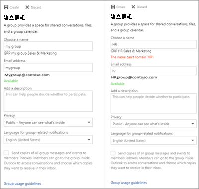
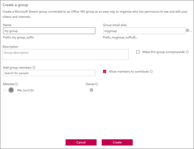

# Namngivningsprincip för Office 365-grupper

Du använder en princip för gruppnamngivning för att tillämpa en konsekvent namngivningsstrategi för grupper som skapats av användare i organisationen. En namngivningsprincip kan hjälpa dig och användarna att identifiera funktionen för gruppen, medlemskap, geografisk region eller vem som skapade gruppen. Namngivningsprincipen kan också hjälpa till att kategorisera grupper i adressboken. Du kan använda principen för att blockera specifika ord från att användas i gruppnamn och alias.

Namngivningsprincipen tillämpas på grupper som skapas i alla gruppers arbetsbelastningar (som Outlook, Microsoft Teams, SharePoint, Planner, Yammer, etc). Den tillämpas på både gruppnamnet och gruppaliaset. Den tillämpas när en användare skapar en grupp och när gruppnamn eller alias redigeras för en befintlig grupp.

> [!TIP]
> En namngivningsprincip för Office 365-grupp gäller endast för Office 365-grupper. Det gäller inte distributionsgrupper som skapats i Exchange Online. Om du vill skapa en namngivningsprincip för distributionsgrupper finns i [Skapa en namngivningsprincip för distributionsgrupper](https://docs.microsoft.com/exchange/recipients-in-exchange-online/manage-distribution-groups/create-group-naming-policy).

Namnprincipen för grupp består av följande funktioner:

- **Namnprincip för prefixsuffix:** Du kan använda prefix eller suffix för att definiera namngivningskonventionen\_för\_grupper (till exempel GRP\_US My Group Engineering"). Prefix och suffix kan antingen vara fasta strängar eller användarattribut som [Department], som ersätts utifrån den användare som skapar gruppen.

- **Anpassade blockerade ord:** Du kan ladda upp en uppsättning blockerade ord som är specifika för deras organisation som skulle blockeras i grupper som skapats av användare. (Till exempel: "VD, Lön, HR").

## Licenskrav

Om du använder Namnprincip för Azure AD för Office 365-grupper krävs att du har men inte nödvändigtvis tilldela en Azure Active Directory Premium P1-licens eller Azure AD Basic EDU-licens för varje unik användare (inklusive gäster) som är medlem i en eller flera Office 365-grupper.
Detta krävs också för administratören som skapar namngivningsprincipen Grupper.

## Namnprinciper för prefixsuffix

Prefix och suffix kan antingen vara fasta strängar eller användarattribut.

### Fasta strängar

Du kan använda korta strängar som kan hjälpa dig att skilja grupper i GAL- och vänsternavigatorn för grupparbetsbelastningarna. Några av de vanliga prefixen är nyckelord som\_Grp-namn ,\#\_"Namn", " Namn"

### Attribut

Du kan använda attribut som kan identifiera vem som skapade gruppen som [Avdelning] och var den skapades från som [Land].

|||
|:-----|:-----|
|**Exempel**|Princip = "GRP [GroupName] [Department]"|
||Användarens avdelning = Teknik|
||Skapat gruppnamn = "GRP Min grupp Teknik"|

Azure Active Directory (Azure AD) attribut stöds är [Avdelning], [Företag], [Office], [StateOrProvince], [CountryOrRegion], [Titel]

- Användarattribut som inte stöds betraktas som fasta strängar, t.ex. "[postalCode]"

- Tilläggsattribut och egna attribut stöds inte.

Vi rekommenderar att du använder attribut som har värden ifyllda för alla användare i organisationen samt att du inte använder attribut som har långa värden.

### Saker att hålla utkik efter

- När du skapar principen är den totala stränglängden för prefix och suffix begränsad till 53 tecken.

- Prefix och suffix får innehålla specialtecken som stöds i gruppens namn och gruppalias. Om prefix och suffix innehåller specialtecken som inte är tillåtna i gruppaliaset tas de bort och tillämpas på gruppaliaset. I det här fallet skiljer sig de prefix och suffix som tillämpas på gruppnamnet från dem som tillämpas på gruppaliaset.

- Om du använder Yammer Office 365-anslutna grupper bör du undvika att \# \[använda \] \<följande \>tecken i namnprincipen: @, , , och . Om dessa tecken finns i namngivningsprincipen kan vanliga Yammer-användare inte skapa grupper.

## Anpassade blockerade ord

Du kan ange en kommaavgränsad lista med blockerade ord som ska blockeras i gruppnamn och alias.

Den blockerade ordkontrollen görs på det angivna gruppnamnet för användaren. Så om användaren anger "darnit" och "Prefix"\_är\_namngivningsprincipen, misslyckas "Prefix darnit".

Inga understrängssökningar görs. Specifikt krävs en exakt matchning mellan det angivna användarnamnet och de anpassade blockerade orden för att utlösa ett fel. Understrängssökning görs inte så att användarna kan använda några av de vanliga orden som "Klass" även om "röv" är ett blockerat ord.

**Saker att se upp för:**

- Blockerade ord är inte skiftlägeskänsliga.

- Om en användare anger ett blockerat ord visas ett felmeddelande med det blockerade ordet i gruppklienten.

- Det finns inga teckenbegränsningar för de blockerade ord som används.

- Det finns en övre gräns på 5000 ord som kan ställas in som blockerade ord.

## Åsidosättning för administratör

Vissa administratörer är undantagna från de här principerna i alla grupparbetslaster och slutpunkter så att de kan skapa grupper med blockerade ord och med de namnkonventioner de önskar. Nedan följer listan över administratörsroller som är undantagna från namnprincipen för grupp.

- Global administratör

- Partner Tier1-support

- Partner Tier2-support

- Användarkontoadministratör

- Katalogredigerare

## Så här konfigurerar du namngivningsprincipen

Så här konfigurerar du en namngivningsprincip:

1. Klicka på **Grupper**under **Hantera**i [Azure Active Directory](https://aad.portal.azure.com).
2. Klicka på **Namngivningsprincip**under **Inställningar**.
3. Välj fliken **Grupprincip.**
4. Under **Aktuell princip**väljer du om du vill kräva ett prefix eller ett suffix eller båda, och markerar lämpliga kryssrutor.
5. Välj mellan **Attribut** och **sträng** för varje rad och ange sedan attributet eller strängen.
6. När du har lagt till de prefix och suffix som du behöver klickar du på **Spara**.

## Namnprincipanvändning i alla Office 365-program

Office 365-programmen har uppdaterats så att en förhandsgranskning av namnet på namnprincipen för grupp (med prefix och suffix) visas när användaren skriver in gruppens namn och alias. Om användarna skriver in blockerade ord visas ett felmeddelande så att de kan ta bort de blockerade orden.

## Outlook på webben

Outlook på webben (tidigare känt som Outlook Web App eller OWA) visar namngivningsprincipen sett när användaren skriver ett gruppnamn eller gruppalias. Om en användare skriver in ett eget blockerat ord visas ett felmeddelande i användargränssnittet tillsammans med blockerade ordet så att användaren kan ta bort det. Ögonblicksbilder av webbupplevelsen visas nedan.

## Outlook (skrivbordsversion)

Grupper som har skapats i skrivbordsversionen av Outlook följer namnprincipen. I skrivbordsversionen av Outlook visas ännu inte förhandsgranskningen av namnprincipen, och felmeddelanden för egna blockerade ord returneras inte när användaren anger gruppens namn. Namngivningsprincipen tillämpas dock automatiskt vid val av skapa/redigera och användarna visas med fel om det finns anpassade blockerade ord i gruppnamnet eller aliaset.

## Microsoft Teams

Microsoft Teams visar namnet på namnet på namngivningsprincipen när användaren skriver ett teamnamn. När en användare anger ett anpassat blockerat ord visas ett felmeddelande tillsammans med det blockerade ordet så att användaren kan ta bort det.

## Sharepoint

SharePoint visar namnprincipnamnet när användaren skriver ett webbplatsnamn eller en grupps e-postadress. Om en användare skriver in ett eget blockerat ord visas ett felmeddelande tillsammans med blockerade ordet så att användaren kan ta bort det.

## Microsoft Stream

I Microsoft Stream visas namnprincipens dekorerade namn när användaren skriver in ett gruppnamn eller gruppalias. Om en användare skriver in ett eget blockerat ord visas ett felmeddelande med det blockerade ordet så att användaren kan ta bort det.

## Outlook.app för iOS och Android

Grupper som har skapats i Outlook-appar följer namnprincipen. I Outlook Mobile visas förhandsgranskningen av namngivningsprincipen när du anger gruppnamnet. När en användare anger ett anpassat blockerat ord visas ett felmeddelande när gruppen skapas, så att användaren kan ta bort det blockerade ordet.

## Planner

Planner följer namnprincipen. Planner visar förhandsgranskningen av namngivningsprincipen när du anger namnet Planera. När en användare anger ett anpassat blockerat ord visas ett felmeddelande när planen skapas, så att användaren kan ta bort det blockerade ordet.

## Dynamics 365 för kundengagemang

Dynamics 365 for Customer Engagement är kompatibel med namngivningsprincipen. Dynamics 365 visar namnet på namnet på namngivningsprincipen när användaren skriver ett gruppnamn eller ett e-postalias för grupper. När användaren anger ett anpassat blockerat ord visas ett felmeddelande med det blockerade ordet så att användaren kan ta bort det.

## School Data Sync (SDS)

Grupper som skapats i SDS följer namnprincipen, men namnprincipen används inte automatiskt. SDS-administratörer måste lägga till prefix och suffix till klassnamn. Grupper måste sedan skapas och laddas upp till SDS. Annars går det inte att skapa/redigera grupper.

## Outlook Customer Manager (OCM)

Outlook Customer Manager är kompatibel med namngivningsprincipen. Namngivningsprincipen tillämpas automatiskt på gruppen som skapats i Outlook Customer Manager. Om något av orden i "All Sales Team" definieras som ett anpassat blockerat ord blockeras gruppskapandet i OCM. Användaren kommer inte att kunna skapa OCM-gruppen och kommer att blockeras från att använda OCM-appen."

## Classroom-app

Grupper som skapas i Classroom-appen följer namnprincipen men namnprincipen används inte automatiskt, och förhandsgranskning av namnprincipen visas inte för användarna när de anger ett klassrumsgruppnamn. Användarna måste alltså ange det dekorerade klassrumsgruppnamnet med prefix och suffix. Annars går det inte att skapa/redigera klassrumsgruppen.

## Power BI

Grupper som skapas i Power BI-arbetsytor följer namngivningsprincipen, men namngivningsprincipen tillämpas inte automatiskt. Och förhandsgranskningen av namngivningsprincipen visas inte för användarna när de anger ett Power BI-arbetsytenamn.

Det rekommenderade namnet - med den namngivningsprincip som används - visas i felinformationen för att skapa eller redigera arbetsytor. Det innebär att användarna måste ange det dekorerade arbetsytenamnet med prefix och suffix. Annars misslyckas eller misslyckas arbetsytan med fel.

## Yammer

När en användare som är inloggad på Yammer med sitt Azure Active Directory-konto skapar en grupp eller redigerar ett gruppnamn, följer gruppnamnet namngivningsprincipen. Detta gäller både för Office 365-anslutna grupper och alla andra Yammer-grupper.

Om en ansluten office 365-grupp skapades innan namngivningsprincipen är på plats följer gruppnamnet inte automatiskt namngivningsprinciperna. När en användare redigerar gruppnamnet uppmanas de att lägga till prefixet och suffixet.

Om namngivningsprincipen innehåller tecken som inte kan finnas i Yammer-gruppnamn kan endast administratörer skapa en ansluten grupp i Yammer.

## StaffHub (på b80)

StaffHub-team följer inte namngivningsprincipen, men den underliggande Office 365-gruppen gör det. Prefix och suffix används inte för StaffHub-gruppnamn, och egna blockerade ord kontrolleras inte. Men StaffHub tillämpar prefixoch suffix och tar bort blockerade ord från den underliggande Office 365-gruppen.

## Exchange PowerShell

Exchange PowerShell-cmdlet:ar följer namnprincipen. Användarna får felmeddelanden med förslag på prefix och suffix och även för egna blockerade ord om namnprinciper inte används i gruppnamn och gruppalias.

## Azure Active Directory PowerShell-cmdlets

Azure Active Directory PowerShell-cmdlets är kompatibla med namngivningsprincipen. Användarna får felmeddelanden med förslag på prefix och suffix och även för egna blockerade ord om namnprinciper inte används i gruppnamn och gruppalias.

## Administrationscenter för Exchange

Administrationscentret för Exchange (EAC) är kompatibelt med namngivningsprincipen. När användarna skapar eller redigerar grupper får de felmeddelanden med förslag på prefix och suffix och även för egna blockerade ord om namnprinciper inte används i gruppnamn och gruppalias.

## Administrationscenter för Microsoft 365

Administrationscentret för Microsoft 365 är kompatibelt med namngivningsprincipen. Namnprincipen används automatiskt när grupper skapas eller redigeras. Felmeddelanden visas om användarna skriver in egna blockerade ord. Administrationscentret för Microsoft 365 visar ännu inte förhandsgranskningen av namngivningsprincipen och returnerar inte de anpassade blockerade ordfelen när användaren anger gruppnamnet.

## Azure Active Directory-portal

Azure Active Directory-portalen är kompatibel med namngivningsprincipen. Azure Active Directory-portalen visar förhandsgranskningen av namngivningsprincipen när gruppens namn matas in. När en användare anger ett anpassat blockerat ord visas ett felmeddelande när gruppen skapas, så att användaren kan ta bort det blockerade ordet.

## Fler artiklar om namngivningspolicy

[Tillämpa en namngivningsprincip för Office 365-grupper i Azure Active Directory](https://go.microsoft.com/fwlink/?linkid=868340)

[Azure Active Directory-cmdlets för konfigurera gruppinställningar](https://go.microsoft.com/fwlink/?linkid=868341)
