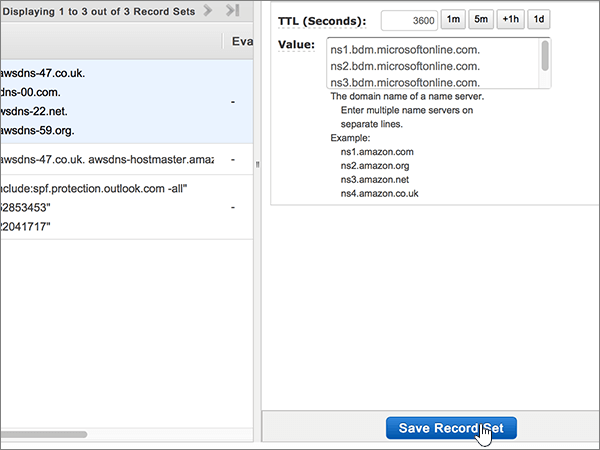

# Ändra namnservrar för att konfigurera Office 365 med AWS (Amazon Web Services)

 **[Läs frågor och svar om domäner](../setup/domains-faq.md)** om du inte hittar det du letar efter. 
  
Följ instruktionerna nedan om du vill att Office 365-DNS-posterna ska hanteras i Office 365. (Om du föredrar, kan du [hantera alla Office 365 DNS-poster hos AWS](create-dns-records-at-aws.md).)
  
    
## Lägga till en TXT-post för verifiering

Innan du använder din domän med Office 365, vill vi vara säkra på att det är du som äger den. Att du kan logga in på ditt konto hos domänregistratorn och skapa DNS-posten bevisar för Office 365 att du äger domänen.
  
> [!NOTE]
> Den här posten används endast för att verifiera att du äger domänen. Den påverkar ingenting annat. Du kan ta bort den senare om du vill. 
  
1. Kom igång genom att gå till domänsidan på AWS genom att klicka på [den här länken](https://console.aws.amazon.com/route53/home). Du uppmanas att logga in först.
    
2. På sidan **Resurser** väljer du **Värdzoner**.
    
3. Välj namnet på den domän som du vill redigera i kolumnen **Domännamn** på sidan **Värdzoner.** 
    
4. Välj **Skapa postuppsättning**.
    
5. I **Create Record Set** skriver du in, eller kopierar och klistrar in, värdena från följande tabell i fälten för den nya posten. 
    
    (Välj värdena för **Type** och **Routing Policy** i listrutorna.) 
    
    > [!TIP]
    > Citattecken som krävs enligt anvisningarna på skärmen anges automatiskt. Du behöver inte skriva in dem manuellt. 
  
|||||||
|:-----|:-----|:-----|:-----|:-----|:-----|
|**Name**   |**Type (Typ)**   |**Alias**   |**TTL (sekunder)**   |**Värde**   |**Routing Policy (Routningsprincip)**   |
|(Lämna det här fältet tomt)    |TXT - text    |Nej    |300    |MS=ms *XXXXXXXX*   **Obs!** Det här är ett exempel. Använd det specifika värdet för **Mål eller pekar på-adress** här, från tabellen i Office 365. [Hur hittar jag det här?](../get-help-with-domains/information-for-dns-records.md)     |Enkelt   |
   
6. Välj **Skapa**.
    
7. Vänta några minuter innan du fortsätter, så att den post som du nyss skapade kan uppdateras på Internet.
    
Nu när du har lagt till posten på domänregistratorns webbplats går du tillbaka till Office 365 och begär att Office 365 letar efter posten.
  
När Office 365 hittar rätt TXT-post är din domän verifierad.
  
1. I administrationscentret går du till **Inställningar** \> <a href="https://go.microsoft.com/fwlink/p/?linkid=834818" target="_blank">Domains</a>.

    
2. På sidan **Domains** väljer du den domän du verifierar. 
    
3. På sidan **Setup** väljer du **Start setup**.
    
4. På sidan **Verify domain** väljer du **Verify**.
    
> [!NOTE]
> Det brukar ta omkring 15 minuter för DNS-ändringarna att gå igenom. Ibland kan det dock ta längre tid att uppdatera DNS-systemet på Internet för en ändring som du har gjort. Om du stöter på problem med e-postflödet eller får andra problem när du har lagt till DNS-posterna, går du till [Hitta och åtgärda problem när du har lagt till din domän eller DNS-poster i Office 365](../get-help-with-domains/find-and-fix-issues.md). 
  
## Ändra domänens namnserverposter (NS)

Om du vill slutföra konfigurationen av domänen med Office 365 kan du ändra domänens NS-poster hos domänregistratorn så att de pekar på de primära och sekundära namnservrarna i Office 365. Då ställs Office 365 in så att domänens DNS-poster uppdateras. Vi lägger till alla poster så att e-post, Skype för företag - Online och den offentliga webbplatsen fungerar med domänen så att du kan börja.
  
> [!CAUTION]
> Om du ändrar domänens NS-poster så att de pekar på Office 365-namnservrarna påverkas alla tjänster som är kopplade till domänen. Till exempel kommer all e-post som skickas till din domän (till exempel rob@ *your_domain*  .com) till Office 365 när du har gjort den här ändringen. 
  
> [!IMPORTANT]
>  Följande procedur visar hur du tar bort andra, oönskade namnservrar från listan, och hur du lägger till korrekta namnservrar om de inte redan finns i listan. >  När du har utfört stegen i det här avsnittet är de enda namnservrarna som bör finnas i listan dessa fyra: >  ns1.bdm.microsoftonline.com >  ns2.bdm.microsoftonline.com >  ns3.bdm.microsoftonline.com >  ns4.bdm.microsoftonline.com 
  
1. Kom igång genom att gå till domänsidan på AWS genom att klicka på [den här länken](https://console.aws.amazon.com/route53/home). Du uppmanas att logga in först.
    
2. På sidan **Resurser** väljer du **Värdzoner**.
    
3. Välj namnet på den domän som du vill redigera i kolumnen **Domännamn** på sidan **Värdzoner.** 
    
4. Välj undergruppen **Nameserver**. 
    
    
  
5. I **NS - Name server**-undergruppen, i **Value**, tar du bort alla namnservrar genom att markera dem alla och sedan trycka på **Delete** på tangentbordet. 
    
    > [!CAUTION]
    > Följ bara dessa steg om du har andra befintliga namnservrar än de fyra korrekta namnservrarna. (Det vill an, ta bara bort alla aktuella namnservrar som *inte* namnges **ns1.bdm.microsoftonline.com**, **ns2.bdm.microsoftonline.com**, **ns3.bdm.microsoftonline.com**eller **ns4.bdm.microsoftonline.com**.) 
  
    
  
6. I **området TTL (Sekunder):** väljer du **1h** (1 timme). 
    
    
  
7. Fortfarande i **NS - Name server**-undergruppen och i värderutan **Value**: Skriv eller kopiera och klistra in värdet för första raden - **First line** - från tabellen nedan. Tryck på **Retur** på tangentbordet och skriv eller kopiera och klistra in värdet för nästa **rad**. 
    
    > [!IMPORTANT]
    > Varje namnservervärde  *måste*  stå på en egen rad i värderutan: **Value**. Se bildförklaringen nedan. 
  
|||
|:-----|:-----|
|**Första raden (First line)**   |ns1.bdm.microsoftonline.com.    **Värdet MÅSTE sluta med en punkt (.)**   |
|**Andra raden (Second line)**   |ns2.bdm.microsoftonline.com.    **Värdet MÅSTE sluta med en punkt (.)**   |
|**Tredje raden (Third line)**   |ns3.bdm.microsoftonline.com.    **Värdet MÅSTE sluta med en punkt (.)**   |
|**Fjärde raden (Fourth line)**   |ns4.bdm.microsoftonline.com.    **Värdet MÅSTE sluta med en punkt (.)**   |
   
   
  
8. Välj **Spara postuppsättning**.
    
    
  
> [!NOTE]
> Det kan ta flera timmar innan ändringarna har uppdaterats genom hela DNS-systemet på Internet. Sedan är din Office 365 e-post och andra tjänster klara att fungera med din domän. 
